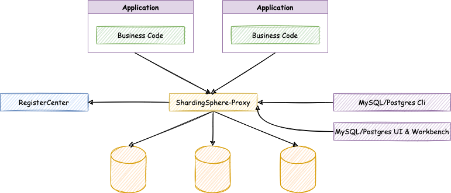
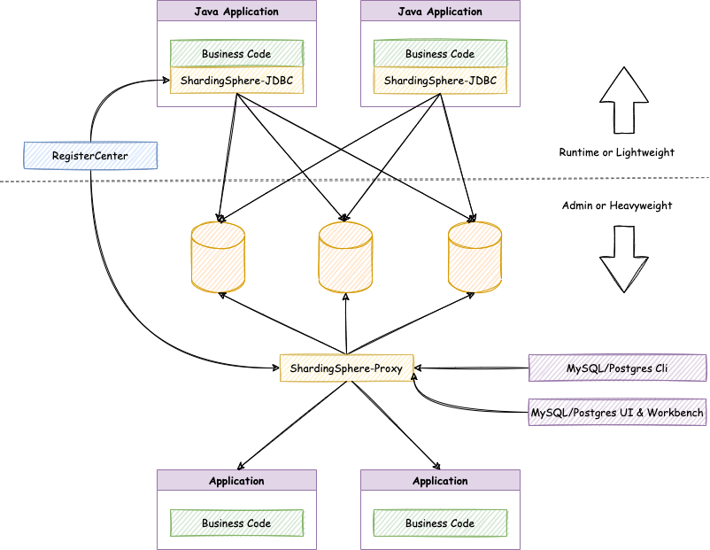
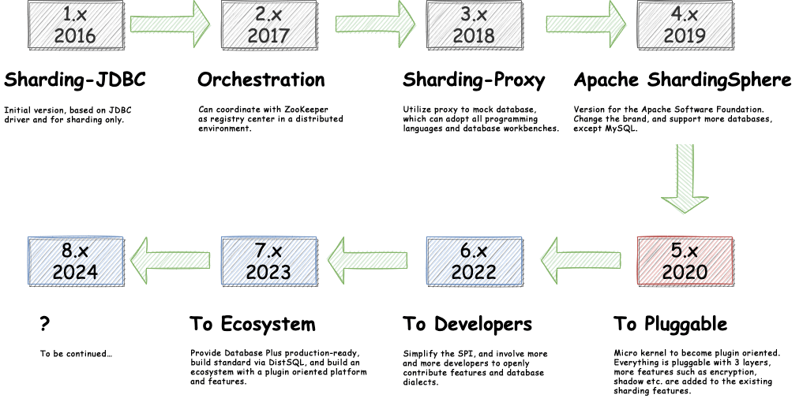

# [ShardingSphere - Building a Criterion and Ecosystem Above Multi-Model Databases](https://shardingsphere.apache.org/)

**Official Website:** [https://shardingsphere.apache.org/]()

[](https://www.apache.org/licenses/LICENSE-2.0.html)
[](https://github.com/apache/shardingsphere/releases)

[](https://twitter.com/ShardingSphere)
[](https://join.slack.com/t/apacheshardingsphere/shared_invite/zt-sbdde7ie-SjDqo9~I4rYcR18bq0SYTg)
[](https://gitter.im/shardingsphere/Lobby)

**Stargazers Over Time**

[](https://starchart.cc/apache/shardingsphere)

**Contributors Over Time**

[](https://www.apiseven.com/en/contributor-graph?chart=contributorOverTime&repo=apache/shardingsphere)

[](https://travis-ci.org/apache/shardingsphere)
[](https://codecov.io/gh/apache/shardingsphere)
[](https://snyk.io/test/github/apache/shardingsphere?targetFile=pom.xml)
[](https://cloud.quality-gate.com/dashboard/branches/30#overview)

[](http://opentracing.io)
[](https://github.com/apache/skywalking)


# ShardingSphere Overview


Apache ShardingSphere is positioned as a Database Plus, and aims at building a new criterion and ecosystem above multi-model databases. It focuses on how to reuse existing databases and their respective upper layer, rather than creating a new database. 

The concepts at the core of the project are Link, Enhance and Pluggable.

•	`Link`：Flexible adaptation of database protocol, SQL dialect and database storage. It can quickly link applications and multi-mode heterogeneous databases quickly.

•	`Enhance`：Capture database access entry to provide additional features transparently, such as: redirect (sharding, readwrite-splitting and shadow), transform (data encrypt and mask), authentication (security, audit and authority), governance (circuit breaker and access limitation and analyze, QoS and observability).

•	`Pluggable`：Leveraging the micro kernel and 3 layers pluggable mode, features and database ecosystem can be embedded flexibily. Developers can customize their ShardingSphere just like building with LEGO blocks.

ShardingSphere became an [Apache](https://apache.org/index.html#projects-list) Top-Level Project on April 16, 2020.
 
## Documentation

[](https://shardingsphere.apache.org/document/current/en/overview/)
[](https://shardingsphere.apache.org/document/current/cn/overview/)

For full documentation & more details, visit: [https://shardingsphere.apache.org/document/current/en/overview/](https://shardingsphere.apache.org/document/current/en/)

## Contribution: 

For guides on how to get started and setup your environment, contributor & committer guides, visit: [https://shardingsphere.apache.org/community/en/contribute/](https://shardingsphere.apache.org/document/current/en/)

## Community & Support

•	[Mailing List](dev@shardingsphere.apache.org). Best for: Apache community updates, releases, changes.

•	[GitHub Issues](https://github.com/apache/shardingsphere/issues). Best for: larger systemic questions/bug reports or anythingdevelopment related.

•	[GitHub Discussions](https://github.com/apache/shardingsphere/discussions). Best for: technical questions & support, requesting new features, proposing new features.

•	[Slack channel](https://join.slack.com/t/apacheshardingsphere/shared_invite/zt-sbdde7ie-SjDqo9~I4rYcR18bq0SYTg). Best for:instant communications and online meetings, sharing your applications.

•	[Twitter](https://twitter.com/ShardingSphere). Best for: keeping up to date on everything ShardingSphere.

## Status:

•	Version 5.0.0-beta: released, stable enough & anyone can sign up.

-	Version 5.0.0-RC1

We are currently working towards our 5.0.0-RC1 milestone. Keep an eye on the milestones page of this repo to stay up to date.

## How it Works: 

Apache ShardingSphere includes 3 independent products: JDBC, Proxy & Sidecar (Planning). They all provide functions of data scale-out, distributed transaction and distributed governance, applicable in a variety of situations such as Java isomorphism, heterogeneous language and Cloud-Native.

### ShardingSphere-JDBC

[](https://mvnrepository.com/artifact/org.apache.shardingsphere/shardingsphere-jdbc)

ShardingSphere-JDBC is a lightweight Java framework providing extra services at the Java JDBC layer. With the client end connecting directly to the database, it provides services in the form of a jar and requires no extra deployment and dependence. It can be considered as an enhanced JDBC driver, fully compatible with JDBC and all kinds of ORM frameworks.
Applicable in any ORM framework based on JDBC, such as JPA, Hibernate, Mybatis, Spring JDBC Template or direct use of JDBC. Supports any third-party database connection pool, such as DBCP, C3P0, BoneCP, Druid, HikariCP. Supports any kind of JDBC standard database: MySQL, Oracle, SQLServer, PostgreSQL and any SQL92 followed databases.


 
### ShardingSphere-Proxy

[](https://apache.org/dyn/closer.cgi?path=shardingsphere/5.0.0-beta/apache-shardingsphere-5.0.0-beta-shardingsphere-proxy-bin.tar.gz)
[](https://store.docker.com/community/images/apache/sharding-proxy)

ShardingSphere-Proxy is a transparent database proxy, providing a database server that encapsulates database binary protocol to support heterogeneous languages. Friendlier to DBAs, the MySQL version now provided can use any kind of terminal (such as MySQL Command Client, MySQL Workbench, etc.) that is compatible with the MySQL protocol to operate data.
It can be used directly as MySQL and PostgreSQL servers, and is applicable to any kind of terminal that is compatible with MySQL and PostgreSQL protocol.




|                         | *ShardingSphere-JDBC* | *ShardingSphere-Proxy* |
| ----------------------- | --------------------- | ---------------------- |
| Database                | Any                   | MySQL/PostgreSQL       |
| Connections Count Cost  | High                  | Low                    |
| Supported Languages     | Java Only             | Any                    |
| Performance             | Low loss              | Relatively High loss   |
| Decentralization        | Yes                   | No                     |
| Static Entry            | No                    | Yes                    |


### Hybrid Architecture

ShardingSphere-JDBC adopts a decentralized architecture, applicable to high-performance light-weight OLTP application developed with Java. ShardingSphere-Proxy provides static entry and all languages support, suitable for OLAP application and sharding databases management and operation.

Through the mixed use of ShardingSphere-JDBC & ShardingSphere-Proxy together with a unified sharding strategy by the same registry center, the ShardingSphere ecosystem can build an application system suitable to all kinds of scenarios.



## Roadmap:



## Solution

|  *Distributed Database* |    *Data Security*   |    *Database Gateway* | *Stress Testing* |        
| ----------------------- | ---------------------| ---------------------- | ---------------|
| Data Sharding           | Data Encrypt         | Multi-model Databases supported | Shadow Database |
| Readwrite-splitting     | Row Authority (TODO) | SQL Dialect Translate (TODO) | Observability (Tracing & Metrics)|
| Distributed Transaction | SQL Audit (TODO)     | Any                    
| Elastic Scale-out       | SQL Firewall (TODO)  | Relatively High loss   |
| Distributed Highly Available |                |                |


## How to Build

### Build Apache ShardingSphere

```bash
./mvnw clean install -Prelease
```

Artifact:

```
shardingsphere-distribution/shardingsphere-src-distribution/target/apache-shardingsphere-${latest.release.version}-src.zip  # Source code package of Apache ShardingSphere
shardingsphere-distribution/shardingsphere-jdbc-distribution/target/apache-shardingsphere-${latest.release.version}-shardingsphere-jdbc-bin.tar.gz  # Binary package of ShardingSphere-JDBC
shardingsphere-distribution/shardingsphere-proxy-distribution/target/apache-shardingsphere-${latest.release.version}-shardingsphere-proxy-bin.tar.gz  # Binary package of ShardingSphere-Proxy
shardingsphere-distribution/shardingsphere-scaling-distribution/target/apache-shardingsphere-${latest.release.version}-shardingsphere-scaling-bin.tar.gz  # Binary package of ShardingSphere-Scaling
```

### Build ShardingSphere-UI

```bash
git clone https://github.com/apache/shardingsphere-ui
cd shardingsphere-ui
./mvnw clean install -Prelease
```

Artifact:

```
shardingsphere-ui/shardingsphere-ui-distribution/shardingsphere-ui-bin-distribution/target/apache-shardingsphere-${latest.release.version}-shardingsphere-ui-bin.tar.gz  # Binary package of ShardingSphere-UI
```

## Landscapes

<p align="center">
<br/><br/>
&nbsp;&nbsp;
<br/><br/>
Apache ShardingSphere enriches the <a href="https://landscape.cncf.io/landscape=observability-and-analysis&license=apache-license-2-0">CNCF CLOUD NATIVE Landscape</a>.
</p>

