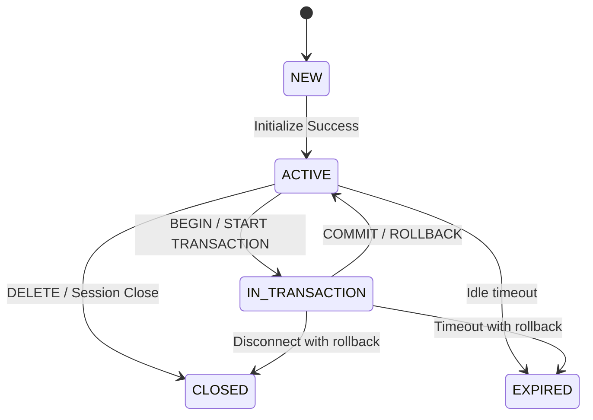

# ShardingSphere MCP 详细设计说明书

## 1. 文档信息
- 文档名称：ShardingSphere MCP 详细设计说明书
- 文档版本：最终版
- 文档类型：Detailed Design
- 状态：可进入编码实现
- 适用范围：ShardingSphere MCP V1

## 2. 文档目标
- 本文档用于将前面的 PRD 和技术设计方案落到实现级别，目标是让 MCP 子系统能够直接进入开发，而不会在实现过程中因为模块结构、协议契约、测试落位或构建链不明确而返工。
- 本文档重点回答：
  - 代码模块如何组织
  - Maven / 模块 / JDK 17 子链路如何落地
  - MCP Streamable HTTP 如何实现
  - Session / transaction / savepoint 如何维护
  - capability / transaction matrix 如何建模
  - 配置如何组织
  - 单测、集成测试、E2E 如何落地
  - distribution 如何发布

## 3. 已知输入与约束

### 3.1 仓库现状
- 当前仓库结构与基础约束如下：
  - 根工程模块链见 `pom.xml`（line 33）
  - 根工程 Java 基线为 8，`pom.xml`（line 55）
  - 根工程当前 Jackson 版本为 2.16.1，`pom.xml`（line 93）
  - 根 distribution 聚合结构见 `distribution/pom.xml`（line 30）
  - 根 test 聚合结构见 `test/pom.xml`（line 30）
  - `test/e2e` 聚合结构见 `test/e2e/pom.xml`（line 30）

### 3.2 协议与运行时约束
- 截至 2026-03-21，当前实现与协议基线如下：
  - MCP 当前标准 HTTP transport 为 Streamable HTTP
  - 当前协议版本基线为 `2025-11-25`
  - 仓库内实现采用 JDK 17 编译的自管 runtime
  - 远程 HTTP listener 由 `mcp/bootstrap` 局部引入的 embedded Tomcat 与 MCP Java SDK servlet transport 承载
  - SDK 侧 JSON 绑定继续服从根工程 Jackson `2.16.1`
- 来源：
  - 本仓库实现
  - MCP Transports 2025-11-25

### 3.3 当前设计边界
- 本说明书固定以下前提：
  - MCP 放在主仓库内
  - 代码模块位于根目录 `mcp/`
  - 发布模块位于根目录 `distribution/mcp`
  - E2E 模块位于 `test/e2e/mcp`
  - 不引入 Spring AI
  - 不推动全仓升级 JDK 17
  - 不实现分布式会话存储
  - 不实现事务态无损 failover

## 4. 总体实现结论
- V1 的最终实现结构如下：

```text
shardingsphere
├── mcp
│   ├── pom.xml
│   ├── core
│   └── bootstrap
├── distribution
│   └── mcp
├── test
│   └── e2e
│       └── mcp
└── pom.xml
```

- 三条子链路职责分别为：
  - `mcp`
    - 实现 MCP 运行时代码
  - `distribution/mcp`
    - 产出 `shardingsphere-mcp-distribution`
  - `test/e2e/mcp`
    - 承担 MCP 端到端验证
- 这三条链路直接进入常规 Maven reactor 模块，不再通过独立 `mcp` profile 挂载。

## 5. Maven 与模块落地设计

### 5.1 artifact 命名
- 建议固定为：
  - `shardingsphere-mcp`
  - `shardingsphere-mcp-core`
  - `shardingsphere-mcp-jdbc`
  - `shardingsphere-mcp-bootstrap`
  - `shardingsphere-mcp-distribution`
  - `shardingsphere-test-e2e-mcp`

### 5.2 parent 关系
- 建议：
  - `mcp/pom.xml`
    - `parent`：`org.apache.shardingsphere:shardingsphere`
    - `packaging`：`pom`
    - `modules`：
      - `core`
      - `jdbc`
      - `bootstrap`
  - `distribution/mcp/pom.xml`
    - `parent`：`org.apache.shardingsphere:shardingsphere-distribution`
    - `packaging`：`pom`
  - `test/e2e/mcp/pom.xml`
    - `parent`：`org.apache.shardingsphere:shardingsphere-test-e2e`
    - `packaging`：`jar`
- 这样可以同时保证：
  - 版本与主仓库统一
  - distribution 与 test 的聚合逻辑一致
  - 模块边界清晰

### 5.3 模块接入方式
- 这是整个实现里最关键的结构性设计。

#### 根 `pom.xml`
- 在默认 `<modules>` 内引入 `<module>mcp</module>`

#### `distribution/pom.xml`
- 在默认 `<modules>` 内引入 `<module>mcp</module>`

#### `test/e2e/pom.xml`
- 在默认 `<modules>` 内引入 `<module>mcp</module>`

#### 最终效果
- 默认构建：包含 MCP
- MCP 构建：直接走常规 Maven reactor
- 这样可以保持：
  - `mcp`、`distribution/mcp`、`test/e2e/mcp` 与 JDBC、Proxy、agent 一致
  - 打包与 E2E 不依赖额外 profile
  - Java 17 设置仍局部收敛在 MCP 子模块

### 5.4 JDK 17 隔离策略
- 建议：
  - `mcp/pom.xml` 内局部声明 `maven.compiler.release=17`
  - 使用 Maven Toolchains
  - JDK 17 子链路 CI lane 固定 JDK 17
- 禁止：
  - 将 Java 17 相关设置扩散到根工程统一配置
  - 将额外 HTTP 容器或 MCP SDK 依赖写入根工程统一依赖管理
  - 让 MCP Java SDK 类型进入 `mcp/core`

## 6. 包结构设计

### 6.1 `mcp/core`
- 推荐根包：
  - `org.apache.shardingsphere.mcp`
- 推荐子包：
  - `protocol`
  - `resource`
  - `tool`
  - `capability`
  - `session`
  - `metadata`
  - `execute`
  - `audit`
  - `config`
  - `common`
- 说明：
  - `protocol`
    - 协议对象与 DTO
  - `resource`
    - resource 映射与读取
  - `tool`
    - tool handler 与 dispatcher
  - `capability`
    - capability matrix / assembler
  - `session`
    - session / tx / savepoint 管理
  - `metadata`
    - metadata discovery facade
  - `execute`
    - `execute_query` facade
  - `audit`
    - audit facade
  - `config`
    - MCP 内部配置模型
  - `common`
    - 公共常量、枚举、异常

### 6.2 `mcp/jdbc`
- 推荐子包：
  - `config`
  - `config.yaml`
  - `runtime`
- 设计原则：
  - JDBC-specific runtime 细节进入 `mcp/jdbc`
  - `mcp/jdbc` 依赖 `mcp/core`
  - `mcp/bootstrap` 只通过 runtime context factory 使用 JDBC runtime

### 6.3 `mcp/bootstrap`
- 推荐子包：
  - `transport.http`
  - `transport.stdio`
  - `server`
  - `wiring`
  - `config`
  - `lifecycle`
- 设计原则：
  - core 不依赖 bootstrap
  - bootstrap 依赖 core
  - transport 细节不进入 core

## 7. 协议与 Transport 详细设计

### 7.1 HTTP transport 固定为 Streamable HTTP
- V1 的 HTTP transport 固定为：
  - MCP Streamable HTTP
  - 协议版本基线：`2025-11-25`
- 这意味着不再使用模糊表述“HTTP 模式”，而是明确遵守当前 MCP 标准 transport。

### 7.2 MCP endpoint
- V1 使用单一 MCP endpoint，例如：
  - `/mcp`
- 该 endpoint 必须支持：
  - `POST`
  - `GET`
  - `DELETE`

#### `POST /mcp`
- 用途：
  - 初始化 HTTP session
  - 处理 session 绑定后的 JSON-RPC follow-up 请求
- 规则：
  - 缺少 `MCP-Session-Id` 时创建新会话
  - 初始化成功后返回 `MCP-Session-Id` 与协商后的 `MCP-Protocol-Version`
  - 带 `MCP-Session-Id` 的 follow-up `POST` 负责承载 `tools/list`、`tools/call`、`resources/list` 与 `resources/read`
  - follow-up `POST` 必须先完成协议版本与 session 校验，再进入 tool / resource dispatch

#### `GET /mcp`
- 用途：
  - 满足 Streamable HTTP 规范
  - 支持服务端到客户端的 SSE 流
- V1 说明：
  - MCP 业务功能本身不依赖 server push
  - 但服务端仍提供 GET 能力，以满足 transport 规范与 future-proofing

#### `DELETE /mcp`
- 用途：
  - 客户端显式终止 MCP session
- V1 设计选择：
  - 实现 DELETE
  - 不使用 405 作为默认行为
- 原因：
  - 本设计是 stateful session 模型
  - 显式关闭会话有利于及时释放事务与会话资源

### 7.3 会话头与版本头
- V1 固定使用当前协议定义的头：
  - `MCP-Session-Id`
  - `MCP-Protocol-Version`
- 规则：
  1. 初始化成功后，服务端在 `InitializeResult` 对应 HTTP 响应头中返回 `MCP-Session-Id`
  2. 后续 HTTP 请求必须带 `MCP-Session-Id`
  3. 后续 HTTP 请求应带 `MCP-Protocol-Version`
  4. 若请求缺少必须的 session id，返回 `400 Bad Request`
  5. 若 session 已终止或不存在，返回 `404 Not Found`

### 7.4 协议版本处理
- V1 采用如下策略：
  - 服务端协议基线固定为 `2025-11-25`
  - 初始化阶段记录协商结果
  - 后续请求：
    - 若 header 存在，必须与会话协商版本一致
    - 若 header 缺失但 session 存在，服务端允许回退到会话协商版本并记录警告日志
    - 若既无 header 又无 session，上游请求视为不合法并返回 `400`
- 这样既符合协议，也避免过度脆弱。

### 7.5 本地模式运行边界
- 根据 transport 规范，V1 要求：
  - 本地模式默认仅绑定 `127.0.0.1`
  - 若本地模式请求显式携带 `Origin`，服务端校验其 host 必须仍为 loopback / localhost
  - 远程模式应由外部网关、反向代理或网络边界提供保护
- 以上约束用于限定本地运行边界，与 MCP session 语义分层处理。

## 8. 会话、事务与 Savepoint 详细设计

### 8.1 Session 状态
- 定义 Session 状态：
  - `NEW`
  - `ACTIVE`
  - `IN_TRANSACTION`
  - `CLOSED`
  - `EXPIRED`

### 8.2 Transaction 状态
- 定义事务状态：
  - `NONE`
  - `ACTIVE`
  - `ROLLBACK_ONLY`
  - `FINISHED`

### 8.3 Savepoint 前置条件
- 只有同时满足以下条件，savepoint 才可用：
  - 当前 database capability `supportsSavepoint = true`
  - 当前事务状态为 `ACTIVE`
- 否则：
  - 返回 `unsupported`
  - 或 `transaction_state_error`

### 8.4 状态流转


### 8.5 Timeout 设计
- 分两类：
  - session idle timeout
  - transaction timeout
- 规则：
  - session idle timeout 到期：
    - session 转为 `EXPIRED`
  - transaction timeout 到期：
    - 当前事务自动回滚
    - 会话转为 `ACTIVE` 或 `EXPIRED`
    - 后续针对旧事务上下文的操作返回 `transaction_state_error`

### 8.6 故障语义
- V1 采用：
  - sticky session
  - 本地内存 session store
- 因此，节点故障语义必须明确：
  - 节点故障或重启时，本节点上的 session 丢失
  - 活动事务不做跨节点恢复
  - 未提交事务视为失败并回滚
  - 客户端需重新初始化 session
- V1 不支持：
  - distributed session store
  - 无粘性路由事务恢复
  - savepoint 栈的跨节点恢复

## 9. capability / transaction matrix 详细设计

### 9.1 数据来源

#### capability 来源
- 由三层叠加得到：
  1. 静态矩阵
  2. 运行时 metadata
  3. 部署时覆盖

### 9.2 transaction matrix 存储方式
- V1 推荐：
  - Java 强类型注册表
- 不优先用 YAML / JSON 作为首版事实源。
- 理由：
  - 更稳定
  - 更容易测试
  - 不容易被错误配置污染
  - 更适合作为 capability 默认事实源

### 9.3 transaction matrix 字段
- 至少包含：
  - `databaseType`
  - `minSupportedVersion`
  - `supportsTransactionControl`
  - `supportsSavepoint`
  - `defaultAutocommit`
  - `supportedTransactionStatements`
  - `supportedObjectTypes`
  - `supportedStatementClasses`
  - `supportsExplainAnalyze`
  - `ddlTransactionBehavior`
  - `dclTransactionBehavior`
  - `explainAnalyzeResultBehavior`
  - `explainAnalyzeTransactionBehavior`

### 9.4 capability 组装顺序
- 固定组装顺序：
  1. 读取静态矩阵
  2. 读取运行时 metadata
  3. 应用部署时覆盖项
  4. 生成数据库级 capability

## 10. `execute_query` 详细设计

### 10.1 职责
- `execute_query` 负责：
  - 单语句校验
  - statement class 归类
  - capability 校验
  - session / transaction 校验
  - 调用 ShardingSphere parse / route / execute
  - 统一结果映射
  - 统一错误映射
  - 审计输出

### 10.2 执行阶段
- 内部固定为 7 个阶段：
  1. request validation
  2. statement classification
  3. session validation
  4. capability validation
  5. kernel execution
  6. result / error mapping

### 10.3 Statement Class
- 统一按以下维度治理：
  - `select`
  - `dml`
  - `ddl`
  - `dcl`
  - `transaction_control`
  - `savepoint`
  - `explain_analyze`

### 10.4 统一结果
- 仅允许三类：
  - `result_set`
  - `update_count`
  - `statement_ack`

### 10.5 错误映射
- 底层异常不得直接透传。
- 统一映射为：
  - `invalid_request`
  - `not_found`
  - `unsupported`
  - `conflict`
  - `unavailable`
  - `transaction_state_error`
  - `query_failed`

## 11. 配置设计

### 11.1 配置文件
- distribution 建议提供：
  - `conf/mcp.yaml`
  - `conf/logback.xml`

### 11.2 `mcp.yaml` 分层
- 建议包含以下一级段：
  - `transport`
  - `runtimeDatabases`

### 11.3 配置职责

#### `transport`
- `http.enabled`
- `http.bindHost`
- `http.port`
- `http.endpointPath`
- `stdio.enabled`
- 所有 transport 字段都必须显式声明，不保留隐式默认值或省略时兜底
- HTTP transport 固定使用 MCP `2025-11-25` 协议基线，不作为外部配置项暴露
- distribution 默认配置同时启用 HTTP 与 STDIO；STDIO 仍主要用于本地测试与进程内联调，不作为额外交互式文本 Shell

#### `runtimeDatabases`
- canonical logical database mapping
  - `databaseType`
  - `jdbcUrl`
  - `username`
  - `password`
  - `driverClassName`
- schema 采用 strict mapping
  - unknown key 直接报错
  - legacy `runtime.*` alias 不再作为专门迁移分支保留
  - per-database capability booleans 不再接受为 operator-facing 配置
- distribution 默认配置提供一段 demo JDBC runtime，确保发行包第一次启动即可验证非空 metadata 与真实执行链路；真实部署需替换为目标环境配置

## 12. 运行边界与审计详细设计

### 12.1 运行边界
- V1 内置 runtime 聚焦 session 协商、会话状态维护与运行边界校验。
- follow-up production runtime 路径要求通过 `runtimeDatabases` 显式装配真实 metadata 与执行适配，不再允许空 runtime 作为成功启动兜底。
- HTTP 端点如需对外暴露，应放在受信网络、上游网关、反向代理或其他网络边界之后。

### 12.2 审计模型
- 统一输出：
  - sessionId
  - database
  - operationClass
  - operationDigest
  - successOrFailure
  - errorCode
  - transactionMarker
  - timestamp

## 13. 测试设计

### 13.1 测试分层
- V1 测试分 4 层：
  1. 单元测试
  2. 模块集成测试
  3. 协议联调测试
  4. E2E 测试

### 13.2 单元测试重点
- 重点覆盖：
  - capability assembler
  - transaction matrix registry
  - session manager
  - `execute_query` facade
  - error mapper

### 13.3 模块集成测试重点
- 重点覆盖：
  - `/mcp` endpoint 行为
  - `MCP-Protocol-Version`
  - `MCP-Session-Id`
  - `transaction/savepoint` 状态流转
  - `DELETE /mcp`

### 13.4 E2E 模块落位
- 建议新增：
  - `test/e2e/mcp`
- `artifactId`：
  - `shardingsphere-test-e2e-mcp`
- `parent`：
  - `shardingsphere-test-e2e`
- 不放在：
  - `test/e2e/operation/mcp`
- 原因：
  - MCP 是新的接入面，不是 operation 子类型
  - `test/e2e/pom.xml` 的顶层聚合更适合把 MCP 作为一级测试模块承载

### 13.5 E2E 模块接入约束
- 和代码、distribution 一样，`test/e2e/mcp` 直接进入默认 `test/e2e` 模块链。
- 也就是说：
  - `test/e2e/pom.xml` 默认 `<modules>` 直接加入 `<module>mcp</module>`
  - JDK 17 要求通过 MCP 子模块局部配置和 JDK 17 子链路 CI 兜底
- 这样 E2E 与代码、distribution 的聚合方式保持一致，不再依赖额外 profile。

### 13.6 E2E 依赖
- `test/e2e/mcp` 直接依赖建议包括：
  - `shardingsphere-mcp-core`
  - `shardingsphere-mcp-jdbc`
  - `shardingsphere-mcp-bootstrap`
  - `shardingsphere-test-e2e-env`
  - `shardingsphere-test-e2e-fixture`
- 必要时补充：
  - HTTP 客户端依赖
  - 数据库驱动依赖

### 13.7 E2E 最小覆盖矩阵
- A. 事务 + savepoint 组
  - MySQL
  - PostgreSQL
  - openGauss
- B. 事务但不支持 savepoint 组
  - Doris
  - Presto
- C. 不支持事务控制组
  - Hive
  - ClickHouse
- D. optional object 组
  - 一个支持 index
  - 一个不支持 index
- E. capability 组
  - capability 与矩阵一致

### 13.8 E2E 最小冒烟场景
- 至少固定以下 12 个场景：
  1. 服务级 capability
  2. 数据库级 capability
  3. `list_databases`
  4. `list_schemas`
  5. `list_tables / search_metadata`
  6. `describe_table`
  7. `execute_query(SELECT)`
  8. `execute_query(DML)`
  9. `BEGIN / COMMIT / ROLLBACK`
  10. `SAVEPOINT` 成功场景
  11. `SAVEPOINT unsupported` 场景
  12. `DELETE close / invalid session` 场景

## 14. distribution 详细设计

### 14.1 `distribution/mcp` 依赖关系
- `distribution/mcp` 直接依赖：
  - `shardingsphere-mcp-bootstrap`
- 运行时依赖分类建议参考 `distribution/proxy` 与 `distribution/jdbc`：
  - mode repositories
  - parser / runtime dialect support
  - JDBC drivers
  - logging

### 14.2 目录结构
- 建议产出：

```text
apache-shardingsphere-mcp-<version>/
├── bin/
├── conf/
├── lib/
├── logs/
└── LICENSE / NOTICE / README.md
```

### 14.3 启动脚本
- 建议至少提供：
  - `bin/start.sh`

### 14.4 容器化
- 当前 V1 建议提供：
  - Dockerfile
  - 配置挂载约定
- 健康检查可作为后续运行时增强项追加，不阻塞当前打包与 smoke。

## 15. 实施顺序
- 建议实现顺序固定如下：
  1. Maven / 模块 / toolchain 结构
  2. `mcp/core` 公共模型与 transaction matrix
  3. `mcp/core` 的 capability / error / session
  4. `mcp/bootstrap` 的 HTTP / STDIO transport
  5. `/mcp` 的 Streamable HTTP endpoint
  6. `execute_query` 与 metadata discovery
  7. `distribution/mcp`
  8. 单元测试
  9. 模块集成测试
  10. `test/e2e/mcp`

## 16. 开工前检查清单
- 开始写代码前必须全部满足：
  - `mcp` 与 `distribution/mcp` 的模块接入方式已定
  - `test/e2e/mcp` 的模块落位已定
  - JDK 17 Toolchains 已定
  - Streamable HTTP 版本已固定为 `2025-11-25`
  - `MCP-Session-Id / MCP-Protocol-Version` 行为已定
  - `DELETE /mcp` 会话关闭行为已定
  - transaction matrix 存储方式已定
  - capability / `execute_query` 输入输出边界已定

## 17. 最终结论
- 这份详细设计说明书的作用，是把前面的 PRD 与技术方案真正推进到“可以开工写代码”的状态。
- 现在已经明确并固定了：
  - 仓库结构
  - Maven / 模块结构
  - JDK 17 隔离策略
  - Streamable HTTP 协议基线
  - session / transaction / savepoint 模型
  - capability / matrix 设计
  - configuration 结构
  - testing / E2E 落地方式
  - distribution 落地方式
