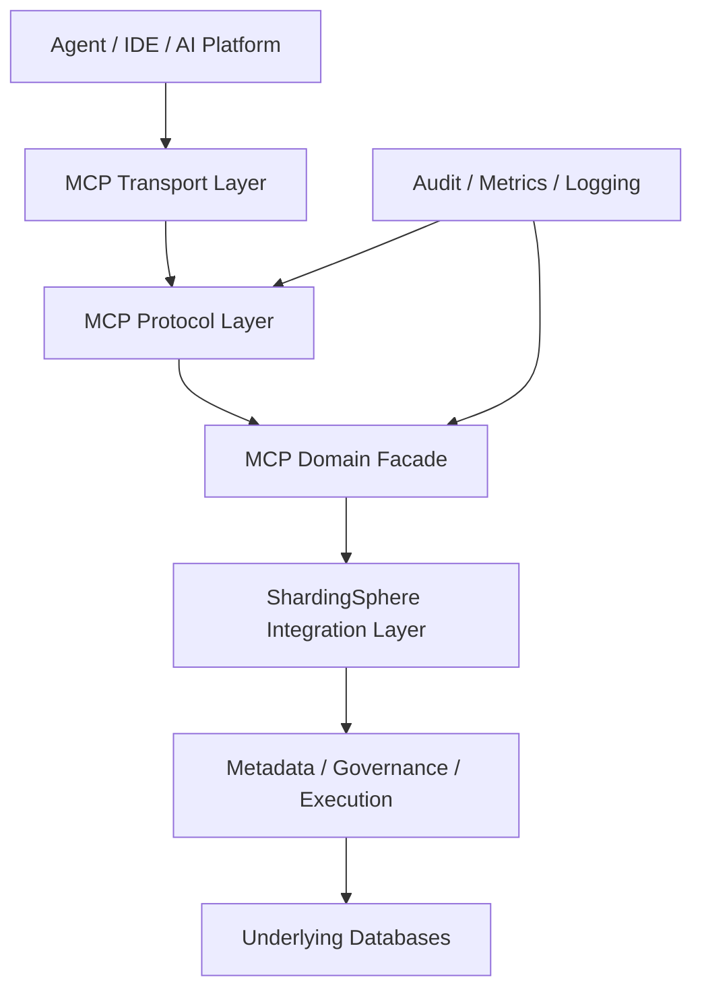
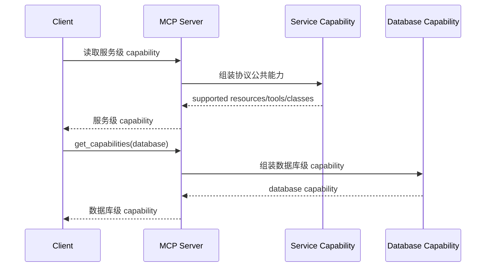
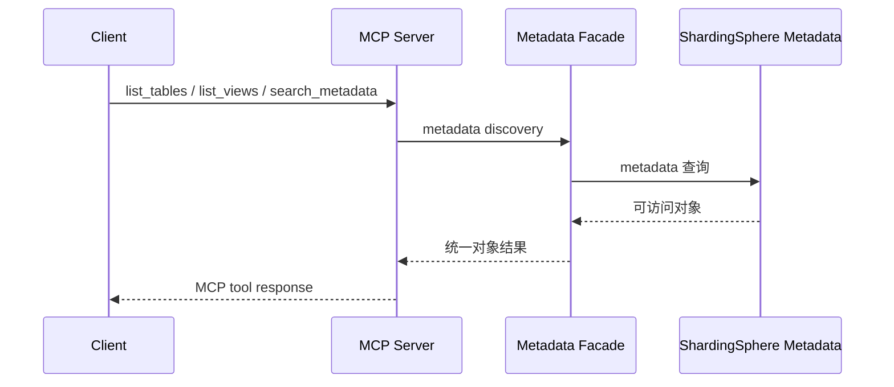
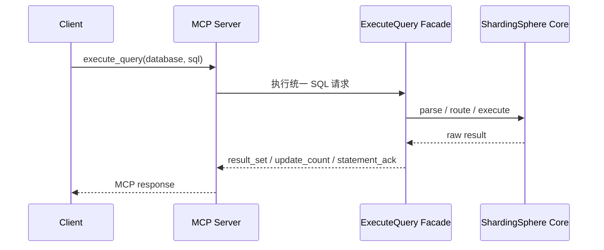

# ShardingSphere MCP 技术设计方案

## 1. 文档信息
- 文档名称：ShardingSphere MCP 技术设计方案
- 文档版本：最终版
- 文档类型：Technical Design
- 状态：可进入正式架构评审
- 目标范围：ShardingSphere MCP V1

## 2. 方案摘要
- ShardingSphere MCP 作为 ShardingSphere 主仓库内的新接入面落地，但采用“独立代码模块 + 根 distribution 发布模块”的组织方式。
- 代码模块：
  - `mcp/core`
  - `mcp/bootstrap`
- 发布模块：
  - `distribution/mcp`
  - `artifactId`：`shardingsphere-mcp-distribution`
- 协议层与运行层采用仓库内自管 MCP 领域模型与 bootstrap 适配层，HTTP 服务承载采用：
  - `mcp/bootstrap` 中局部引入的 MCP Java SDK
  - embedded Tomcat 11
- 本地调试采用：
  - STDIO
- 同时通过 JDK 17 子链路 + 常规 reactor 模块接入 + JDK 17 子链路 CI + 独立 distribution 与当前主仓库主线共存。

## 3. 背景
- 根据前期 PRD，ShardingSphere MCP 要解决的不是“把 MCP 跑起来”，而是形成正式的数据库统一 AI/Agent 接入面，覆盖：
  - 统一 metadata 发现
  - 统一 capability 声明
  - 统一 SQL 执行入口 `execute_query`
  - 统一错误模型
  - 统一事务与 `savepoint` 能力边界
  - 统一审计与治理能力
- 当前仓库和生态事实如下：
  - 根工程模块结构见 `pom.xml`（line 33）
  - 根工程 Java 基线为 8，`pom.xml`（line 55）
  - 根工程 Jackson 版本为 2.16.1，`pom.xml`（line 93）
  - 根 distribution 聚合当前管理：
    - `src`
    - `agent`
    - `jdbc`
    - `proxy`
    - `proxy-native`
  - 见 `distribution/pom.xml`（line 30）
  - MCP 子链路当前实现固定在 Java 17
- 因此，技术方案必须同时满足：
  - MCP 进入主仓库
  - 不破坏根工程 Java 8 默认构建
  - 保持与现有 distribution 结构一致
  - 覆盖 PRD 中定义的 `capability / execute_query / transaction semantics`

## 4. 目标
- 本方案目标如下：
  - 将 MCP 作为 ShardingSphere 的正式接入子系统落地。
- `mcp/core` 继续使用仓库内自管 runtime 与领域模型，`mcp/bootstrap` 局部引入 MCP Java SDK。
  - 在不推动全仓升级到 JDK 17 的前提下，引入 MCP 子链路的 Java 17 能力。
  - 形成独立部署、独立运行、独立发布的 MCP 服务。
  - 支撑 PRD 中定义的：
    - `capability`
    - `execute_query`
    - `transaction matrix`
    - `audit`
    - 统一错误模型

## 5. 非目标
- 本方案不包括以下内容：
  - 不展开类图、接口签名、方法级实现细节。
  - 不推动整个主仓库统一升级到 JDK 17。
  - 不引入 Spring AI 或 Spring Boot 作为主实现框架。
  - 不把 MCP 嵌入 proxy 或 jdbc。
  - 不在 V1 实现分布式会话存储。
  - 不在 V1 承诺事务态无损 failover。
  - 不在本阶段定义全部配置文件字段细节。

## 6. 关键约束

### 6.1 仓库约束
- 根工程当前默认模块链固定，`pom.xml`（line 33）
- 根工程 Java 基线是 8，`pom.xml`（line 55）
- 根工程当前 Jakarta BOM 为 8.0.0，`pom.xml`（line 102）
- 根 distribution 当前是默认构建链的一部分，`pom.xml`（line 49）

### 6.2 运行时约束
- 截至 2026-03-21：
  - MCP 子链路实现固定为 Java 17
  - Streamable HTTP 与 STDIO 双 transport 由仓库内 runtime 提供

### 6.3 HTTP Runtime 约束
- HTTP listener 由 `mcp/bootstrap` 局部引入的 embedded Tomcat 承载
- MCP Java SDK 只允许出现在 `mcp/bootstrap`
- 不引入 Spring runtime
- HTTP transport mechanics 优先复用官方
  `HttpServletStreamableServerTransportProvider`
- ShardingSphere 自定义代码只保留协议版本 contract、initialize 响应头、
  managed session cleanup 与必要兼容层

### 6.4 合规约束
- 官方 Java SDK 使用 MIT 许可
- MIT/X11 属于 ASF Category A，可纳入 Apache 产品分发
- 来源：ASF 3rd Party License Policy

## 7. 关键设计决策

### 7.1 MCP 进入主仓库并沿用常规模块接入
- 最终决策：
  - `mcp` 放在主仓库根目录下
  - 作为独立代码子项目存在
  - 直接进入根 `pom.xml` 默认 `<modules>`
  - 不再通过独立 `mcp` profile 启用
- 原因：
  - 保持统一版本、统一仓库、统一演进
  - 与 JDBC、Proxy、agent 保持一致的模块管理方式
  - 打包、测试和发布链路不再依赖额外 profile

### 7.2 `distribution/mcp` 放在根 distribution 下
- 最终决策：
  - 发布模块位于 `distribution/mcp`
  - `artifactId` 为 `shardingsphere-mcp-distribution`
- 原因：
  - 与现有 distribution 结构一致
  - 更符合仓库发布与 release 组织方式
  - 与 `distribution/proxy`、`distribution/jdbc` 的模式一致

### 7.3 `mcp` 和 `distribution/mcp` 直接进入默认 modules
- 最终决策：
  - 根 `pom.xml` 直接加入 `mcp`
  - `distribution/pom.xml` 直接加入 `distribution/mcp`
  - `test/e2e/pom.xml` 直接加入 `test/e2e/mcp`
  - JDK 17 子链路 CI 继续保留独立 lane
- 原因：
  - 这样可以让 MCP 与 JDBC、Proxy、agent 保持一致的模块接入方式
  - 打包、测试和发布链路不再依赖额外 profile
  - Java 17 约束仍局部收敛在 MCP 子模块

### 7.4 不使用 Spring AI
- 最终决策：
  - MCP 不采用 Spring AI 作为核心实现方案
- 原因：
  - Spring AI 提供的是 Boot 集成增强
  - 本项目主复杂度不在 starter / 注解层
  - 主仓库当前不是 Spring 工程
  - 引入 Spring AI 会扩大技术栈侵入与长期维护成本

### 7.5 Runtime 默认选型
- 最终决策：
  - `mcp/core` 继续使用仓库内自管 protocol DTO 与领域模型
  - `mcp/bootstrap` 使用 MCP Java SDK 的 Jackson 2 适配与 Streamable HTTP transport
- 不采用：
  - 让 `mcp/core` 直接依赖 SDK 类型
  - Spring AI / Spring Boot runtime
- 原因：
  - 用最小边界复用官方协议实现
  - 保持 ShardingSphere 领域模型与外部 SDK 解耦
  - 通过根工程 Jackson 版本管理保证 2.16.1 一致性

### 7.6 JSON 处理策略
- 最终决策：
  - transport JSON 编解码通过 MCP Java SDK 的 Jackson 2 适配完成
  - Jackson 版本继续受根工程 `2.16.1` 约束
  - 业务对象继续使用仓库内 DTO
- 原因：
  - 降低协议序列化样板代码
  - 避免引入与主仓库不一致的 Jackson 版本

### 7.7 HTTP 服务承载
- 最终决策：
  - 使用 embedded Tomcat 11 承载 MCP Java SDK 的 Streamable HTTP servlet
  - loopback `Origin` 边界保持独立本地策略类，并由 servlet 前置校验
- 原因：
  - 只在 bootstrap 层引入最小 servlet 容器
  - 与官方 Streamable HTTP servlet transport 对齐
  - 仍然不把运行时依赖扩散到主仓库其他模块

### 7.8 HTTP 会话与事务状态
- 最终决策：
  - STDIO 为天然会话态
  - HTTP 也维护逻辑 MCP 会话
  - V1 采用：
    - sticky session
    - 本地内存会话状态
  - V1 不做：
    - distributed session store
    - 事务态无损故障切换
- 原因：
  - PRD 已定义事务与 `savepoint` 语义
  - HTTP 不能被实现为完全无状态请求模型

## 8. 仓库组织与模块设计

### 8.1 推荐目录结构
```text
shardingsphere
├── mcp
│   ├── pom.xml
│   ├── core
│   ├── jdbc
│   └── bootstrap
├── distribution
│   └── mcp
└── pom.xml
```

### 8.2 模块职责

#### `mcp/core`
- MCP 公共对象模型
- capability 组装
- metadata discovery facade
- execute_query facade
- session / transaction facade
- session lifecycle registry
- resource URI resolver
- tool catalog 与参数归一化
- 通用 payload / error payload builder
- error model
- audit facade
- 对 ShardingSphere 内核能力的统一门面
- runtime service 聚合
- JDBC runtime 配置模型
- JDBC metadata 发现
- `DatabaseRuntime` 装配
- JDBC-backed runtime context factory

#### `mcp/bootstrap`
- MCP server 启动入口
- HTTP / STDIO transport 装配
- 配置加载
- MCP Java SDK `Tool` / `ResourceTemplate` schema 适配
- tools / resources 注册
- servlet / stdio 生命周期接线

#### `distribution/mcp`
- `shardingsphere-mcp-distribution`
- 二进制包
- Docker 镜像
- 启动脚本
- 配置模板
- 发布资产

### 8.3 Parent 与版本对齐
- 推荐：
  - `mcp/pom.xml` 继承根 `shardingsphere` parent，保持版本一致
  - `distribution/mcp/pom.xml` 继承 `shardingsphere-distribution` parent，保持发布结构一致
- 这样既能保证版本统一，也能保证模块分层清晰。

### 8.4 依赖方向
- 允许：
  - `mcp/core` 依赖 `infra`
  - `mcp/core` 依赖 `database`
  - `mcp/core` 依赖 `parser`
  - `mcp/core` 依赖 `mode`
  - `mcp/core` 依赖 `kernel`
  - 必要时依赖少量 `features`
  - `mcp/bootstrap` 依赖 `mcp/core`
- 禁止：
  - `kernel -> mcp`
  - `proxy -> mcp`
  - `jdbc -> mcp`

### 8.5 MCP 与 Proxy/JDBC 的关系
- MCP 与 Proxy/JDBC 的关系是：
  - 产品层：都属于 ShardingSphere 接入面
  - 实现层：都消费 ShardingSphere 内核
  - 运行层：彼此独立部署、独立治理、独立发布
- MCP 不是 Proxy façade，也不是 JDBC wrapper。

## 9. 构建与发布模型

### 9.1 Operator Rollout Notes

#### 9.1.1 Distribution Layout
- `distribution/mcp` 在 `package` 阶段输出：
  - `apache-shardingsphere-mcp-<version>/bin`
  - `apache-shardingsphere-mcp-<version>/conf`
  - `apache-shardingsphere-mcp-<version>/lib`
  - `apache-shardingsphere-mcp-<version>/logs`
- `bin/start.sh` 仅面向发布目录启动，避免把源码树调试逻辑混入发布入口

#### 9.1.2 Runtime Assets
- 默认配置模板：
  - `distribution/mcp/src/main/resources/conf/mcp.yaml`
- 默认容器入口：
  - `distribution/mcp/Dockerfile`
- 默认本地启动脚本：
  - `distribution/mcp/src/main/bin/start.sh`

#### 9.1.3 Validation Flow
- 运维侧推荐的最小验证顺序：
  1. `./mvnw -pl mcp -am test -DskipITs -Dspotless.skip=true`
  2. `./mvnw -pl distribution/mcp -am -DskipTests package`
  3. `./mvnw -pl test/e2e/mcp -am test -Dsurefire.failIfNoSpecifiedTests=false`
  4. `sh distribution/mcp/target/apache-shardingsphere-mcp-<version>/bin/start.sh`
- 验证重点：
  - `/mcp` Streamable HTTP 会话初始化与关闭
  - STDIO 本地调试入口
  - metadata discovery
  - `execute_query`
  - 审计与变化可见性

#### 9.1.4 Rollback Guidance
- 如需回滚：
  - 停止 MCP 独立进程或容器
  - 回退 `mcp`、`distribution/mcp` 与 `test/e2e/mcp` 子链路代码
  - 同时回退根 `pom.xml`、`distribution/pom.xml` 与 `test/e2e/pom.xml` 中对 MCP 模块的聚合变更
- 本方案不修改 Proxy/JDBC 运行链，因此回滚边界限定在 MCP 子链路及其 reactor 聚合改动。

### 9.2 总体策略
- 采用“与 JDBC、Proxy、agent 一致的常规模块接入 + JDK 17 子链路 CI”的方案：
  - 根工程默认构建链直接包含 `mcp`
  - 根 distribution 默认构建链直接包含 `distribution/mcp`
  - 根 `test/e2e` 默认构建链直接包含 `test/e2e/mcp`
  - MCP 继续保留 JDK 17 子链路 CI lane，但不依赖独立 Maven profile

### 9.3 模块接入方式

#### 根 `pom.xml`
- 直接在 `<modules>` 中加入：
  - `<module>mcp</module>`

#### `distribution/pom.xml`
- 直接在 `<modules>` 中加入：
  - `<module>mcp</module>`

#### `test/e2e/pom.xml`
- 直接在 `<modules>` 中加入：
  - `<module>mcp</module>`

### 9.4 构建链

#### 默认构建链
- 默认 reactor 直接包含 `mcp`、`distribution/mcp` 与 `test/e2e/mcp`
- 需要为 MCP 子模块提供 JDK 17 编译环境
- Java 17 相关依赖与编译参数局部收敛在 MCP 子链路

#### MCP 构建链
- 固定 JDK 17
- 构建：
  - `mcp/core`
  - `mcp/bootstrap`
  - `test/e2e/mcp`
  - `distribution/mcp`

### 9.5 JDK 17 隔离策略
- 推荐：
  - Maven Toolchains
  - `mcp/pom.xml` 明确 `maven.compiler.release=17`
  - JDK 17 子链路 CI lane 固定 JDK 17

### 9.6 依赖管理隔离
- 必须遵守：
  - 不把额外 MCP SDK 或 HTTP 容器依赖引入根工程 `dependencyManagement`
  - MCP 子链路内部独立管理依赖版本
  - MCP Java SDK transitive Jackson 版本必须服从根工程 Jackson `2.16.1`

### 9.7 为什么 `distribution/mcp` 仍需局部隔离
- 因为 `distribution/mcp` 依赖的是 Java 17 的 `mcp/bootstrap`。
- 现在 `distribution/mcp` 已进入默认构建链，因此必须把 Java 17 约束局部收敛在 MCP 子链路内部，而不是重新引入独立 profile。

## 10. 技术选型明细

### 10.1 协议与 JSON
- 默认采用：
  - `mcp/core` 仓库内 protocol DTO
  - `mcp/bootstrap` 中的 MCP Java SDK transport facade
  - `mcp-json-jackson2` 与仓库统一 Jackson 2.16.1
- 不采用：
  - 让 SDK 类型进入 `mcp/core`
  - 外部 JSON bridge

### 10.2 HTTP Runtime
- 采用：
  - embedded Tomcat 11
  - MCP Java SDK `HttpServletStreamableServerTransportProvider`
- 约束：
  - 运行时实现只出现在：
    - `mcp/bootstrap`
    - `distribution/mcp`
  - 不进入根工程统一依赖管理
  - routing、SDK session 与 `DELETE` 基础语义优先交给官方 provider
  - provider 继续执行严格 `Accept` 校验；missing/blank `Accept` 的零损失兼容由本地 shim 承接
  - initialize `MCP-Protocol-Version` 响应头、follow-up protocol contract、
    managed session cleanup 和零损失兼容 shim 继续由 ShardingSphere 保留

### 10.3 本地调试
- 采用：
  - STDIO

### 10.4 联调工具
- 推荐：
  - 本地 STDIO 集成测试路径
  - HTTP 冒烟联调
  - capability / transaction 专项联调

## 11. 总体架构



### 11.1 分层职责

#### MCP Transport Layer
- 承载 HTTP 与 STDIO
- 管理会话、连接、请求 / 响应生命周期
- 不承载业务能力判断

#### MCP Protocol Layer
- 处理 MCP 概念：
  - resources
  - tools
  - capability
  - errors
- 将协议对象转换为领域命令

#### MCP Domain Facade
- 是 MCP 子系统的核心语义层
- 统一提供：
  - metadata discovery
  - capability
  - execute_query
  - transaction / savepoint handling

#### ShardingSphere Integration Layer
- 适配 metadata、parser、mode、kernel 与相关治理模块能力
- 屏蔽内核模块差异
- 不向内核泄露 MCP 概念

## 12. Capability 设计

### 12.1 基本原则
- capability = 客观能力边界

### 12.2 服务级 Capability
- 服务级 capability 只描述协议公共能力，例如：
  - supported resources
  - supported tools
  - supported statement classes
- 服务级 capability 不携带单个 `database` 的事务与对象支持差异。

### 12.3 数据库级 Capability
- 数据库级 capability 至少覆盖：
  - `supported_object_types`
  - `supported_statement_classes`
  - `supports_transaction_control`
  - `supports_savepoint`
  - `supported_transaction_statements`
  - `default_autocommit`
  - `supports_cross_schema_sql`
  - `supports_explain_analyze`
  - `ddl_transaction_behavior`
  - `dcl_transaction_behavior`
  - `explain_analyze_result_behavior`
  - `explain_analyze_transaction_behavior`

### 12.4 Optional Object Types
- V1 强制统一对象基线：
  - `database`
  - `schema`
  - `table`
  - `view`
  - `column`
  - `capability`
- V1 可选对象：
  - `index`
- 规则：
  - `index` 由数据库级 capability 的 `supported_object_types` 声明
  - 不支持时 direct API 返回 `unsupported`

## 13. `execute_query` 统一执行入口设计

### 13.1 设计原则
- `execute_query` 是 V1 唯一 SQL 执行入口。
- 它不是 SQL 透传接口，而是统一执行与治理入口。

### 13.2 高层处理阶段
- 统一划分为 5 个阶段：
  1. 请求合法性校验
  2. MCP 会话与事务状态校验
  3. capability 校验
  4. ShardingSphere parse / route / execute 适配
  5. 统一结果与错误映射

### 13.3 Statement Class 统一分类
- `select`
- `dml`
- `ddl`
- `dcl`
- `transaction_control`
- `savepoint`
- `explain_analyze`

### 13.4 统一结果模型
- `result_set`
- `update_count`
- `statement_ack`

### 13.5 统一错误模型
- `invalid_request`
- `not_found`
- `unsupported`
- `conflict`
- `unavailable`
- `transaction_state_error`
- `query_failed`

## 14. 会话、事务与 Savepoint 设计

### 14.1 会话模型
- 每个 MCP 会话绑定：
  - 当前 database 上下文
  - 当前事务状态
  - `savepoint` 状态
  - 审计使用的 session_id

### 14.2 HTTP 会话策略
- 由于 PRD 已定义事务与 `savepoint` 语义，HTTP 路径必须维护逻辑 MCP 会话。
- 因此 V1 不采用完全无状态 HTTP 模型。

### 14.3 V1 集群策略
- 采用：
  - sticky session
  - 本地内存会话状态
- 不纳入：
  - distributed session store
  - 任意节点无粘性事务恢复
  - 事务态无损 failover

### 14.4 故障语义
- 节点故障、重启或会话丢失时：
  - 该节点上的未提交事务视为失败
  - 相关 MCP 会话失效
  - 客户端需要重新建立会话并重新开始事务
- 这属于 V1 的明确运行约束，而不是实现细节遗漏。

### 14.5 事务能力矩阵
- 事务能力必须显式维护为矩阵。
- 矩阵至少包含：
  - `database_type`
  - `min_supported_version`
  - `supports_transaction_control`
  - `supports_savepoint`
  - `default_autocommit`
  - `supported_transaction_statements`
  - `supported_object_types`
  - `supported_statement_classes`
  - `supports_explain_analyze`
  - `ddl_transaction_behavior`
  - `dcl_transaction_behavior`
  - `explain_analyze_result_behavior`
  - `explain_analyze_transaction_behavior`
- 矩阵角色：
  - capability 的默认事实源
  - 验收标准的技术来源
  - 支持矩阵维护的统一资产

## 15. 运行边界与审计设计

### 15.1 运行边界
- V1 内置 runtime 聚焦 session 协商、会话状态维护与运行边界校验。
- follow-up production runtime 路径通过 `runtimeDatabases` 显式装配真实 metadata 与执行适配，不再允许默认空 `MetadataCatalog` / 空 `DatabaseRuntime` 作为成功启动路径。
- HTTP 服务如需对外暴露，应放在受信网络、上游网关、反向代理或其他网络边界之后。

### 15.2 审计基线
- 统一输出：
  - session_id
  - database
  - operation_class
  - operation_digest
  - success_or_failure
  - error_code
  - transaction_marker
  - timestamp

## 16. 运行与部署模型

### 16.1 生产主模型
- 远程 HTTP MCP 服务
- 特点：
  - 独立进程
  - 独立容器
  - 独立配置目录
  - 独立日志与审计
  - 独立版本发布

### 16.2 调试模型
- 本地 STDIO 模式
- 特点：
  - 适合 IDE / 本地 Agent 的进程内联调
  - 不作为生产主模型
  - distribution 默认仍启用 STDIO，但定位保持为本地集成辅助入口，而不是额外的交互式文本 Shell

### 16.2.1 默认发行包启动面
- distribution 默认同时启用 HTTP 与 STDIO。
- 默认 `conf/mcp.yaml` 内置一段 demo JDBC runtime，用于首次启动时验证非空 metadata 和真实 `execute_query` 行为。
- `conf/mcp.yaml` 采用 strict schema：`transport.http.enabled`、`transport.http.bindHost`、`transport.http.port`、`transport.http.endpointPath`、`transport.stdio.enabled` 以及每个 runtime database 的全部字段都必须显式声明。
- 真实部署需要替换 `runtimeDatabases` 段为目标逻辑库与 JDBC 连接属性；schema 范围与默认 schema 由 JDBC metadata 自动发现，如需额外 JDBC 驱动，可放入发行包根目录下的 `ext-lib/`。

### 16.3 推荐集群拓扑
- MCP 服务集群
- 前置 L7 网关
- sticky session 打开
- 每个实例维护本地会话状态
- metadata 来源共享
- 外部接入边界由前置网关或网络边界承担

### 16.4 为什么不嵌入 Proxy
- 因为：
  - proxy 是数据库协议代理
  - mcp 是 AI / Agent 控制与执行公共面
- 把两者放在同一运行时，会让：
  - 运维边界不清
  - 治理边界不清
  - 版本与资源隔离变差

## 17. 交互流程

### 17.1 Capability 发现


### 17.2 Metadata 发现


### 17.3 SQL 执行


## 18. Distribution 与运维模型

### 18.1 发布模块
- 发布模块位于：
  - `distribution/mcp`
  - `artifactId`：`shardingsphere-mcp-distribution`

### 18.2 发行物结构
- 建议产出：

```text
apache-shardingsphere-mcp-<version>/
├── bin/
├── conf/
├── lib/
├── logs/
└── LICENSE / NOTICE / README.md
```

### 18.3 配置分层
- 当前 V1 打包模板直接暴露三类配置：
  - 服务配置
  - transport 配置
- 更细粒度的暴露/治理配置保留为后续演进项，不在当前 `mcp.yaml` 模板中展开。

### 18.4 容器化要求
- V1 应提供：
  - 独立 Dockerfile
  - 独立镜像
  - 独立启动参数
  - 独立配置挂载约定

### 18.5 可观测性
- 当前 V1 打包运行时默认具备：
  - 服务日志目录
  - `conf/logback.xml` 日志配置
  - 审计相关代码路径
- `readiness / liveness` 属于后续运行时增强项，当前 standalone runtime 未直接提供。
  - capability 快照
  - tool 调用统计
  - 会话统计

## 19. 第三方依赖与合规

### 19.1 依赖策略
- V1 默认采用：
  - `mcp/core`
  - `mcp/bootstrap`
- `mcp/bootstrap` 局部采用：
  - MCP Java SDK
  - embedded Tomcat
- 不采用：
  - SDK 类型扩散到 `mcp/core`
  - Spring runtime

### 19.2 依赖管理边界
- 以下依赖仅允许出现在 MCP 子链路：
  - MCP Java SDK
  - embedded Tomcat runtime 代码
  - MCP 子链路局部测试依赖
- 不得：
  - 进入根工程统一依赖管理
  - 覆盖根工程现有依赖版本
  - 反向传播到 `kernel / proxy / jdbc`

### 19.3 合规要求
- 由于官方 Java SDK 采用 MIT 许可，需完成：
  - LICENSE / NOTICE 核对
  - 第三方依赖许可证审查
  - 发布前依赖清单确认

## 20. 风险与缓解

### 20.1 JDK 双基线风险
- 风险：
  - 主仓库常规构建环境与 MCP 的 Java 17 需求并存
  - MCP Java 17
- 缓解：
  - `mcp`、`distribution/mcp` 与 `test/e2e/mcp` 直接进入默认 reactor
  - MCP 子模块局部声明 Java 17
  - JDK 17 子链路 CI 固定 JDK 17

### 20.2 依赖冲突风险
- 风险：
  - MCP 子链路局部运行时依赖
  - JDK 17 runtime 边界
- 缓解：
  - MCP 子链路内部独立管理
  - 不引额外根 BOM
  - 不让依赖外溢到主仓库主线

### 20.3 数据库能力差异风险
- 风险：
  - transaction
  - savepoint
  - index
  - explain analyze
- 缓解：
  - 事务能力矩阵显式维护
  - capability 显式声明
  - optional object 明确控制

### 20.4 集群事务会话风险
- 风险：
  - HTTP 集群下事务上下文丢失
  - 节点故障导致会话失效
- 缓解：
  - sticky session
  - 本地内存会话态
  - distributed session store 不纳入 V1
  - 明确 failover 语义，不承诺无损恢复

## 21. 实施计划
- 阶段 1：结构落位
  - 建立 `mcp` 子项目
  - 建立 `core / bootstrap`
  - 在根 distribution 下建立 `distribution/mcp`
  - 建立 MCP 专用 JDK 17 构建链
- 阶段 2：协议公共面
  - 完成 resources / tools 框架
  - 完成 capability 组装链
  - 完成统一 error model
- 阶段 3：执行与治理
  - 完成 `execute_query`
  - 完成事务能力矩阵
  - 完成 audit 治理链路
- 阶段 4：部署与联调
  - 完成 HTTP 服务化部署
  - 完成 STDIO 本地调试
  - 完成 capability / transaction 验证

## 22. 验收标准
- 技术验收建议至少覆盖：
  - MCP 是否作为独立代码模块存在
  - `distribution/mcp` 是否作为根 distribution 正式发布模块存在
  - 是否未反向污染主仓库 Java 8 主线
  - 是否使用官方 SDK 而非自研协议实现
  - capability 是否实现分层清晰
  - `execute_query` 是否成为统一执行入口
  - 事务能力矩阵是否显式维护
  - HTTP 会话与事务语义是否闭合
  - distribution 是否形成独立运维单元

## 23. 最终结论
- 最终方案可以压缩成四句话：
  - MCP 进入 ShardingSphere 主仓库，但代码模块与发布模块分层组织。
  - 代码模块位于 `mcp/core` 与 `mcp/bootstrap`，发布模块位于根 `distribution/mcp`，`artifactId` 为 `shardingsphere-mcp-distribution`。
  - `mcp/core` 继续自管领域模型，`mcp/bootstrap` 局部使用 MCP Java SDK 与 embedded Tomcat 承载 Streamable HTTP，STDIO 用于本地调试。
  - MCP 子链路通过 JDK 17、常规 reactor 模块接入、JDK 17 子链路 CI 和独立 distribution 与主仓库主线共存。
