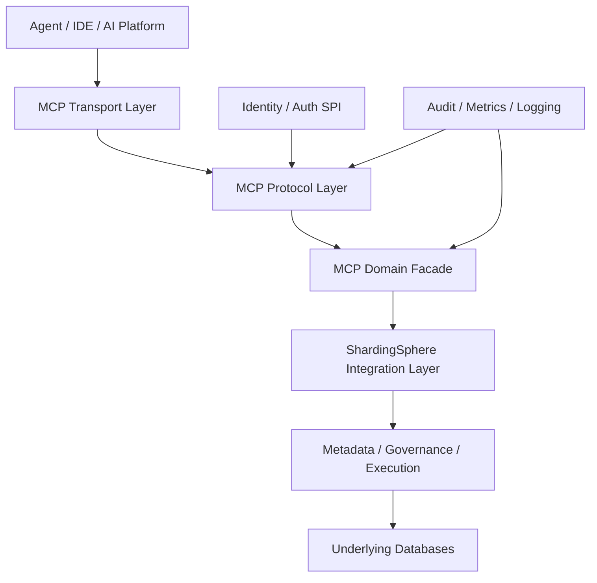
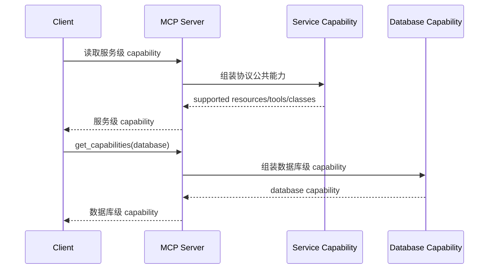
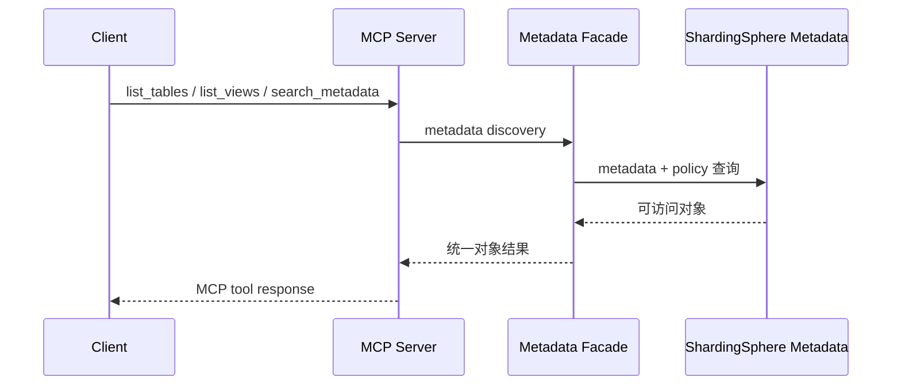
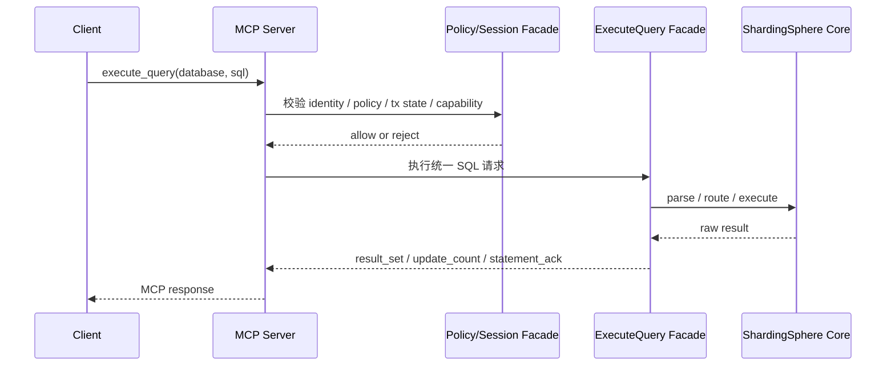

# ShardingSphere MCP 技术设计方案

## 1. 文档信息
- 文档名称：ShardingSphere MCP 技术设计方案
- 文档版本：最终版
- 文档类型：Technical Design
- 状态：可进入正式架构评审
- 目标范围：ShardingSphere MCP V1

## 2. 方案摘要
- ShardingSphere MCP 作为 ShardingSphere 主仓库内的新接入面落地，但采用“独立代码模块 + 根 distribution 发布模块”的组织方式。
- 代码模块：
  - `mcp/core`
  - `mcp/bootstrap`
- 发布模块：
  - `distribution/mcp`
  - `artifactId`：`shardingsphere-mcp-distribution`
- 协议层使用官方 MCP Java SDK，V1 默认技术选型为：
  - `mcp-core`
  - `mcp-json-jackson2`
- 运行层不采用 Spring AI，HTTP 服务承载采用：
  - 官方 SDK 的 Servlet 支撑
  - Embedded Tomcat 11
- 本地调试采用：
  - STDIO
- 同时通过 JDK 17 子链路 + 专用 profile + 专用 CI + 独立 distribution 与当前主仓库 Java 8 主线共存。

## 3. 背景
- 根据前期 PRD，ShardingSphere MCP 要解决的不是“把 MCP 跑起来”，而是形成正式的数据库统一 AI/Agent 接入面，覆盖：
  - 统一 metadata 发现
  - 统一 capability 声明
  - 统一 access policy 声明
  - 统一 SQL 执行入口 `execute_query`
  - 统一错误模型
  - 统一事务与 `savepoint` 能力边界
  - 统一审计与治理能力
- 当前仓库和生态事实如下：
  - 根工程模块结构见 `pom.xml`（line 33）
  - 根工程 Java 基线为 8，`pom.xml`（line 55）
  - 根工程 Jackson 版本为 2.16.1，`pom.xml`（line 93）
  - 根 distribution 聚合当前管理：
    - `src`
    - `agent`
    - `jdbc`
    - `proxy`
    - `proxy-native`
  - 见 `distribution/pom.xml`（line 30）
  - 官方 MCP Java SDK 当前要求 Java 17+
  - 来源：官方 Java SDK README
- 因此，技术方案必须同时满足：
  - MCP 进入主仓库
  - 不破坏根工程 Java 8 默认构建
  - 保持与现有 distribution 结构一致
  - 覆盖 PRD 中定义的 `capability / access policy / execute_query / transaction semantics`

## 4. 目标
- 本方案目标如下：
  - 将 MCP 作为 ShardingSphere 的正式接入子系统落地。
  - 使用官方 MCP Java SDK，而不是自研协议层。
  - 在不推动全仓升级到 JDK 17 的前提下，引入 MCP 子链路的 Java 17 能力。
  - 形成独立部署、独立运行、独立发布的 MCP 服务。
  - 支撑 PRD 中定义的：
    - `capability`
    - `access policy`
    - `execute_query`
    - `transaction matrix`
    - `audit`
    - 统一错误模型

## 5. 非目标
- 本方案不包括以下内容：
  - 不展开类图、接口签名、方法级实现细节。
  - 不推动整个主仓库统一升级到 JDK 17。
  - 不引入 Spring AI 或 Spring Boot 作为主实现框架。
  - 不把 MCP 嵌入 proxy 或 jdbc。
  - 不在 V1 实现分布式会话存储。
  - 不在 V1 承诺事务态无损 failover。
  - 不在本阶段定义全部配置文件字段细节。

## 6. 关键约束

### 6.1 仓库约束
- 根工程当前默认模块链固定，`pom.xml`（line 33）
- 根工程 Java 基线是 8，`pom.xml`（line 55）
- 根工程当前 Jakarta BOM 为 8.0.0，`pom.xml`（line 102）
- 根 distribution 当前是默认构建链的一部分，`pom.xml`（line 49）

### 6.2 官方 SDK 约束
- 截至 2026-03-21：
  - 官方 MCP Java SDK 为 Java 17+
  - `mcp-core` 提供协议核心能力
  - README 中列有 STDIO 与 Servlet 方向支撑
- 来源：官方 Java SDK README

### 6.3 HTTP Runtime 约束
- Tomcat 11 要求 Java 17 或更高版本
- 来源：Tomcat 11 Migration Guide
- 因此 Tomcat 11 与 Servlet 6 相关依赖必须严格限制在 MCP 子链路中。

### 6.4 合规约束
- 官方 Java SDK 使用 MIT 许可
- MIT/X11 属于 ASF Category A，可纳入 Apache 产品分发
- 来源：ASF 3rd Party License Policy

## 7. 关键设计决策

### 7.1 MCP 进入主仓库，但不是根默认模块
- 最终决策：
  - `mcp` 放在主仓库根目录下
  - 作为独立代码子项目存在
  - 不进入根 `pom.xml` 默认 `<modules>`
  - 通过专用 `mcp` profile 启用
- 原因：
  - 保持统一版本、统一仓库、统一演进
  - 又不破坏根工程 Java 8 默认构建链

### 7.2 `distribution/mcp` 放在根 distribution 下
- 最终决策：
  - 发布模块位于 `distribution/mcp`
  - `artifactId` 为 `shardingsphere-mcp-distribution`
- 原因：
  - 与现有 distribution 结构一致
  - 更符合仓库发布与 release 组织方式
  - 与 `distribution/proxy`、`distribution/jdbc` 的模式一致

### 7.3 `mcp` 和 `distribution/mcp` 同时走 profile
- 最终决策：
  - 根 `pom.xml` 增加 profile：`mcp`
  - 将 `mcp` 加入构建链
  - `distribution/pom.xml` 增加同名 profile：`mcp`
  - 将 `distribution/mcp` 加入 distribution 构建链
  - 两个 profile 均不默认激活
- 原因：
  - 只有这样才能同时满足：
    - MCP 代码模块可构建
    - MCP distribution 可构建
    - 根工程默认构建仍保持 Java 8 语义

### 7.4 不使用 Spring AI
- 最终决策：
  - MCP 不采用 Spring AI 作为核心实现方案
- 原因：
  - Spring AI 提供的是 Boot 集成增强
  - 本项目主复杂度不在 starter / 注解层
  - 主仓库当前不是 Spring 工程
  - 引入 Spring AI 会扩大技术栈侵入与长期维护成本

### 7.5 SDK 默认选型
- 最终决策：
  - 使用 `mcp-core`
  - 使用 `mcp-json-jackson2`
- 不采用：
  - `mcp`
  - `mcp-json-jackson3`
- 原因：
  - `mcp` 聚合包会带入 Jackson 3
  - Jackson 3 与主仓库 Jackson 2.x 路线割裂更大
  - `mcp-core + mcp-json-jackson2` 是当前最稳妥组合

### 7.6 JSON 兜底方案
- 最终决策：
  - V1 默认：`mcp-core + mcp-json-jackson2`
  - 兜底方案：`mcp-core + 自定义 McpJsonMapperSupplier`
- 原因：
  - 这样文档不会把 JSON 方案写死成唯一不可退的技术选型
  - 保留未来依赖收缩空间

### 7.7 HTTP 服务承载
- 最终决策：
  - 使用官方 SDK Servlet 支撑
  - 使用 Embedded Tomcat 11
- 原因：
  - 不引 Spring
  - 运行时成熟
  - 与 Java 17 路线匹配

### 7.8 HTTP 会话与事务状态
- 最终决策：
  - STDIO 为天然会话态
  - HTTP 也维护逻辑 MCP 会话
  - V1 采用：
    - sticky session
    - 本地内存会话状态
  - V1 不做：
    - distributed session store
    - 事务态无损故障切换
- 原因：
  - PRD 已定义事务与 `savepoint` 语义
  - HTTP 不能被实现为完全无状态请求模型

## 8. 仓库组织与模块设计

### 8.1 推荐目录结构
```text
shardingsphere
├── mcp
│   ├── pom.xml
│   ├── core
│   └── bootstrap
├── distribution
│   └── mcp
└── pom.xml
```

### 8.2 模块职责

#### `mcp/core`
- MCP 公共对象模型
- capability 组装
- access policy 组装
- metadata discovery facade
- execute_query facade
- session / transaction facade
- error model
- audit facade
- 对 ShardingSphere 内核能力的统一门面

#### `mcp/bootstrap`
- MCP server 启动入口
- HTTP / STDIO transport 装配
- 配置加载
- auth SPI 接入
- tools / resources 注册
- 生命周期管理

#### `distribution/mcp`
- `shardingsphere-mcp-distribution`
- 二进制包
- Docker 镜像
- 启动脚本
- 配置模板
- 发布资产

### 8.3 Parent 与版本对齐
- 推荐：
  - `mcp/pom.xml` 继承根 `shardingsphere` parent，保持版本一致
  - `distribution/mcp/pom.xml` 继承 `shardingsphere-distribution` parent，保持发布结构一致
- 这样既能保证版本统一，也能保证模块分层清晰。

### 8.4 依赖方向
- 允许：
  - `mcp/core` 依赖 `infra`
  - `mcp/core` 依赖 `database`
  - `mcp/core` 依赖 `parser`
  - `mcp/core` 依赖 `mode`
  - `mcp/core` 依赖 `kernel`
  - 必要时依赖少量 `features`
- 禁止：
  - `kernel -> mcp`
  - `proxy -> mcp`
  - `jdbc -> mcp`

### 8.5 MCP 与 Proxy/JDBC 的关系
- MCP 与 Proxy/JDBC 的关系是：
  - 产品层：都属于 ShardingSphere 接入面
  - 实现层：都消费 ShardingSphere 内核
  - 运行层：彼此独立部署、独立治理、独立发布
- MCP 不是 Proxy façade，也不是 JDBC wrapper。

## 9. 构建与发布模型

### 9.1 总体策略
- 采用“代码模块与发布模块共同走专用 profile / 专用 CI”的方案：
  - 根工程默认构建链不包含 `mcp`
  - 根 distribution 默认构建链不包含 `distribution/mcp`
  - 激活 `mcp` profile 后同时启用：
    - `mcp`
    - `distribution/mcp`

### 9.2 推荐 profile 组织

#### 根 `pom.xml`
- 增加 `mcp` profile
- 在 profile 内加入：
  - `<module>mcp</module>`

#### `distribution/pom.xml`
- 增加同名 `mcp` profile
- 在 profile 内加入：
  - `<module>mcp</module>`

### 9.3 构建链

#### 默认构建链
- 面向当前主仓库 Java 8 模块
- 不感知 MCP

#### MCP 构建链
- 固定 JDK 17
- 构建：
  - `mcp/core`
  - `mcp/bootstrap`
  - `distribution/mcp`

### 9.4 JDK 17 隔离策略
- 推荐：
  - Maven Toolchains
  - `mcp/pom.xml` 明确 `maven.compiler.release=17`
  - MCP 专用 CI lane 固定 JDK 17

### 9.5 依赖管理隔离
- 必须遵守：
  - 不把 MCP BOM 引入根工程 `dependencyManagement`
  - 不把 Tomcat / Servlet / Reactor / Jackson 2.20.x 扩散到主仓库主线
  - MCP 子链路内部独立管理依赖版本

### 9.6 为什么 `distribution/mcp` 必须也隔离
- 因为 `distribution/mcp` 依赖的是 Java 17 的 `mcp/bootstrap`。
- 如果只隔离 `mcp` 代码模块、不隔离 `distribution/mcp`，根 distribution 默认构建链仍会被 Java 17 依赖拖进来，和当前 Java 8 主线冲突。

## 10. 技术选型明细

### 10.1 协议与 JSON
- 默认采用：
  - `io.modelcontextprotocol.sdk:mcp-core`
  - `io.modelcontextprotocol.sdk:mcp-json-jackson2`
- 不采用：
  - `io.modelcontextprotocol.sdk:mcp`
  - `io.modelcontextprotocol.sdk:mcp-json-jackson3`
- 兜底路线：
  - `mcp-core + 自定义 McpJsonMapperSupplier`

### 10.2 HTTP Runtime
- 采用：
  - 官方 SDK Servlet 支撑
  - Embedded Tomcat 11
- 约束：
  - Tomcat 11 及相关 Servlet 6 依赖只出现在：
    - `mcp/bootstrap`
    - `distribution/mcp`
  - 不进入根工程统一依赖管理
  - 不复用根工程当前 Jakarta 8 BOM

### 10.3 本地调试
- 采用：
  - STDIO

### 10.4 认证接入
- 不引入 Spring Security。
- 使用高层 SPI：
  - Identity Provider SPI
  - Auth Context Resolver SPI
- V1 推荐两种模式：
  - Trusted Gateway 模式
  - Static API Key 模式

### 10.5 联调工具
- 推荐：
  - 官方 MCP Inspector
  - 本地 STDIO 模式
  - HTTP 冒烟联调
  - capability / transaction / access policy 专项联调

## 11. 总体架构



### 11.1 分层职责

#### MCP Transport Layer
- 承载 HTTP 与 STDIO
- 管理会话、连接、请求 / 响应生命周期
- 不承载业务能力判断

#### MCP Protocol Layer
- 处理 MCP 概念：
  - resources
  - tools
  - capability
  - errors
- 将协议对象转换为领域命令

#### MCP Domain Facade
- 是 MCP 子系统的核心语义层
- 统一提供：
  - metadata discovery
  - capability
  - access policy
  - execute_query
  - transaction / savepoint handling

#### ShardingSphere Integration Layer
- 适配 metadata、parser、mode、authority、kernel 等核心能力
- 屏蔽内核模块差异
- 不向内核泄露 MCP 概念

## 12. Capability 与 Access Policy 设计

### 12.1 基本原则
- 必须始终区分：
  - capability = 客观能力边界
  - access policy = 当前身份允许边界

### 12.2 服务级 Capability
- 服务级 capability 只描述协议公共能力，例如：
  - supported resources
  - supported tools
  - supported statement classes
- 服务级 capability 不携带单个 `database` 的事务与对象支持差异。

### 12.3 数据库级 Capability
- 数据库级 capability 至少覆盖：
  - `supported_object_types`
  - `supported_statement_classes`
  - `supports_transaction_control`
  - `supports_savepoint`
  - `supported_transaction_statements`
  - `default_autocommit`
  - `supports_cross_schema_sql`
  - `supports_explain_analyze`
  - `ddl_transaction_behavior`
  - `dcl_transaction_behavior`
  - `explain_analyze_result_behavior`
  - `explain_analyze_transaction_behavior`

### 12.4 Access Policy
- Access Policy 至少覆盖：
  - `allowed_databases`
  - `allowed_schemas`
  - `allowed_objects`
  - `allowed_statement_classes`
  - `max_rows`
  - `max_timeout_ms`
  - `transaction_policy`
  - `advanced_statement_policy`

### 12.5 Optional Object Types
- V1 强制统一对象基线：
  - `database`
  - `schema`
  - `table`
  - `view`
  - `column`
  - `capability`
  - `access policy`
- V1 可选对象：
  - `index`
- 规则：
  - `index` 由数据库级 capability 的 `supported_object_types` 声明
  - 不支持时 direct API 返回 `unsupported`

## 13. `execute_query` 统一执行入口设计

### 13.1 设计原则
- `execute_query` 是 V1 唯一 SQL 执行入口。
- 它不是 SQL 透传接口，而是统一执行与治理入口。

### 13.2 高层处理阶段
- 统一划分为 6 个阶段：
  1. 请求合法性校验
  2. MCP 会话与事务状态校验
  3. access policy 校验
  4. capability 校验
  5. ShardingSphere parse / route / execute 适配
  6. 统一结果与错误映射

### 13.3 Statement Class 统一分类
- `select`
- `dml`
- `ddl`
- `dcl`
- `transaction_control`
- `savepoint`
- `explain_analyze`

### 13.4 统一结果模型
- `result_set`
- `update_count`
- `statement_ack`

### 13.5 统一错误模型
- `invalid_request`
- `unauthorized`
- `policy_denied`
- `not_found`
- `unsupported`
- `conflict`
- `timeout`
- `unavailable`
- `transaction_state_error`
- `query_failed`

## 14. 会话、事务与 Savepoint 设计

### 14.1 会话模型
- 每个 MCP 会话绑定：
  - identity
  - 当前 database 上下文
  - 当前事务状态
  - `savepoint` 状态
  - 当前 policy 上下文

### 14.2 HTTP 会话策略
- 由于 PRD 已定义事务与 `savepoint` 语义，HTTP 路径必须维护逻辑 MCP 会话。
- 因此 V1 不采用完全无状态 HTTP 模型。

### 14.3 V1 集群策略
- 采用：
  - sticky session
  - 本地内存会话状态
- 不纳入：
  - distributed session store
  - 任意节点无粘性事务恢复
  - 事务态无损 failover

### 14.4 故障语义
- 节点故障、重启或会话丢失时：
  - 该节点上的未提交事务视为失败
  - 相关 MCP 会话失效
  - 客户端需要重新建立会话并重新开始事务
- 这属于 V1 的明确运行约束，而不是实现细节遗漏。

### 14.5 事务能力矩阵
- 事务能力必须显式维护为矩阵。
- 矩阵至少包含：
  - `database_type`
  - `min_supported_version`
  - `supports_transaction_control`
  - `supports_savepoint`
  - `default_autocommit`
  - `supported_transaction_statements`
  - `supported_object_types`
  - `supported_statement_classes`
  - `supports_explain_analyze`
  - `ddl_transaction_behavior`
  - `dcl_transaction_behavior`
  - `explain_analyze_result_behavior`
  - `explain_analyze_transaction_behavior`
- 矩阵角色：
  - capability 的默认事实源
  - 验收标准的技术来源
  - 支持矩阵维护的统一资产

## 15. 安全、治理与审计设计

### 15.1 认证
- 不绑定 Spring Security。
- 使用：
  - Identity Provider SPI
  - Auth Context Resolver SPI
- V1 推荐：
  - Trusted Gateway 模式
  - Static API Key 模式

### 15.2 授权
- 授权分两层：
  - 对象级权限
  - statement class 权限
- 高级语句规则：
  - CREATE 按 database / schema 权限
  - ALTER / DROP / TRUNCATE 按目标对象权限
  - GRANT / REVOKE 按 database 级权限与治理策略
  - `EXPLAIN ANALYZE` 同时校验：
    - explain analyze 权限
    - 底层目标语句对应权限

### 15.3 治理
- V1 统一支持：
  - `max_rows`
  - `timeout_ms`
  - `policy_denied`
  - `transaction policy`
  - `advanced statement policy`
  - `audit switch`

### 15.4 审计基线
- 统一输出：
  - identity
  - database
  - operation_class
  - operation_digest
  - success_or_failure
  - error_code
  - transaction_marker
  - timestamp

## 16. 运行与部署模型

### 16.1 生产主模型
- 远程 HTTP MCP 服务
- 特点：
  - 独立进程
  - 独立容器
  - 独立配置目录
  - 独立日志与审计
  - 独立版本发布

### 16.2 调试模型
- 本地 STDIO 模式
- 特点：
  - 适合 Inspector
  - 适合 IDE / 本地 Agent 联调
  - 不作为生产主模型

### 16.3 推荐集群拓扑
- MCP 服务集群
- 前置 L7 网关
- sticky session 打开
- 每个实例维护本地会话状态
- metadata / governance 来源共享

### 16.4 为什么不嵌入 Proxy
- 因为：
  - proxy 是数据库协议代理
  - mcp 是 AI / Agent 控制与执行公共面
- 把两者放在同一运行时，会让：
  - 运维边界不清
  - 治理边界不清
  - 版本与资源隔离变差

## 17. 交互流程

### 17.1 Capability 发现


### 17.2 Metadata 发现


### 17.3 SQL 执行


## 18. Distribution 与运维模型

### 18.1 发布模块
- 发布模块位于：
  - `distribution/mcp`
  - `artifactId`：`shardingsphere-mcp-distribution`

### 18.2 发行物结构
- 建议产出：

```text
apache-shardingsphere-mcp-<version>/
├── bin/
├── conf/
├── lib/
├── logs/
└── LICENSE / NOTICE / README
```

### 18.3 配置分层
- 配置分为四类：
  - 服务配置
  - 暴露配置
  - 治理配置
  - 接入配置

### 18.4 容器化要求
- V1 应提供：
  - 独立 Dockerfile
  - 独立镜像
  - 独立启动参数
  - 独立配置挂载约定

### 18.5 可观测性
- 建议默认具备：
  - readiness / liveness
  - 服务日志
  - 审计日志
  - capability 快照
  - tool 调用统计
  - 会话统计

## 19. 第三方依赖与合规

### 19.1 依赖策略
- V1 默认采用：
  - `mcp-core`
  - `mcp-json-jackson2`
- 不采用：
  - `mcp`
  - `mcp-json-jackson3`

### 19.2 依赖管理边界
- 以下依赖仅允许出现在 MCP 子链路：
  - Jackson 2.20.x
  - Reactor
  - Servlet 6
  - Embedded Tomcat 11
- 不得：
  - 进入根工程统一依赖管理
  - 覆盖根工程现有依赖版本
  - 反向传播到 `kernel / proxy / jdbc`

### 19.3 合规要求
- 由于官方 Java SDK 采用 MIT 许可，需完成：
  - LICENSE / NOTICE 核对
  - 第三方依赖许可证审查
  - 发布前依赖清单确认

## 20. 风险与缓解

### 20.1 JDK 双基线风险
- 风险：
  - 根工程 Java 8
  - MCP Java 17
- 缓解：
  - `mcp` 与 `distribution/mcp` 一起走专用 profile / CI
  - Maven Toolchains
  - 不进入默认构建链

### 20.2 依赖冲突风险
- 风险：
  - Jackson
  - Reactor
  - Servlet API
  - Tomcat 11 / Jakarta 6 依赖
- 缓解：
  - MCP 子链路内部独立管理
  - 不引根 BOM
  - 不让依赖外溢到主仓库主线
  - 必要时回退到自定义 JSON mapper 方案

### 20.3 数据库能力差异风险
- 风险：
  - transaction
  - savepoint
  - index
  - explain analyze
- 缓解：
  - 事务能力矩阵显式维护
  - capability 显式声明
  - optional object 明确控制

### 20.4 集群事务会话风险
- 风险：
  - HTTP 集群下事务上下文丢失
  - 节点故障导致会话失效
- 缓解：
  - sticky session
  - 本地内存会话态
  - distributed session store 不纳入 V1
  - 明确 failover 语义，不承诺无损恢复

## 21. 实施计划
- 阶段 1：结构落位
  - 建立 `mcp` 子项目
  - 建立 `core / bootstrap`
  - 在根 distribution 下建立 `distribution/mcp`
  - 建立 MCP 专用 JDK 17 构建链
- 阶段 2：协议公共面
  - 完成 resources / tools 框架
  - 完成 capability / access policy 组装链
  - 完成统一 error model
- 阶段 3：执行与治理
  - 完成 `execute_query`
  - 完成事务能力矩阵
  - 完成 audit 和 policy 治理链路
- 阶段 4：部署与联调
  - 完成 HTTP 服务化部署
  - 完成 STDIO 本地调试
  - 完成 Inspector 联调
  - 完成 capability / transaction / policy 验证

## 22. 验收标准
- 技术验收建议至少覆盖：
  - MCP 是否作为独立代码模块存在
  - `distribution/mcp` 是否作为根 distribution 正式发布模块存在
  - 是否未反向污染主仓库 Java 8 主线
  - 是否使用官方 SDK 而非自研协议实现
  - capability / access policy 是否实现分层清晰
  - `execute_query` 是否成为统一执行入口
  - 事务能力矩阵是否显式维护
  - HTTP 会话与事务语义是否闭合
  - distribution 是否形成独立运维单元

## 23. 最终结论
- 最终方案可以压缩成四句话：
  - MCP 进入 ShardingSphere 主仓库，但代码模块与发布模块分层组织。
  - 代码模块位于 `mcp/core` 与 `mcp/bootstrap`，发布模块位于根 `distribution/mcp`，`artifactId` 为 `shardingsphere-mcp-distribution`。
  - 协议层采用官方 MCP Java SDK，V1 默认选用 `mcp-core + mcp-json-jackson2`，运行层采用官方 Servlet support + Embedded Tomcat 11，STDIO 用于本地调试。
  - MCP 子链路通过 JDK 17、专用 profile、专用 CI 和独立 distribution 与主仓库 Java 8 主线共存。
