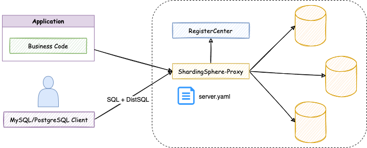
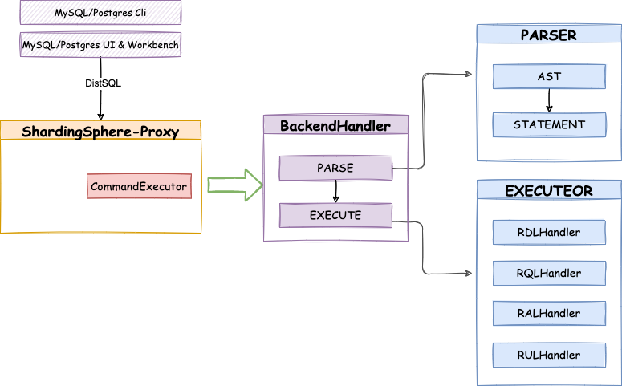

.. _sec:distsql:

Язык Distributed SQL (DistSQL)
===============================

В этой главе будет представлено подробное описание синтаксиса DistSQL.

DistSQL (Distributed SQL) — это специализированный язык SQL, созданный Apache ShardingSphere 
для настройки правил и управления кластером через SQL-команды.

DistSQL позволяет настраивать:

- правила шардирования;
- broadcast-таблицы;
- одиночные (single) таблицы (single);
- разделенное чтение-запись (read/write splitting);
- правила шифрования и маскирования;
- правила теневых (shadow) баз данных;
- источники данных;
- пользователей и привилегии;
- системные настройки Proxy.

DistSQL подразделяется на категории RDL, RQL, RAL и RUL по типам команд и их семантике.

.. rubric:: RDL — Resource & Rule Definition Language
    :heading-level: 4

Используется для создания, изменения и удаления правил ShardingSphere, т.е.:
``CREATE ... RULE, ALTER ... RULE, DROP ... RULE``.

.. rubric:: RQL — Resource & Rule Query Language
    :heading-level: 4

Предназначен для получения информации о текущей конфигурации правил (просмотра существующих правил,
диагностики и анализа конфигурации, аудита настроек).

.. rubric:: RAL — Resource & Rule Administration Language
    :heading-level: 4

Язык администрирования ресурсов и прав доступа

Применяется для управления физическими ресурсами и административными параметрами (добавление или удаление источников данных,
управление пользователями и правами, включение или отключение определённых административных функций).

.. rubric:: RUL — Resource & Rule Utility Language
    :heading-level: 4

Отвечает за синтаксический анализ SQL-запросов, форматирование SQL-запросов, предварительный просмотр плана выполнения и т.д.

Принцип работы
----------------------------

До появления DistSQL пользователи использовали SQL для работы с данными, а для 
управления ShardingSphere — файлы конфигурации YAML, как показано ниже:

.. image:: imgs/before.png
   :scale: 60
   :align: center

При таком подходе пользователи сталкивались со следующими проблемами: 

- Для работы с данными и управления конфигурацией ShardingSphere требовались различные типы клиентов.
- Для работы с несколькими логическими базами данных требовалось несколько файлов YAML. 
- Редактирование файла YAML требовало прав на запись. 
- После редактирования файла YAML необходимо перезапустить ShardingSphere.

С появлением DistSQL изменился и принцип работы ShardingSphere:

Теперь пользовательский опыт работы с Apache ShardingSphere был существенно улучшен:

- Используется один и тот же клиент для работы с данными и конфигурацией ShardingSphere. 
- Нет необходимости в дополнительных YAML-файлах, а логические базы данных управляются
  через DistSQL. 
- Больше не требуются права на редактирование файлов, а конфигурация управляется
  через DistSQL. 
- Изменения конфигурации вступают в силу в режиме реального времени без перезапуска ShardingSphere.

Подобно стандартному SQL, DistSQL распознаётся парсером ShardingSphere. 
Введённая команда сначала разбирается синтаксическим анализатором и преобразуется 
в абстрактное синтаксическое дерево (AST). Затем на основе этого дерева формируется 
объект Statement, соответствующий конкретной грамматике DistSQL. 
После этого данный Statement передаётся в специализированный Handler, 
который выполняет соответствующую логику обработки команды.

Синтаксис
------------

В этой главе подробно описывается синтаксис DistSQL и приводятся практические примеры его использования.

Правила синтаксиса
~~~~~~~~~~~~~~~~~~~~~

В операторе DistSQL, за исключением ключевых слов, формат ввода остальных элементов должен соответствовать следующим правилам.

.. rubric:: Идентификатор
    :heading-level: 4

1. Идентификатор представляет объект в SQL-операторе, включая:

- имя базы данных
- имя таблицы
- имя столбца
- имя индекса
- имя ресурса
- имя правила
- имя алгоритма

2. Допустимые символы в идентификаторе: ``[a-z, A-Z, 0-9, _]`` (буквы, цифры и символ подчёркивания). 
   Идентификатор должен начинаться с буквы.

3. Если в идентификаторе используются ключевые слова или специальные символы, необходимо заключать его в обратные апострофы (`).

.. rubric:: Литералы
    :heading-level: 4

Типы литералов включают:

- строка: заключается в одинарные (') или двойные (") кавычки
- целое число (int): обычно положительное целое число, например, 0–9;
  
  .. note::
    
    Некоторая синтаксическая конструкция DistSQL допускает отрицательные значения. 
    В этом случае перед числом можно поставить знак минус (-), например, -1.

- логическое значение (boolean): допускает только ``true`` и ``false``, регистр букв неважен.

.. rubric:: Особые указания
    :heading-level: 4

- При указании пользовательского типа алгоритма имя типа должно заключаться в двойные кавычки, например: ``NAME="AlgorithmTypeName"``.

- Для встроенных типов алгоритмов ShardingSphere двойные кавычки не требуются, например: ``NAME=HASH_MOD``.

Синтаксис RDL
~~~~~~~~~~~~~~~

``REGISTER STORAGE UNIT``
^^^^^^^^^^^^^^^^^^^^^^^^^

Оператор ``REGISTER STORAGE UNIT`` в DistSQL (ShardingSphere) регистрирует 
новый источник данных (единицу хнанения) для текущей выбранной логической базы данных.

Эта команда добавляет подключение к физической базе данных 
в ShardingSphere Proxy, определяя параметры вроде URL, имени пользователя, пароля и свойств 
пула соединений. После регистрации единица хранения становится доступной для создания шардов, 
правил распределения и других операций.

.. code-block:: sql

    REGISTER STORAGE UNIT [<ifNotExists>] <storageUnitsDefinition> [, <checkPrivileges>]

    <ifNotExists> ::= IF NOT EXISTS

    <storageUnitsDefinition> ::= <storageUnitDefinition> [, <storageUnitDefinition> ...]

    <storageUnitDefinition> ::= 
            <storageUnitName> ( { { HOST = <hostName> , PORT = <port> , DB = <dbName>} 
                                  | URL = <url> 
                                },
                                USER = <user> [, PASSWORD = <password>] 
                                [, PROPERTIES ('<key>'= <value> [,'<key>' = <value>...])]
                              )
    
    checkPrivileges ::= CHECK_PRIVILEGES = <privilegeType> [, <privilegeType> ... ]

.. rubric:: Примечания
    :heading-level: 4

- Перед регистрацией единиц хранения убедитесь, что база данных создана в Proxy, 
  и выполните команду ``USE``, чтобы успешно выбрать базу данных.
- Убедитесь, что регистрируемая единица хранения подключается нормально, иначе она не будет добавлена успешно.
- Имя ``storageUnitName`` чувствительно к регистру.
- Имя ``storageUnitName`` должно быть уникальным в текущей базе данных.
- Имя ``storageUnitName`` - это идентификатор.
- ``PROPERTIES`` является необязательным и используется для настройки свойств пула соединений; 
  ключ ``key`` должен совпадать с именем свойства пула соединений.
- Можно указать ``CHECK_PRIVILEGES`` для проверки привилегий пользователя единицы хранения. 
  Поддерживаемые типы ``privilegeType``: ``SELECT, XA, PIPELINE`` и ``NONE``. 
  Значение по умолчанию — ``SELECT``. Если в списке типов указано ``NONE``, проверка привилегий пропускается.

.. rubric:: Примеры
    :heading-level: 4

- Регистрация единицы хранения с использованием метода ``HOST`` и ``PORT``
  
  .. code-block:: sql

    REGISTER STORAGE UNIT ds_0 (
        HOST="127.0.0.1",
        PORT=3306,
        DB="db_0",
        USER="root",
        PASSWORD="root"
    );

- Регистрация единицы хранения и установка свойств пула соединений с использованием метода ``HOST`` и ``PORT``

  .. code-block:: sql

    REGISTER STORAGE UNIT ds_1 (
        HOST="127.0.0.1",
        PORT=3306,
        DB="db_1",
        USER="root",
        PASSWORD="root",
        PROPERTIES("maximumPoolSize"=10)
    );

- Регистрация единицы хранения и установка свойств пула соединений с использованием метода ``URL``

  .. code-block:: sql

    REGISTER STORAGE UNIT ds_2 (
        URL="jdbc:mysql://127.0.0.1:3306/db_2?serverTimezone=UTC&useSSL=false&allowPublicKeyRetrieval=true",
        USER="root",
        PASSWORD="root",
        PROPERTIES("maximumPoolSize"=10,"idleTimeout"=30000)
    );

- Регистрация единицы хранения с кляузой ``IF NOT EXISTS``

  .. code-block:: sql

    REGISTER STORAGE UNIT IF NOT EXISTS ds_0 (
        HOST="127.0.0.1",
        PORT=3306,
        DB="db_0",
        USER="root",
        PASSWORD="root"
    );

- Проверка привилегий ``SELECT``, ``XA`` и ``PIPELINE`` при регистрации

  .. code-block:: sql

    REGISTER STORAGE UNIT ds_3 (
        URL="jdbc:mysql://127.0.0.1:3306/db_3?serverTimezone=UTC&useSSL=false&
        allowPublicKeyRetrieval=true",
        USER="root",
        PASSWORD="root",
        PROPERTIES("maximumPoolSize"=10,"idleTimeout"=30000)
    ), CHECK_PRIVILEGES=SELECT,XA,PIPELINE;

``ALTER STORAGE UNIT``
^^^^^^^^^^^^^^^^^^^^^^^^^

Оператор ``ALTER STORAGE UNIT`` в DistSQL используется для изменения 
уже зарегистрированной единицы хранения (storage unit) в текущей логической базе данных.

.. code-block:: sql

    ALTER STORAGE UNIT <storageUnitsDefinition> [, <checkPrivileges>]

    <storageUnitsDefinition> ::= <storageUnitDefinition> [, <storageUnitDefinition> ...]

    <storageUnitDefinition> ::= 
        <storageUnitName> ( { { HOST = <hostName> , PORT = <port> , DB = <dbName>} 
                              | URL = <url> 
                            },
                            USER = <user> [, PASSWORD = <password>] 
                            [, PROPERTIES ('<key>'= <value> [,'<key>' = <value>...])]
                          )
    
    checkPrivileges ::= CHECK_PRIVILEGES = <privilegeType> [, <privilegeType> ... ]

.. rubric:: Примечания
    :heading-level: 4

- Перед изменением единиц хранения убедитесь, что база данных существует в Proxy, 
  и выполните команду ``USE`` для выбора базы данных.
- ``ALTER STORAGE UNIT`` не позволяет изменять реальный источник данных, 
  связанный с этой единицей хранения (определяется по host, port и db).
- ``ALTER STORAGE UNIT`` переключает пул соединений. Эта операция может повлиять 
  на текущие бизнес‑процессы, используйте её с осторожностью.
- Убедитесь, что к изменяемой единице хранения можно успешно подключиться, иначе изменение завершится неудачно.
- ``PROPERTIES`` является необязательным параметром и используется для настройки свойств пула соединений; 
  ключ должен совпадать с именем свойства пула соединений.
- Можно указать ``CHECK_PRIVILEGES`` для проверки привилегий пользователя единицы хранения. 
  Поддерживаемые типы ``privilegeType``: ``SELECT, XA, PIPELINE`` и ``NONE``. 
  Значение по умолчанию — ``SELECT``. Если в списке типов присутствует ``NONE``, проверка привилегий пропускается.

.. rubric:: Примеры
    :heading-level: 4

- Изменение единицы хранения с использованием метода ``HOST`` и ``PORT``
  
  .. code-block:: sql

    ALTER STORAGE UNIT ds_0 (
        HOST="127.0.0.1",
        PORT=3306,
        DB="db_0",
        USER="root",
        PASSWORD="root"
    );

- Изменение единицы хранения и установка свойств пула соединений с использованием метода ``HOST`` и ``PORT``

  .. code-block:: sql

    ALTER STORAGE UNIT ds_1 (
        HOST="127.0.0.1",
        PORT=3306,
        DB="db_1",
        USER="root",
        PASSWORD="root",
        PROPERTIES("maximumPoolSize"=10)
    );

- Изменение единицы хранения и установка свойств пула соединений с использованием метода ``URL``

  .. code-block:: sql

    ALTER STORAGE UNIT ds_2 (
        URL="jdbc:mysql://127.0.0.1:3306/db_2?serverTimezone=UTC&useSSL=false&allowPublicKeyRetrieval=true",
        USER="root",
        PASSWORD="root",
        PROPERTIES("maximumPoolSize"=10,"idleTimeout"=30000)
    );

- Проверка привилегий ``SELECT``, ``XA`` и ``PIPELINE`` при изменении

  .. code-block:: sql

    ALTER STORAGE UNIT ds_2 (
        URL="jdbc:mysql://127.0.0.1:3306/db_2?serverTimezone=UTC&useSSL=false&allowPublicKeyRetrieval=true",
        USER="root",
        PASSWORD="root",
        PROPERTIES("maximumPoolSize"=10,"idleTimeout"=30000)
    ), CHECK_PRIVILEGES=SELECT,XA,PIPELINE;

``UNREGISTER STORAGE UNIT``
^^^^^^^^^^^^^^^^^^^^^^^^^^^^^^^^^^^^^^^^^^^^^^^^^^

Оператор ``UNREGISTER STORAGE UNIT`` в DistSQL удаляет зарегистрированную единицу 
хранения (storage unit) из текущей логической базы данных в Proxy.

.. code-block:: sql

    UNREGISTER STORAGE UNIT [<ifExists>] <storageUnitName> [, <storageUnitName>] [<ignoreTables>]

    <ifExists> ::= IF EXISTS
    
    <ignoreTables> ::= IGNORE [SINGLE] [,] [BROADCAST] TABLES

.. rubric:: Примечания
    :heading-level: 4

- Физический источник данных (реальная БД) при этом не удаляется — только логическая привязка в ShardingSphere Proxy.
- Нельзя удалить storage unit, если она используется в активных правилах шардинга, репликации 
  или других конфигурациях — сначала нужно удалить/изменить правила.
  При попытке удалить единицы хранения, используемые правилами, будет выведено сообщение «Storage unit are still in used».
- Если единица хранения используется только в двух типах правил: ``SINGLE RULE`` или ``BROADCAST RULE``, то её можно удалить,
  добавив ключевые слова ``IGNORE SINGLE TABLES``, ``IGNORE BROADCAST TABLES`` или ``IGNORE SINGLE, BROADCAST TABLES``.
- Клауза ``ifExists`` используется для избежания ошибки «Storage unit not exists».    

.. rubric:: Примеры
    :heading-level: 4

- Отмена регистрации единицы хранения

  .. code-block:: sql

    UNREGISTER STORAGE UNIT ds_0;

- Отмена регистрации нескольких единиц хранения

  .. code-block:: sql

    UNREGISTER STORAGE UNIT ds_0, ds_1;

- Отмена регистрации единицы хранения и игнорирования правил Single-таблиц

  .. code-block:: sql

    UNREGISTER STORAGE UNIT ds_0 IGNORE SINGLE TABLES;

- Отмена регистрации единицы хранения и игнорирования правил Broadcast-таблиц

  .. code-block:: sql

    UNREGISTER STORAGE UNIT ds_0 IGNORE BROADCAST TABLES;

- Отмена регистрации единицы хранения и игнорирования правил Broadcast- и Single-таблиц

  .. code-block:: sql

    UNREGISTER STORAGE UNIT ds_0 IGNORE SINGLE, BROADCAST TABLES;

- Отмена регистрации единицы хранения с кляузой ifExists

  .. code-block:: sql

    UNREGISTER STORAGE UNIT IF EXISTS ds_0;

``CREATE SHARDING TABLE RULE``
^^^^^^^^^^^^^^^^^^^^^^^^^^^^^^^^^^^^^^^^^^^^^^^^^^

Оператор ``CREATE SHARDING TABLE RULE`` в DistSQL создаёт правило шардирования для конкретной таблицы 
в текущей выбранной логической базе данных.

Команда определяет, как распределять данные таблицы по зарегистрированным storage units.
После выполнения обычные SQL-запросы к таблице автоматически маршрутизируются по шардам.

.. code-block:: sql

    CREATE SHARDING TABLE RULE [<ifNotExists>] {<tableRuleDefinition> | <autoTableRuleDefinition>}
    [, <tableRuleDefinition> | <autoTableRuleDefinition> ...]

    <ifNotExists> ::= IF NOT EXISTS

    <tableRuleDefinition> ::= 
        <ruleName> ( DATANODES (<dataNode> [, <dataNode>...]) 
                     [, DATABASE_STRATEGY (<strategyDefinition>)] 
                     [, TABLE_STRATEGY (<strategyDefinition>)] 
                     [, KEY_GENERATE_STRATEGY (<keyGenerateStrategyDefinition>)] 
                     [, AUDIT_STRATEGY (<auditStrategyDefinition>)] 
                   )

    <autoTableRuleDefinition> ::= 
        <ruleName> ( STORAGE_UNITS (storageUnitName [, storageUnitName...] ), 
                     SHARDING_COLUMN = columnName, 
                     algorithmDefinition 
                     [, KEY_GENERATE_STRATEGY ( keyGenerateStrategyDefinition )] 
                     [, AUDIT_STRATEGY (auditStrategyDefinition )] 
                   )
    
    <strategyDefinition> ::= TYPE = strategyType, 
                             {SHARDING_COLUMN | SHARDING_COLUMNS} = columnName,
                             algorithmDefinition
    
    <keyGenerateStrategyDefinition> ::= KEY_GENERATE_STRATEGY (COLUMN = columnName, algorithmDefinition)

    auditStrategyDefinition ::= AUDIT_STRATEGY (algorithmDefinition [, algorithmDefinition...])

    algorithmDefinition ::= TYPE (NAME = algorithmType [, propertiesDefinition] )

    propertiesDefinition ::= PROPERTIES ( key = value [, key = value...] )

.. rubric:: Примечания
    :heading-level: 4

- Правила ``<tableRuleDefinition>`` определяются для стандартного шардирования таблицы; 
  правила ``<autoTableRuleDefinition>`` — для автоматического шардирования таблицы.
- Стандартное правило шардирования таблицы:

  - ``DATANODES`` может использовать только ресурсы, добавленные в текущую базу данных, и может 
    указывать требуемые ресурсы только с помощью выражений ``INLINE``;
  - ``DATABASE_STRATEGY``, ``TABLE_STRATEGY`` — это стратегия шардирования базы данных и стратегия 
    шардирования таблицы, они необязательны, при отсутствии настройки используется стратегия по умолчанию;
  - атрибут ``TYPE`` в ``<strategyDefinition>`` используется для указания типа алгоритма шардирования, 
    в настоящее время поддерживаются только ``STANDARD`` и ``COMPLEX``. 
    Для ``COMPLEX`` требуется указать несколько столбцов шардирования с помощью ``SHARDING_COLUMNS``.

- Автоматическое правило шардирования таблицы:

  - ``STORAGE_UNITS`` может использовать только единицы хранения, зарегистрированные в текущей базе данных, 
    требуемые единицы хранения можно указать перечислением или выражением ``INLINE``;
  - допускается использование только автоматического алгоритма шардирования. См. раздел :ref:`subsec:buildin_alg_autotables`.

- ``algorithmType`` — это тип алгоритма шардирования;
- правило именования автоматически генерируемого алгоритма: ``tableName_strategyType_shardingAlgorithmType``;
- правило именования стратегии генерации первичного ключа: ``tableName_strategyType``;
- ``KEY_GENERATE_STRATEGY`` используется для указания стратегии генерации первичного ключа, 
  необязательный параметр. 
- ``AUDIT_STRATEGY`` используется для указания стратегии аудита шардирования, необязательный параметр. 
- клауза ``ifNotExists`` используется для избежания ошибки ``«Duplicate sharding rule»``.

.. rubric:: Примеры
    :heading-level: 4

1. Стандартные правила шардирования
   
   .. code-block:: sql

        CREATE SHARDING TABLE RULE t_order_item (
            DATANODES ("ds_${0..1}.t_order_item_${0..1}"),
            DATABASE_STRATEGY ( TYPE="standard",
                                SHARDING_COLUMN=user_id,
                                SHARDING_ALGORITHM( TYPE (NAME="inline",PROPERTIES("algorithm-expression"="ds_${user_id % 2}")))
                              ),
            TABLE_STRATEGY( TYPE="standard",
                            SHARDING_COLUMN=order_id,
                            SHARDING_ALGORITHM(TYPE(NAME="inline",PROPERTIES("algorithm-expression"="t_order_item_${order_id % 2}")))
                          ),
            KEY_GENERATE_STRATEGY(COLUMN=another_id,TYPE(NAME="snowflake")),
            AUDIT_STRATEGY (TYPE(NAME="DML_SHARDING_CONDITIONS"),ALLOW_HINT_DISABLE=true)
        );

2. Автоматические правила шардирования
   
   .. code-block:: sql
    
        CREATE SHARDING TABLE RULE t_order (
            STORAGE_UNITS(ds_0,ds_1),
            SHARDING_COLUMN=order_id,
            TYPE(NAME="hash_mod",PROPERTIES("sharding-count"="4")),
            KEY_GENERATE_STRATEGY(COLUMN=another_id,TYPE(NAME="snowflake")),
            AUDIT_STRATEGY (TYPE(NAME="DML_SHARDING_CONDITIONS"),ALLOW_HINT_DISABLE=true)
        );

3. Правила шардирования с условием ``ifNotExists``
   
   - Стандартные правила 

     .. code-block:: sql

        CREATE SHARDING TABLE RULE IF NOT EXISTS t_order_item (
            DATANODES("ds_${0..1}.t_order_item_${0..1}"),
            DATABASE_STRATEGY( TYPE="standard",
                               SHARDING_COLUMN=user_id,
                               SHARDING_ALGORITHM (TYPE(NAME="inline",PROPERTIES("algorithm-expression"="ds_${user_id % 2}")))
                             ),
            TABLE_STRATEGY( TYPE="standard",
                            SHARDING_COLUMN=order_id,
                            SHARDING_ALGORITHM (TYPE(NAME="inline",PROPERTIES("algorithm-expression"="t_order_item_${order_id % 2}")))
                          ),
            KEY_GENERATE_STRATEGY( COLUMN=another_id,
                                   TYPE(NAME="snowflake")
                                 ),
            AUDIT_STRATEGY (TYPE (NAME="DML_SHARDING_CONDITIONS"), ALLOW_HINT_DISABLE=true)
        );

   - Автоматические правила 

     .. code-block:: sql

        CREATE SHARDING TABLE RULE IF NOT EXISTS t_order (
            STORAGE_UNITS(ds_0,ds_1),
            SHARDING_COLUMN=order_id,
            TYPE(NAME="hash_mod",PROPERTIES("sharding-count"="4")),
            KEY_GENERATE_STRATEGY( COLUMN=another_id,
                                   TYPE(NAME="snowflake")
                                 ),
            AUDIT_STRATEGY (TYPE(NAME="DML_SHARDING_CONDITIONS"),ALLOW_HINT_DISABLE=true)
        );

``ALTER SHARDING TABLE RULE``
^^^^^^^^^^^^^^^^^^^^^^^^^^^^^^^^^^^^^^^^^^^^^^^^^^

Оператор ``ALTER SHARDING TABLE RULE`` изменяет уже существующее правило шардирования 
для конкретной таблицы в текущей логической базе данных.

.. code-block:: sql

    ALTER SHARDING TABLE RULE {<tableRuleDefinition> | <autoTableRuleDefinition>}
    [, <tableRuleDefinition> | <autoTableRuleDefinition> ...]

    <tableRuleDefinition> ::= 
        <ruleName> ( DATANODES (<dataNode> [, <dataNode>...]) 
                     [, DATABASE_STRATEGY (<strategyDefinition>)] 
                     [, TABLE_STRATEGY (<strategyDefinition>)] 
                     [, KEY_GENERATE_STRATEGY (<keyGenerateStrategyDefinition>)] 
                     [, AUDIT_STRATEGY (<auditStrategyDefinition>)] 
                   )

    <autoTableRuleDefinition> ::= 
        <ruleName> ( STORAGE_UNITS (storageUnitName [, storageUnitName...] ), 
                     SHARDING_COLUMN = columnName, 
                     algorithmDefinition 
                     [, KEY_GENERATE_STRATEGY ( keyGenerateStrategyDefinition )] 
                     [, AUDIT_STRATEGY (auditStrategyDefinition )] 
                   )
    
    <strategyDefinition> ::= TYPE = strategyType, 
                             {SHARDING_COLUMN | SHARDING_COLUMNS} = columnName,
                             algorithmDefinition
    
    <keyGenerateStrategyDefinition> ::= KEY_GENERATE_STRATEGY (COLUMN = columnName, algorithmDefinition)

    auditStrategyDefinition ::= AUDIT_STRATEGY (algorithmDefinition [, algorithmDefinition...])

    algorithmDefinition ::= TYPE (NAME = algorithmType [, propertiesDefinition] )

    propertiesDefinition ::= PROPERTIES ( key = value [, key = value...] )

.. rubric:: Примечания
    :heading-level: 4

- Правила ``<tableRuleDefinition>`` определяются для стандартного шардирования таблицы; 
  правила ``<autoTableRuleDefinition>`` — для автоматического шардирования таблицы.
- Стандартное правило шардирования таблицы:

  - ``DATANODES`` может использовать только ресурсы, добавленные в текущую базу данных, и может 
    указывать требуемые ресурсы только с помощью выражений ``INLINE``;
  - ``DATABASE_STRATEGY``, ``TABLE_STRATEGY`` — это стратегия шардирования базы данных и стратегия 
    шардирования таблицы, они необязательны, при отсутствии настройки используется стратегия по умолчанию;
  - атрибут ``TYPE`` в ``<strategyDefinition>`` используется для указания типа алгоритма шардирования, 
    в настоящее время поддерживаются только ``STANDARD`` и ``COMPLEX``. 
    Для ``COMPLEX`` требуется указать несколько столбцов шардирования с помощью ``SHARDING_COLUMNS``.

- Автоматическое правило шардирования таблицы:

  - ``STORAGE_UNITS`` может использовать только единицы хранения, зарегистрированные в текущей базе данных, 
    требуемые единицы хранения можно указать перечислением или выражением ``INLINE``;
  - допускается использование только автоматического алгоритма шардирования. См. раздел :ref:`subsec:buildin_alg_autotables`.

- ``algorithmType`` — это тип алгоритма шардирования;
- правило именования автоматически генерируемого алгоритма: ``tableName_strategyType_shardingAlgorithmType``;
- правило именования стратегии генерации первичного ключа: ``tableName_strategyType``;
- ``KEY_GENERATE_STRATEGY`` используется для указания стратегии генерации первичного ключа, 
  необязательный параметр. 
- ``AUDIT_STRATEGY`` используется для указания стратегии аудита шардирования, необязательный параметр. 

.. rubric:: Примеры
    :heading-level: 4

1. Стандартные правила шардирования

   .. code-block:: sql

        ALTER SHARDING TABLE RULE t_order_item (
            DATANODES("ds_${0..3}.t_order_item${0..3}"),
            DATABASE_STRATEGY( TYPE="standard",
                               SHARDING_COLUMN=user_id,
                               SHARDING_ALGORITHM(TYPE(NAME="inline",PROPERTIES("algorithm-expression"="ds_${user_id % 4}")))
                             ),
            TABLE_STRATEGY( TYPE="standard",
                            SHARDING_COLUMN=order_id,
                            SHARDING_ALGORITHM(TYPE(NAME="inline",PROPERTIES("algorithm-expression"="t_order_item_${order_id % 4}")))
                          ),
            KEY_GENERATE_STRATEGY( COLUMN=another_id,
                                   TYPE(NAME="snowflake")
                                 ),
            AUDIT_STRATEGY(TYPE(NAME="dml_sharding_conditions"),ALLOW_HINT_DISABLE=true)
        );

2. Автоматические правила шардирования

   .. code-block:: sql

        ALTER SHARDING TABLE RULE t_order (
            STORAGE_UNITS(ds_0,ds_1,ds_2,ds_3),
            SHARDING_COLUMN=order_id,
            TYPE(NAME="hash_mod",PROPERTIES("sharding-count"="16")),
            KEY_GENERATE_STRATEGY ( COLUMN=another_id,
                                   TYPE(NAME="snowflake")
                                  ),
            AUDIT_STRATEGY(TYPE(NAME="dml_sharding_conditions"),ALLOW_HINT_DISABLE=true)
        );

``DROP SHARDING TABLE RULE``
^^^^^^^^^^^^^^^^^^^^^^^^^^^^^^^^^^^^^^^^^^^^^^^^^^

Оператор ``DROP SHARDING TABLE RULE`` в DistSQL удаляет существующее 
правило шардирования для указанной таблицы в текущей логической базе данных.

.. code-block:: sql

    DROP SHARDING TABLE RULE [ IF EXISTS ] <ruleName>  [, <ruleName> ...]
    [FROM databaseName]

.. rubric:: Примечания
    :heading-level: 4

- Если ``databaseName`` не указан, по умолчанию используется текущая выбранная база данных. 
  Если база данных не используется, будет выведено сообщение «No database selected».

- Клауза ``ifExists`` используется для избежания ошибки «Sharding rule not exists»

.. rubric:: Примеры
    :heading-level: 4

- Удаление нескольких правил шардирования таблиц для указанной базы данных
  
  .. code-block:: sql

    DROP SHARDING TABLE RULE t_order, t_order_item FROM sharding_db;
  
- Удаление правила шардирования таблицы для текущей базы данных

  .. code-block:: sql

    DROP SHARDING TABLE RULE t_order;

- Удаление правила шардирования таблицы с кляузей ``IF EXISTS``

  .. code-block:: sql

    DROP SHARDING TABLE RULE IF EXISTS t_order;

``CREATE DEFAULT SHARDING STRATEGY``
^^^^^^^^^^^^^^^^^^^^^^^^^^^^^^^^^^^^^^^^^^^^^^^^^^

Оператор ``CREATE DEFAULT SHARDING STRATEGY`` в DistSQL используется для создания стратегии шардинга по умолчанию.

.. code-block:: sql

    CREATE DEFAULT SHARDING {DATABASE | TABLE} STRATEGY [<ifNotExists>] (<shardingStrategy>)

    <ifNotExists> ::= IF NOT EXISTS

    <shardingStrategy> ::= TYPE = strategyType,
                           { SHARDING_COLUMN = columnName | SHARDING_COLUMNS = columnNames}, 
                           SHARDING_ALGORITHM = algorithmDefinition
    
    columnNames ::= columnName, columnName [, columnName ...]

    <algorithmDefinition> ::= TYPE( NAME = algorithmType, propertiesDefinition )

    propertiesDefinition ::= PROPERTIES ( key = value [, key = value ...] )

.. rubric:: Примечания
    :heading-level: 4

- При использовании комплексного (complex) алгоритма шардирования необходимо указать 
  несколько столбцов шардирования с помощью ``SHARDING_COLUMNS``.

- ``algorithmType`` — это тип алгоритма шардирования. 

- Клауза ``ifNotExists`` используется для избежания ошибки «Duplicate default sharding strategy».    

.. rubric:: Примеры
    :heading-level: 4

- создание стратегии шардирования таблиц по умолчанию

  .. code-block:: sql

    CREATE DEFAULT SHARDING TABLE STRATEGY (
        TYPE="standard", 
        SHARDING_COLUMN=user_id, 
        SHARDING_ALGORITHM(TYPE(NAME="inline", PROPERTIES("algorithm-expression"="t_order_${user_id % 2}")))
    );

- создание стратегии шардирования таблиц по умолчанию с кляузей ifNotExists 

  .. code-block:: sql

    CREATE DEFAULT SHARDING TABLE STRATEGY IF NOT EXISTS (
        TYPE="standard", 
        SHARDING_COLUMN=user_id, 
        SHARDING_ALGORITHM(TYPE(NAME="inline", PROPERTIES("algorithm-expression"="t_order_${user_id % 2}")))
    );

``ALTER DEFAULT SHARDING STRATEGY``
^^^^^^^^^^^^^^^^^^^^^^^^^^^^^^^^^^^^^^^^^^^^^^^^^^

Оператор ``ALTER DEFAULT SHARDING STRATEGY`` в DistSQL используется для изменения стратегии шардинга по умолчанию.

.. code-block:: sql

    ALTER DEFAULT SHARDING {DATABASE | TABLE} STRATEGY (<shardingStrategy>)

    <shardingStrategy> ::= TYPE = strategyType,
                           { SHARDING_COLUMN = columnName | SHARDING_COLUMNS = columnNames}, 
                           SHARDING_ALGORITHM = algorithmDefinition
    
    columnNames ::= columnName, columnName [, columnName ...]

    <algorithmDefinition> ::= TYPE( NAME = algorithmType, propertiesDefinition )

    propertiesDefinition ::= PROPERTIES ( key = value [, key = value ...] )

.. rubric:: Примечания
    :heading-level: 4

- При использовании комплексного (complex) алгоритма шардирования необходимо указать 
  несколько столбцов шардирования с помощью ``SHARDING_COLUMNS``.

- ``algorithmType`` — это тип алгоритма шардирования. 

.. rubric:: Примеры
    :heading-level: 4

- изменение стратегии шардирования таблиц по умолчанию

  .. code-block:: sql

    ALTER DEFAULT SHARDING TABLE STRATEGY (
        TYPE="standard", 
        SHARDING_COLUMN=user_id, 
        SHARDING_ALGORITHM(TYPE(NAME="inline", PROPERTIES("algorithm-expression"="t_order_${user_id % 2}")))
    );

``DROP DEFAULT SHARDING STRATEGY``
^^^^^^^^^^^^^^^^^^^^^^^^^^^^^^^^^^^^^^^^^^^^^^^^^^

Оператор ``DROP DEFAULT SHARDING STRATEGY`` в DistSQL используется для удаления 
стратегии шардинга (для таблиц и баз данных) по умолчанию для указанной логической базы данных.

.. code-block:: sql

    DROP DEFAULT SHARDING {DATABASE | TABLE} STRATEGY [IF EXISTS] [FROM databaseName]

.. rubric:: Примечания
    :heading-level: 4

- Если ``databaseName`` не указан, по умолчанию используется текущая выбранная 
  база данных. Если база данных не используется, 
  будет выведено сообщение «No database selected».

- Клауза ``IF EXISTS`` используется для избежания ошибки «Default sharding strategy not exists».

.. rubric:: Примеры
    :heading-level: 4

- удаление стратегии шардинга по умолчанию для таблиц для указанной базы данных.
  
  .. code-block:: sql
    
      DROP DEFAULT SHARDING TABLE STRATEGY FROM sharding_db;

- удаление стратегии шардинга по умолчанию (для баз данных) для текущей базы данных.

  .. code-block:: sql
    
      DROP DEFAULT SHARDING DATABASE STRATEGY;

- удаление стратегии шардинга по умолчанию для таблиц с кляузей ``IF EXISTS``

  .. code-block:: sql
    
      DROP DEFAULT SHARDING TABLE STRATEGY IF EXISTS;

- удаление стратегии шардинга по умолчанию для баз данных с кляузей ``IF EXISTS``

  .. code-block:: sql
    
      DROP DEFAULT SHARDING DATABASE STRATEGY IF EXISTS;

``DROP SHARDING KEY GENERATOR``
^^^^^^^^^^^^^^^^^^^^^^^^^^^^^^^^^^^^^^^^^^^^^^^^^^

Оператор ``DROP SHARDING KEY GENERATOR`` в DistSQL удаляет стратегию 
генерации распределённого первичного ключа для указанной базы данных.

.. code-block:: sql

    DROP SHARDING KEY GENERATOR [IF EXISTS] <keyGeneratorName> 
    [keyGeneratorName] [FROM databaseName]

.. rubric:: Примечания
    :heading-level: 4

- Если ``databaseName`` не указан, по умолчанию используется текущая выбранная база 
  данных. Если база данных не используется, будет выведено сообщение «No database selected».

- Клауза ``IF EXISTS`` используется для избежания ошибки «Sharding key generator not exists».

.. rubric:: Примеры
    :heading-level: 4

- Удаление стратегии генерации распределённого первичного ключа для указанной базы данных
  
  .. code-block:: sql

      DROP SHARDING KEY GENERATOR t_order_snowflake FROM sharding_db;

- Удаление стратегии генерации распределённого первичного ключа для текущей базы данных
  
  .. code-block:: sql

      DROP SHARDING KEY GENERATOR t_order_snowflake;

- Удаление стратегии генерации распределённого первичного ключа с кляузей ``IF EXISTS``

  .. code-block:: sql

      DROP SHARDING KEY GENERATOR IF EXISTS t_order_snowflake;

``DROP SHARDING ALGORITHM``
^^^^^^^^^^^^^^^^^^^^^^^^^^^^^^^^^^^^^^^^^^^^^^^^^^

Оператор ``DROP SHARDING ALGORITHM`` в DistSQL удаляет алгоритм шардирования для указанной логической базы данных.

.. code-block:: sql

      DROP SHARDING ALGORITHM <algorithmName> [IF EXISTS] [FROM <databaseName>]

.. rubric:: Примечания
    :heading-level: 4

- Если имя базы данных не указано, по умолчанию используется текущая база данных. 
  Если база данных не используется, будет выведено сообщение «No database selected».

- Клауза ``IF EXISTS`` используется для избежания ошибки «Sharding key generator not exists».

.. rubric:: Примеры
    :heading-level: 4

- Удаление алгоритма шардирования для указанной логической базы данных.

  .. code-block:: sql

    DROP SHARDING ALGORITHM t_order_hash_mod FROM sharding_db;

- Удаление алгоритма шардирования для текущей логической базы данных.
  
  .. code-block:: sql

    DROP SHARDING ALGORITHM t_order_hash_mod;

- Удаление алгоритма шардирования с кляузей ``IF EXISTS``

  .. code-block:: sql

    DROP SHARDING ALGORITHM IF EXISTS t_order_hash_mod;

``CREATE SHARDING TABLE REFERENCE RULE``
^^^^^^^^^^^^^^^^^^^^^^^^^^^^^^^^^^^^^^^^^^^^^^^^^^

Оператор ``CREATE SHARDING TABLE REFERENCE RULE`` в DistSQL  используется 
для создания правила привязки (binding) шардированных таблиц.

Подробно о связанных таблицах можно найти в :numref:`подразделе %s<subsubsec:binding_table>`.

.. code-block:: sql

    CREATE SHARDING TABLE REFERENCE RULE [<ifNotExists>] referenceRelationshipDefinition [, referenceRelationshipDefinition ...]

    <ifNotExists> ::= IF NOT EXISTS

    referenceRelationshipDefinition ::= ruleName (tableName [, tableName...])

.. rubric:: Примечания
    :heading-level: 4

- Правило для связывания таблиц может быть создано только для sharding-таблиц. 
  То есть перед созданием этого правила нужно создать правила для шардированных таблиц.
  Обычные (нешардированные) таблицы не могут участвовать в таком правиле.
- Одна шардированная таблица может быть связана только с одним правилом связанных таблиц.
  Повторное включение той же таблицы в другое reference-правило недопустимо.
- Связанные шардированные таблицы должны размещаться в одних и тех же единицах хранения 
  и иметь одинаковое количество шардов. 
  
  Пример допустимой конфигурации:
  
  ``ds_${0..1}.t_order_${0..1}`` и ``ds_${0..1}.t_order_item_${0..1}``.

- Связанные шардированные таблицы должны использовать согласованные алгоритмы шардинга.
  
  Например:

  ``t_order_{order_id % 2}`` и ``t_order_item_{order_item_id % 2}``.
- Клауза ``IF NOT EXISTS`` используется для предотвращения ошибки дублирования правила "Duplicate sharding table reference rule ".
  

.. rubric:: Примеры
    :heading-level: 4

- Создание правила связанных таблиц

  .. code-block:: sql

    CREATE SHARDING TABLE REFERENCE RULE ref_0 (t_order,t_order_item);

- Создание нескольких правил для связанных таблиц

  .. code-block:: sql
    
    CREATE SHARDING TABLE REFERENCE RULE ref_0 (t_order,t_order_item), ref_1 (t_product, t_product_item);

- Создание правила связанных таблиц с кляузей ``IF NOT EXISTS``

  .. code-block:: sql

     CREATE SHARDING TABLE REFERENCE RULE IF NOT EXISTS ref_0 (t_order,t_order_item);

``ALTER SHARDING TABLE REFERENCE RULE``
^^^^^^^^^^^^^^^^^^^^^^^^^^^^^^^^^^^^^^^^^^^^^^^^^^

Оператор ``ALTER SHARDING TABLE REFERENCE RULE`` в DistSQL  используется 
для изменения правила привязки (binding) шардированных таблиц. 

.. code-block:: sql

    ALTER SHARDING TABLE REFERENCE RULE referenceRelationshipDefinition [, referenceRelationshipDefinition ...]

    referenceRelationshipDefinition ::= ruleName (tableName [, tableName ...])

.. rubric:: Примечания
    :heading-level: 4

- Одна шардированная таблица может быть связана только с одним правилом связанных таблиц.
  Повторное включение той же таблицы в другое reference-правило недопустимо.
- Связанные шардированные таблицы должны размещаться в одних и тех же единицах хранения 
  и иметь одинаковое количество шардов. 
  
  Пример допустимой конфигурации:
  
  ``ds_${0..1}.t_order_${0..1}`` и ``ds_${0..1}.t_order_item_${0..1}``.

- Связанные шардированные таблицы должны использовать согласованные алгоритмы шардинга.
  
  Например:

  ``t_order_{order_id % 2}`` и ``t_order_item_{order_item_id % 2}``.

.. rubric:: Примеры
    :heading-level: 4

- Изменение правила связанных таблиц

  .. code-block:: sql

    ALTER SHARDING TABLE REFERENCE RULE ref_0 (t_order,t_order_item);

- Изменение нескольких правил для связанных таблиц

  .. code-block:: sql

    ALTER SHARDING TABLE REFERENCE RULE ref_0 (t_order,t_order_item), 
                                        ref_1 (t_product,t_product_item);

``DROP SHARDING TABLE REFERENCE RULE``
^^^^^^^^^^^^^^^^^^^^^^^^^^^^^^^^^^^^^^^^^^^^^^^^^^

Оператор ``DROP SHARDING TABLE REFERENCE RULE`` в DistSQL  используется 
для удаления правила привязки (binding) шардированных таблиц. 

.. code-block:: sql

    DROP SHARDING TABLE REFERENCE RULE [IF EXISTS] ruleName [, ruleName ...]

.. rubric:: Примечания
    :heading-level: 4

- Клауза ``IF EXISTS`` используется для предотвращения ошибки "Sharding reference rule not exists".
  
.. rubric:: Примеры
    :heading-level: 4

- Удаления правила связанных таблиц

  .. code-block:: sql

    DROP SHARDING TABLE REFERENCE RULE ref_0;

- Удаление нескольких правил связанных таблиц

  .. code-block:: sql

    DROP SHARDING TABLE REFERENCE RULE ref_0, ref_1;

- Удаления правила связанных таблиц с кляузей ``IF EXISTS``

  .. code-block:: sql

    DROP SHARDING TABLE REFERENCE RULE IF EXISTS ref_0;

``CREATE BROADCAST TABLE RULE``
^^^^^^^^^^^^^^^^^^^^^^^^^^^^^^^^^^^^^^^^^^^^^^^^^^

Оператор ``CREATE BROADCAST TABLE RULE`` в DistSQL используется для объявления broadcast-таблиц.

.. code-block:: sql

    CREATE BROADCAST TABLE RULE [IF NOT EXISTS] tableName [, tableName ...]

.. rubric:: Примечания
    :heading-level: 4

- В качестве имени таблицы можно использовать существующую таблицу или таблицу, которая будет создана.    
- Клауза ``IF NOT EXISTS`` используется для предотвращения ошибки "Duplicate Broadcast rule".

.. rubric:: Примеры
    :heading-level: 4

- Объявление broadcast-таблиц
  
  .. code-block:: sql

    CREATE BROADCAST TABLE RULE t_province, t_city;

- Объявление broadcast-таблиц с кляузей ``IF NOT EXISTS``

  .. code-block:: sql

    CREATE BROADCAST TABLE RULE IF NOT EXISTS t_province, t_city;

``DROP BROADCAST TABLE RULE``
^^^^^^^^^^^^^^^^^^^^^^^^^^^^^^^^^^^^^^^^^^^^^^^^^^

Оператор ``CREATE BROADCAST TABLE RULE`` в DistSQL используется для удаления правила broadcast-таблицы.
Данная команда отменяет статус broadcast-таблицы для указанной логической таблицы.

.. code-block:: sql

    DROP BROADCAST TABLE RULE [IF EXISTS] tableName [, tableName ...]

.. rubric:: Примечания
    :heading-level: 4

- ``tableName`` может указывать на таблицу, для которой уже существует правило ``broadcast``.
- Клауза ``IF EXISTS`` используется для предотвращения ошибки "Broadcast rule not exists".

.. rubric:: Примеры
    :heading-level: 4

- Удаление правила для broadcast-таблицы
  
  .. code-block:: sql

    DROP BROADCAST TABLE RULE t_province, t_city;

- Удаление правила для broadcast-таблиц с кляузей ``IF EXISTS``

  .. code-block:: sql

    DROP BROADCAST TABLE RULE IF EXISTS t_province, t_city;

``LOAD SINGLE TABLE``
^^^^^^^^^^^^^^^^^^^^^^^^^

Оператор ``LOAD SINGLE TABLE`` в DistSQL используется для загрузки и регистрации 
одиночных (single) таблиц в конфигурации ShardingSphere.

.. code-block:: sql

    LOAD SINGLE TABLE <tableIdentifier> [, <tableIdentifier> ...]

    tableIdentifier ::= { *.* 
                        | *.*.* 
                        | storageUnitName .* 
                        | storageUnitName .*.* 
                        | storageUnitName.schemaName.* 
                        | storageUnitName.tableName 
                        }

.. rubric:: Примеры
    :heading-level: 4

- Загрузка указанной одиночной таблицы
  
  .. code-block:: sql

    LOAD SINGLE TABLE ds_0.t_single;

- Загрузка всех single-таблиц в указанную единицу хранилища

  .. code-block:: sql

    LOAD SINGLE TABLE ds_0.*;

- Загрузка всех single-таблиц 

  .. code-block:: sql

    LOAD SINGLE TABLE *.*;

``UNLOAD SINGLE TABLE``
^^^^^^^^^^^^^^^^^^^^^^^^^

Оператор ``UNLOAD SINGLE TABLE`` в DistSQL используется для выгрузки (удаления) одиночных таблиц из метаданных ShardingSphere.
Физическая таблица при этом не удаляется.

.. code-block:: sql

    UNLOAD SINGLE TABLE tableName [, tableName ...]

.. rubric:: Примечания
    :heading-level: 4

- В отличие от загрузки, при выгрузке одиночной таблицы достаточно указать только имя таблицы.

.. rubric:: Примеры
    :heading-level: 4

- Выгрузка указанной одиночной таблицы 

  .. code-block:: sql

    UNLOAD SINGLE TABLE t_single;

- Выгрузка всех одиночных таблиц 
  
  .. code-block:: sql

    UNLOAD SINGLE TABLE *;
  
  или

  .. code-block:: sql

    UNLOAD ALL SINGLE TABLES;

``SET DEFAULT SINGLE TABLE STORAGE UNIT``
^^^^^^^^^^^^^^^^^^^^^^^^^^^^^^^^^^^^^^^^^^^^^^^^^^

Оператор ``SET DEFAULT SINGLE TABLE STORAGE UNIT`` в DistSQL
используется для задания источника данных (storage unit) по умолчанию для одиночных (single) таблиц.

.. code-block:: sql

    SET DEFAULT SINGLE TABLE STORAGE UNIT = {storageUnitName | RANDOM}

.. rubric:: Примечания
    :heading-level: 4

- ``STORAGE UNIT`` должен указывать на единицу хранения, управляемую через RDL.
- Ключевое слово ``RANDOM`` означает случайный выбор единицы хранения.

.. rubric:: Примеры
    :heading-level: 4

- Установка единицы хранения по умолчанию

  .. code-block:: sql

    SET DEFAULT SINGLE TABLE STORAGE UNIT = ds_0

- Установка рандомной единицы хранения по умолчанию

  .. code-block:: sql

    SET DEFAULT SINGLE TABLE STORAGE UNIT = RANDOM

Неиспользуемые операторы 
^^^^^^^^^^^^^^^^^^^^^^^^^

- ``CREATE READWRITE_SPLITTING RULE``
- ``ALTER READWRITE_SPLITTING RULE``
- ``DROP READWRITE_SPLITTING RULE``
- ``CREATE ENCRYPT RULE``
- ``ALTER ENCRYPT RULE``
- ``DROP ENCRYPT RULE``
- ``CREATE MASK RULE``
- ``ALTER MASK RULE``
- ``DROP MASK RULE``
- ``CREATE SHADOW RULE``
- ``ALTER SHADOW RULE``
- ``DROP SHADOW RULE``
- ``CREATE DEFAULT SHADOW ALGORITHM``
- ``ALTER DEFAULT SHADOW ALGORITHM``
- ``DROP DEFAULT SHADOW ALGORITHM``
- ``DROP SHADOW ALGORITHM``

Синтаксис RQL
~~~~~~~~~~~~~~~

``SHOW STORAGE UNITS``
^^^^^^^^^^^^^^^^^^^^^^^^^

Синтаксис ``SHOW STORAGE UNITS`` используется для получения информации об источниках данных, 
добавленных в указанную базу данных.

.. code-block:: sql

    SHOW STORAGE UNITS [FROM databaseName] [LIKE likePattern]

.. rubric:: Примечания
    :heading-level: 4

- Если параметр ``databaseName`` не указан, по умолчанию используется текущая база данных. 
  Если база данных не выбрана, будет выведено сообщение ``«No database selected»``.

- Описание возвращаемых значений:

  .. tabularcolumns:: |>{\ttfamily\arraybackslash}\X{8}{16}|>{\arraybackslash}\X{8}{16}|
  .. list-table:: 
   :class: longtable
   :name: table:volume_range
   :header-rows: 1

   * - Название столбца
     - Описание
   * - name
     - Имя источника данных
   * - type
     - Тип источника данных
   * - host
     - Хост источника данных
   * - port
     - Порт источника данных
   * - db
     - Имя физической базы данных 
   * - connection_timeout_milliseconds
     - Тайм-аут соединения (в миллисекундах)
   * - idle_timeout_milliseconds
     - Тайм-аут бездействия (в миллисекундах)
   * - max_lifetime_milliseconds
     - Максимальное время жизни соединения в пуле (в миллисекундах)
   * - max_pool_size
     - Максимальный размер пула
   * - min_pool_size
     - Минимальный размер пула
   * - read_only
     - Флаг только для чтения
   * - other_attributes
     - Другие свойства пула соединений

.. rubric:: Примеры
    :heading-level: 4

- Получение информации об источниках данных для текущей логической базы данных
  
  .. code-block:: sql

    SHOW STORAGE UNITS;

- Получение информации об источниках данных для указанной логической базы данных 

  .. code-block:: sql
  
    SHOW STORAGE UNITS FROM sharding_db;

- Получение информации об источниках данных с кляузей ``LIKE``

  .. code-block:: sql
  
    SHOW STORAGE UNITS LIKE '%_0';

- Пример вывода оператора:

  .. code-block:: sql

    +------+-------+-----------+------+------+---------------------------------+-------
    --------------------+---------------------------+---------------+---------------+--
    ---------+-------------------------------------------------------------------------
    -----------------------------------------------------------------------------------
    --------------------------------------------------------------------------+
    | name | type | host | port | db | connection_timeout_milliseconds | idle_
    timeout_milliseconds | max_lifetime_milliseconds | max_pool_size | min_pool_size |
    read_only | other_attributes
    |
    +------+-------+-----------+------+------+---------------------------------+-------
    --------------------+---------------------------+---------------+---------------+--
    ---------+-------------------------------------------------------------------------
    -----------------------------------------------------------------------------------
    --------------------------------------------------------------------------+
    | ds_1 | MySQL | 127.0.0.1 | 3306 | db1 | 30000 | 60000
    | 2100000 | 50 | 1 | false | {
    "healthCheckProperties":{},"initializationFailTimeout":1,"validationTimeout":5000,
    "keepaliveTime":0,"leakDetectionThreshold":0,"registerMbeans":false,
    "allowPoolSuspension":false,"autoCommit":true,"isolateInternalQueries":false} |
    | ds_0 | MySQL | 127.0.0.1 | 3306 | db0 | 30000 | 60000
    | 2100000 | 50 | 1 | false | {
    "healthCheckProperties":{},"initializationFailTimeout":1,"validationTimeout":5000,
    "keepaliveTime":0,"leakDetectionThreshold":0,"registerMbeans":false,
    "allowPoolSuspension":false,"autoCommit":true,"isolateInternalQueries":false} |
    +------+-------+-----------+------+------+---------------------------------+-------
    --------------------+---------------------------+---------------+---------------+--
    ---------+-------------------------------------------------------------------------
    -----------------------------------------------------------------------------------
    --------------------------------------------------------------------------+
    2 rows in set (0.01 sec)

``SHOW SHARDING TABLE RULE``
^^^^^^^^^^^^^^^^^^^^^^^^^^^^^^^^^^^^^^^^^^^^^^^^^^

Синтаксис ``SHOW SHARDING TABLE RULE`` используется для просмотра правил шардинга для таблиц.

.. code-block:: sql

  SHOW SHARDING TABLE {RULE tableName | RULES} [FROM databaseName]

.. rubric:: Примечания
    :heading-level: 4

- Если параметр ``databaseName`` не указан, по умолчанию используется текущая база данных. 
  Если база данных не выбрана, будет выведено сообщение ``«No database selected»``.

- Описание возвращаемых значений:

  .. tabularcolumns:: |>{\ttfamily\arraybackslash}\X{8}{16}|>{\arraybackslash}\X{8}{16}|
  .. list-table:: 
   :class: longtable
   :name: table:volume_range
   :header-rows: 1

   * - Название столбца
     - Описание
   * - table
     - Имя логической таблицы
   * - actual_data_nodes
     - Перечисление узлов данных
   * - actual_data_sources
     - Перечисление имен источников данных (отображается при создании правил с помощью RDL)
   * - database_strategy_type
     - Тип стратегии шардинга на уровне базы данных. 
   * - database_sharding_column
     - Имя столбца - ключа шардинга
   * - database_sharding_algorithm_type
     - Имя алгоритма шардинга, используемого в стратегии
   * - database_sharding_algorithm_props
     - Свойства алгоритма
   * - table_strategy_type
     - Тип стратегии шардинга для таблицы
   * - table_sharding_column
     - Имя столбца - ключа шардинга
   * - table_sharding_algorithm_type
     - Имя алгоритма шардинга, используемого в стратегии
   * - table_sharding_algorithm_props 
     - Свойства алгоритма
   * - key_generate_column
     - Имя столбца для автоматической генерации ключей
   * - key_generator_type
     - Тип алгоритма генератора распределённых первичных ключей
   * - key_generator_props
     - Свойства алгоритма генератора распределённых первичных ключей

.. rubric:: Примеры
    :heading-level: 4

- Получение информации о правил шардинга для таблиц из указанной логической базы данных.

  .. code-block:: sql

    SHOW SHARDING TABLE RULES FROM sharding_db;

- Получение информации о правил шардинга для таблиц из текущей логической базы данных.

  .. code-block:: sql

    SHOW SHARDING TABLE RULES;

- Получение информации о правил шардинга для заданной таблицы.

  .. code-block:: sql

    SHOW SHARDING TABLE RULE t_order;

- Пример вывода оператора:

  .. code-block:: sql

    +--------------+-------------------+---------------------+------------------------
    +--------------------------+----------------------------------+--------------------
    ---------------+---------------------+-----------------------+---------------------
    ----------+--------------------------------+---------------------+-----------------
    ---+---------------------+
    | table | actual_data_nodes | actual_data_sources | database_strategy_type |
    database_sharding_column | database_sharding_algorithm_type | database_sharding_
    algorithm_props | table_strategy_type | table_sharding_column | table_sharding_
    algorithm_type | table_sharding_algorithm_props | key_generate_column | key_
    generator_type | key_generator_props |
    +--------------+-------------------+---------------------+------------------------
    +--------------------------+----------------------------------+--------------------
    ---------------+---------------------+-----------------------+---------------------
    ----------+--------------------------------+---------------------+-----------------
    ---+---------------------+
    | t_order | | ds_0,ds_1 | |
    | | | mod
    | order_id | mod | sharding-count=4
    | | | |
    | t_order_item | | ds_0,ds_1 | |
    | | | mod
    | order_id | mod | sharding-count=4
    | | | |
    +--------------+-------------------+---------------------+------------------------
    +--------------------------+----------------------------------+--------------------
    ---------------+---------------------+-----------------------+---------------------
    ----------+--------------------------------+---------------------+-----------------
    ---+---------------------+
    2 rows in set (0.12 sec)

``SHOW SHARDING ALGORITHMS``
^^^^^^^^^^^^^^^^^^^^^^^^^^^^^^^^^^^^^^^^^^^^^^^^^^

Оператор ``SHOW SHARDING ALGORITHMS`` используется для получения информации об алгоритмах 
шардинга в указанной логической базе данных.

.. code-block:: sql

  SHOW SHARDING ALGORITHMS [FROM databaseName]

.. rubric:: Примечания
    :heading-level: 4

- Если параметр ``databaseName`` не указан, по умолчанию используется текущая база данных. 
  Если база данных не выбрана, будет выведено сообщение ``«No database selected»``.

- Описание возвращаемых значений:

  .. tabularcolumns:: |>{\ttfamily\arraybackslash}\X{8}{16}|>{\arraybackslash}\X{8}{16}|
  .. list-table:: 
   :class: longtable
   :name: table:volume_range
   :header-rows: 1

   * - Название столбца
     - Описание
   * - name
     - Имя алгоритма шардинга
   * - type
     - Тип алгоритма
   * - props
     - Свойства алгоритма шардинга

.. rubric:: Примеры
    :heading-level: 4

- Получение информации об алгоритмах шардинга для указанной логической базы данных 

  .. code-block:: sql

    SHOW SHARDING ALGORITHMS FROM sharding_db;

- Получение информации об алгоритмах шардинга для текущей логической базы данных 

  .. code-block:: sql

    SHOW SHARDING ALGORITHMS;

- Пример вывода оператора:

  .. code-block:: sql

    +-------------------------+--------+-----------------------------------------------------+
    | name | type | props |
    +-------------------------+--------+-----------------------------------------------------+
    | t_order_inline | INLINE | algorithm-expression=t_order_${order_id % 2}
    |
    | t_order_item_inline | INLINE | algorithm-expression=t_order_item_${order_id % 2} 
    |
    +-------------------------+--------+-----------------------------------------------------+
    2 rows in set (0.01 sec)

``SHOW UNUSED SHARDING ALGORITHMS``
^^^^^^^^^^^^^^^^^^^^^^^^^^^^^^^^^^^^^^^^^^^^^^^^^^

Оператор ``SHOW UNUSED SHARDING ALGORITHMS`` используется для получения информации о неиспользуемых алгоритмах 
шардинга в указанной логической базе данных.

.. code-block:: sql

  SHOW UNUSED SHARDING ALGORITHMS [FROM databaseName]

.. rubric:: Примечания
    :heading-level: 4

- Если параметр ``databaseName`` не указан, по умолчанию используется текущая база данных. 
  Если база данных не выбрана, будет выведено сообщение ``«No database selected»``.

- Описание возвращаемых значений:

  .. tabularcolumns:: |>{\ttfamily\arraybackslash}\X{8}{16}|>{\arraybackslash}\X{8}{16}|
  .. list-table:: 
   :class: longtable
   :name: table:volume_range
   :header-rows: 1

   * - Название столбца
     - Описание
   * - name
     - Имя алгоритма шардинга
   * - type
     - Тип алгоритма
   * - props
     - Свойства алгоритма шардинга

.. rubric:: Примеры
    :heading-level: 4

- Получение информации об неиспользуемых алгоритмах шардинга для текущей логической базы данных 

  .. code-block:: sql

    SHOW SHARDING ALGORITHMS;

- Пример вывода оператора:

  .. code-block:: sql

    +---------------+--------+-----------------------------------------------------+
    | name | type | props |
    +---------------+--------+-----------------------------------------------------+
    | t1_inline | INLINE | algorithm-expression=t_order_${order_id % 2} |
    +---------------+--------+-----------------------------------------------------+
    1 row in set (0.01 sec)

``SHOW DEFAULT SHARDING STRATEGY``
^^^^^^^^^^^^^^^^^^^^^^^^^^^^^^^^^^^^^^^^^^^^^^^^^^

Оператор ``SHOW DEFAULT SHARDING STRATEGY`` используется для получения информации о стратегиях по умолчанию
в указанной логической базе данных.

.. code-block:: sql

  SHOW DEFAULT SHARDING STRATEGY [FROM databaseName]

.. rubric:: Примечания
    :heading-level: 4

- Если параметр ``databaseName`` не указан, по умолчанию используется текущая база данных. 
  Если база данных не выбрана, будет выведено сообщение ``«No database selected»``.

- Описание возвращаемых значений:

  .. tabularcolumns:: |>{\ttfamily\arraybackslash}\X{8}{16}|>{\arraybackslash}\X{8}{16}|
  .. list-table:: 
   :class: longtable
   :name: table:volume_range
   :header-rows: 1

   * - Название столбца
     - Описание
   * - name
     - Область действия стратегии шардинга (для таблиц или баз данных)
   * - type
     - Тип стратегии
   * - sharding_column
     - Ключ шардинга
   * - sharding_algorithm_name
     - Имя алгоритма шардинга
   * - sharding_algorithm_type
     - Тип алгоритма шардинга
   * - sharding_algorithm_props
     - Свойства алгоритма шардинга  
   
.. rubric:: Примеры
    :heading-level: 4

- Получение информации о стратегиях по умолчанию для указанной логической базы данных 

  .. code-block:: sql

    SHOW DEFAULT SHARDING STRATEGY FROM sharding_db;

- Получение информации о стратегиях по умолчанию для текущей логической базы данных 

  .. code-block:: sql

    SHOW DEFAULT SHARDING STRATEGY;

- Пример вывода оператора:

  .. code-block:: sql

    +----------+----------+-----------------+-------------------------+----------------
    ---------+-----------------------------------------------------+
    | name | type | sharding_column | sharding_algorithm_name | sharding_algorithm_type | sharding_algorithm_props |
    +----------+----------+-----------------+-------------------------+----------------
    ---------+-----------------------------------------------------+
    | TABLE | STANDARD | order_id | table_inline | inline
    | {algorithm-expression=t_order_item_${order_id % 2}} |
    | DATABASE | STANDARD | order_id | table_inline | inline
    | {algorithm-expression=t_order_item_${order_id % 2}} |
    +----------+----------+-----------------+-------------------------+----------------
    ---------+-----------------------------------------------------+
    2 rows in set (0.00 sec)

``SHOW SHARDING KEY GENERATORS``
^^^^^^^^^^^^^^^^^^^^^^^^^^^^^^^^^^^^^^^^^^^^^^^^^^

Оператор ``SHOW SHARDING KEY GENERATORS`` используется для получения информации о генераторах распределённых первичных ключей
в указанной логической базе данных.

.. code-block:: sql

  SHOW SHARDING KEY GENERATORS [FROM databaseName]

.. rubric:: Примечания
    :heading-level: 4

- Если параметр ``databaseName`` не указан, по умолчанию используется текущая база данных. 
  Если база данных не выбрана, будет выведено сообщение ``«No database selected»``.

- Описание возвращаемых значений:

  .. tabularcolumns:: |>{\ttfamily\arraybackslash}\X{8}{16}|>{\arraybackslash}\X{8}{16}|
  .. list-table:: 
   :class: longtable
   :name: table:volume_range
   :header-rows: 1

   * - Название столбца
     - Описание
   * - name
     - Имя генератора распределённых первичных ключей
   * - type
     - Тип алгоритма генератора
   * - props
     - Свойства алгоритма генератора
   
.. rubric:: Примеры
    :heading-level: 4

- Получение информации о генераторах распределённых первичных ключей для указанной базы данных. 

  .. code-block:: sql

    SHOW SHARDING KEY GENERATORS FROM sharding_db;

- Пример вывода оператора:

  .. code-block:: sql

    +-------------------------+-----------+-------+
    | name | type | props |
    +-------------------------+-----------+-------+
    | snowflake_key_generator | snowflake | |
    +-------------------------+-----------+-------+
    1 row in set (0.00 sec)

``SHOW UNUSED SHARDING KEY GENERATORS``
^^^^^^^^^^^^^^^^^^^^^^^^^^^^^^^^^^^^^^^^^^^^^^^^^^

Оператор ``SHOW UNUSED SHARDING KEY GENERATORS`` используется для получения информации о неиспользуемых 
генераторах распределённых первичных ключей в указанной логической базе данных.

.. code-block:: sql

  SHOW UNUSED SHARDING KEY GENERATORS [FROM databaseName]

.. rubric:: Примечания
    :heading-level: 4

- Если параметр ``databaseName`` не указан, по умолчанию используется текущая база данных. 
  Если база данных не выбрана, будет выведено сообщение ``«No database selected»``.

- Описание возвращаемых значений:

  .. tabularcolumns:: |>{\ttfamily\arraybackslash}\X{8}{16}|>{\arraybackslash}\X{8}{16}|
  .. list-table:: 
   :class: longtable
   :name: table:volume_range
   :header-rows: 1

   * - Название столбца
     - Описание
   * - name
     - Имя генератора распределённых первичных ключей
   * - type
     - Тип алгоритма генератора
   * - props
     - Свойства алгоритма генератора
   
.. rubric:: Примеры
    :heading-level: 4

- Получение информации о неиспользуемых генераторах распределённых первичных ключей для текущей базы данных. 

  .. code-block:: sql

    SHOW UNUSED SHARDING KEY GENERATORS;

- Пример вывода оператора:

  .. code-block:: sql

    +-------------------------+-----------+-------+
    | name | type | props |
    +-------------------------+-----------+-------+
    | snowflake_key_generator | snowflake | |
    +-------------------------+-----------+-------+
    1 row in set (0.00 sec)

``SHOW SHARDING AUDITORS``
^^^^^^^^^^^^^^^^^^^^^^^^^^^^^^^^^^^^^^^^^^^^^^^^^^

Оператор ``SHOW SHARDING AUDITORS`` используется для получения информации об аудиторах
в указанной логической базе данных.

.. code-block:: sql

  SHOW SHARDING AUDITORS [FROM databaseName]

.. rubric:: Примечания
    :heading-level: 4

- Если параметр ``databaseName`` не указан, по умолчанию используется текущая база данных. 
  Если база данных не выбрана, будет выведено сообщение ``«No database selected»``.

- Описание возвращаемых значений:

  .. tabularcolumns:: |>{\ttfamily\arraybackslash}\X{8}{16}|>{\arraybackslash}\X{8}{16}|
  .. list-table:: 
   :class: longtable
   :name: table:volume_range
   :header-rows: 1

   * - Название столбца
     - Описание
   * - name
     - Имя аудитора
   * - type
     - Тип аудитора, выполняющего определенную проверку
   * - props
     - Свойства определенного типа аудитора
   
.. rubric:: Примеры
    :heading-level: 4

- Получение информации об аудиторах для текущей базы данных. 

  .. code-block:: sql

    SHOW SHARDING AUDITORS;

- Пример вывода оператора:

  .. code-block:: sql

    +-------------------------------+-------------------------+-------+
    | name | type | props |
    +-------------------------------+-------------------------+-------+
    | sharding_key_required_auditor | dml_sharding_conditions | |
    +-------------------------------+-------------------------+-------+
    1 row in set (0.01 sec)

``SHOW UNUSED SHARDING AUDITORS``
^^^^^^^^^^^^^^^^^^^^^^^^^^^^^^^^^^^^^^^^^^^^^^^^^^

Оператор ``SHOW SHARDING AUDITORS`` используется для получения информации об неиспользуемых аудиторах
в указанной логической базе данных.

.. code-block:: sql

  SHOW UNUSED SHARDING AUDITORS [FROM databaseName]

.. rubric:: Примечания
    :heading-level: 4

- Если параметр ``databaseName`` не указан, по умолчанию используется текущая база данных. 
  Если база данных не выбрана, будет выведено сообщение ``«No database selected»``.

- Описание возвращаемых значений:

  .. tabularcolumns:: |>{\ttfamily\arraybackslash}\X{8}{16}|>{\arraybackslash}\X{8}{16}|
  .. list-table:: 
   :class: longtable
   :name: table:volume_range
   :header-rows: 1

   * - Название столбца
     - Описание
   * - name
     - Имя аудитора
   * - type
     - Тип аудитора, выполняющего определенную проверку
   * - props
     - Свойства определенного типа аудитора
   
.. rubric:: Примеры
    :heading-level: 4

- Получение информации об неиспользуемых аудиторах для текущей базы данных. 

  .. code-block:: sql

    SHOW UNUSED SHARDING AUDITORS;

- Пример вывода оператора:

  .. code-block:: sql

    +-------------------------------+-------------------------+-------+
    | name | type | props |
    +-------------------------------+-------------------------+-------+
    | sharding_key_required_auditor | dml_sharding_conditions | |
    +-------------------------------+-------------------------+-------+
    1 row in set (0.00 sec)

``SHOW SHARDING TABLE NODES``
^^^^^^^^^^^^^^^^^^^^^^^^^^^^^^^^^^^^^^^^^^^^^^^^^^

Оператор ``SHOW SHARDING TABLE NODES`` в DistSQL 
используется для просмотра физических узлов (физические таблицы и источники данных), на которых размещены шарды таблиц.

.. code-block:: sql

  SHOW SHARDING TABLE NODES [tableName] [FROM databaseName]

.. rubric:: Примечания
    :heading-level: 4

- Если параметр ``databaseName`` не указан, по умолчанию используется текущая база данных. 
  Если база данных не выбрана, будет выведено сообщение ``«No database selected»``.

- Описание возвращаемых значений:

  .. tabularcolumns:: |>{\ttfamily\arraybackslash}\X{8}{16}|>{\arraybackslash}\X{8}{16}|
  .. list-table:: 
   :class: longtable
   :name: table:volume_range
   :header-rows: 1

   * - Название столбца
     - Описание
   * - name
     - Имя шардируемой таблицы
   * - nodes
     - Узлы шардинга

.. rubric:: Примеры
    :heading-level: 4

- Получение информации об узлах шардинга для конкретной таблицы в указанной базе данных

  .. code-block:: sql

    SHOW SHARDING TABLE NODES t_order_item FROM sharding_db;

- Получение информации об узлах шардинга для всех таблиц в указанной базе данных

  .. code-block:: sql

    SHOW SHARDING TABLE NODES FROM sharding_db;

- Пример вывода оператора:

  .. code-block:: sql

    +--------------+-------------------------------------------------------------------
    -----------------------------------------+
    | name | nodes
    |
    +--------------+-------------------------------------------------------------------
    -----------------------------------------+
    | t_order_item | resource_0.t_order_item_0, resource_0.t_order_item_1, resource_1.t_
    order_item_0, resource_1.t_order_item_1 |
    +--------------+-------------------------------------------------------------------
    -----------------------------------------+
    1 row in set (0.00 sec)

``SHOW SHARDING TABLE RULES USED ALGORITHM``
^^^^^^^^^^^^^^^^^^^^^^^^^^^^^^^^^^^^^^^^^^^^^^^^^^

Оператор ``SHOW SHARDING TABLE RULES USED ALGORITHM`` в DistSQL используется для получения 
информации о том, какие таблицы используют конкретные алгоритмы в правилах шардирования таблиц.

.. code-block:: sql

  SHOW SHARDING TABLE RULES USED ALGORITHM algorithmName [FROM databaseName]

.. rubric:: Примечания
    :heading-level: 4

- Если параметр ``databaseName`` не указан, по умолчанию используется текущая база данных. 
  Если база данных не выбрана, будет выведено сообщение ``«No database selected»``.

- Описание возвращаемых значений:

  .. tabularcolumns:: |>{\ttfamily\arraybackslash}\X{8}{16}|>{\arraybackslash}\X{8}{16}|
  .. list-table:: 
   :class: longtable
   :name: table:volume_range
   :header-rows: 1

   * - Название столбца
     - Описание
   * - type
     - Тип правила шардирования
   * - name
     - Имя логической таблицы

.. rubric:: Примеры
    :heading-level: 4

- Получение информации о правилах шардинга для указанного алгоритма в конкретной базе данных

  .. code-block:: sql

    SHOW SHARDING TABLE RULES USED ALGORITHM table_inline FROM sharding_db;

- Пример вывода оператора:

  .. code-block:: sql

    +-------+--------------+
    | type | name |
    +-------+--------------+
    | table | t_order_item |
    +-------+--------------+
    1 row in set (0.00 sec)

``SHOW SHARDING TABLE RULES USED KEY GENERATOR``
^^^^^^^^^^^^^^^^^^^^^^^^^^^^^^^^^^^^^^^^^^^^^^^^^^

Оператор ``SHOW SHARDING TABLE RULES USED KEY GENERATOR`` в DistSQL используется для получения 
информации о том, какие таблицы используют конкретные генераторы распределенных первичных ключей
в правилах шардирования таблиц.

.. code-block:: sql

  SHOW SHARDING TABLE RULES USED KEY GENERATOR keyGeneratorName [FROM databaseName]

.. rubric:: Примечания
    :heading-level: 4

- Если параметр ``databaseName`` не указан, по умолчанию используется текущая база данных. 
  Если база данных не выбрана, будет выведено сообщение ``«No database selected»``.

- Описание возвращаемых значений:

  .. tabularcolumns:: |>{\ttfamily\arraybackslash}\X{8}{16}|>{\arraybackslash}\X{8}{16}|
  .. list-table:: 
   :class: longtable
   :name: table:volume_range
   :header-rows: 1

   * - Название столбца
     - Описание
   * - type
     - Тип правила шардирования
   * - name
     - Имя логической таблицы

.. rubric:: Примеры
    :heading-level: 4

- Получение информации о правилах шардинга для указанного генератора первичных ключей в конкретной базе данных.

  .. code-block:: sql

    SHOW SHARDING TABLE RULES USED KEY GENERATOR snowflake_key_generator FROM sharding_db;

- Пример вывода оператора:

  .. code-block:: sql

    +-------+--------------+
    | type | name |
    +-------+--------------+
    | table | t_order_item |
    +-------+--------------+
    1 row in set (0.00 sec)

``SHOW SHARDING TABLE RULES USED AUDITOR``
^^^^^^^^^^^^^^^^^^^^^^^^^^^^^^^^^^^^^^^^^^^^^^^^^^

Оператор ``SHOW SHARDING TABLE RULES USED AUDITOR`` в DistSQL используется для получения 
информации о том, какие таблицы используют конкретные аудиторы в правилах шардирования таблиц.

.. code-block:: sql

  SHOW SHARDING TABLE RULES USED AUDITOR AuditortorName [FROM databaseName]

.. rubric:: Примечания
    :heading-level: 4

- Если параметр ``databaseName`` не указан, по умолчанию используется текущая база данных. 
  Если база данных не выбрана, будет выведено сообщение ``«No database selected»``.

- Описание возвращаемых значений:

  .. tabularcolumns:: |>{\ttfamily\arraybackslash}\X{8}{16}|>{\arraybackslash}\X{8}{16}|
  .. list-table:: 
   :class: longtable
   :name: table:volume_range
   :header-rows: 1

   * - Название столбца
     - Описание
   * - type
     - Тип правила шардирования
   * - name
     - Имя логической таблицы

.. rubric:: Примеры
    :heading-level: 4

- Получение информации о правилах шардинга для указанного аудитора в конкретной базе данных.

  .. code-block:: sql

    SHOW SHARDING TABLE RULES USED AUDITOR sharding_key_required_auditor FROM sharding_db;

- Пример вывода оператора:

  .. code-block:: sql

    +-------+---------+
    | type | name |
    +-------+---------+
    | table | t_order |
    +-------+---------+
    1 row in set (0.00 sec)

``SHOW SHARDING TABLE REFERENCE RULE``
^^^^^^^^^^^^^^^^^^^^^^^^^^^^^^^^^^^^^^^^^^^^^^^^^^

Оператор ``SHOW SHARDING TABLE REFERENCE RULE`` в DistSQL используется для  
просмотра правила связывания (binding) шардированных таблиц.

Подробно о связанных таблицах можно найти в :numref:`подразделе %s<subsubsec:binding_table>`.

.. code-block:: sql

  SHOW SHARDING TABLE REFERENCE {RULE ruleName | RULES} [FROM databaseName]

.. rubric:: Примечания
    :heading-level: 4

- Если параметр ``databaseName`` не указан, по умолчанию используется текущая база данных. 
  Если база данных не выбрана, будет выведено сообщение ``«No database selected»``.

- Описание возвращаемых значений:

  .. tabularcolumns:: |>{\ttfamily\arraybackslash}\X{8}{16}|>{\arraybackslash}\X{8}{16}|
  .. list-table:: 
   :class: longtable
   :name: table:volume_range
   :header-rows: 1

   * - Название столбца
     - Описание
   * - name
     - Имя правила связывания шардированных таблиц
   * - sharding_table_reference
     - Перечисление связанных таблиц

.. rubric:: Примеры
    :heading-level: 4

- Получение информации о всех правилах связанных таблиц

  .. code-block:: sql

    SHOW SHARDING TABLE REFERENCE RULES FROM sharding_db;

- Получение информации о конкретном правиле связанных таблиц

  .. code-block:: sql

    SHOW SHARDING TABLE REFERENCE RULE ref_0 FROM sharding_db;

- Пример вывода оператора:

  .. code-block:: sql

    +-------+--------------------------+
    | name | sharding_table_reference |
    +-------+--------------------------+
    | ref_0 | t_a,t_b |
    | ref_1 | t_c,t_d |
    +-------+--------------------------+
    2 rows in set (0.00 sec)

``COUNT SHARDING RULE``
^^^^^^^^^^^^^^^^^^^^^^^^^

Оператор ``COUNT SHARDING RULE`` в DistSQL используется для подсчёта 
количества настроенных sharding-правил в указанной логической базе данных.

.. code-block:: sql

  COUNT SHARDING RULE [FROM databaseName]

.. rubric:: Примечания
    :heading-level: 4

- Если параметр ``databaseName`` не указан, по умолчанию используется текущая база данных. 
  Если база данных не выбрана, будет выведено сообщение ``«No database selected»``.

- Описание возвращаемых значений:

  .. tabularcolumns:: |>{\ttfamily\arraybackslash}\X{8}{16}|>{\arraybackslash}\X{8}{16}|
  .. list-table:: 
   :class: longtable
   :name: table:volume_range
   :header-rows: 1

   * - Название столбца
     - Описание
   * - rule_name
     - Тип правила
   * - database
     - База данных, которой принадлежит правило
   * - count
     - Количество правил

.. rubric:: Примеры
    :heading-level: 4

- Получение информации о количестве настроенных sharding-правил в указанной логической базе данных.

  .. code-block:: sql

    COUNT SHARDING RULE FROM sharding_db;

- Получение информации о конкретном правиле связанных таблиц

  .. code-block:: sql

    SHOW SHARDING TABLE REFERENCE RULE ref_0 FROM sharding_db;

- Пример вывода оператора:

  .. code-block:: sql

    +--------------------------+----------------+-------+
    | rule_name | database | count |
    +--------------------------+----------------+-------+
    | sharding_table | sharding_db | 2 |
    | sharding_table_reference | sharding_db | 2 |
    +--------------------------+----------------+-------+
    2 rows in set (0.00 sec)

``SHOW BROADCAST TABLE RULES``
^^^^^^^^^^^^^^^^^^^^^^^^^^^^^^^^^^^^^^^^^^^^^^^^^^

Оператор ``SHOW BROADCAST TABLE RULES`` в DistSQL используется для 
просмотра имен broadcast-таблиц в указанной логической базе данных.

.. code-block:: sql

  SHOW BROADCAST TABLE RULES [FROM databaseName]

.. rubric:: Примечания
    :heading-level: 4

- Если параметр ``databaseName`` не указан, по умолчанию используется текущая база данных. 
  Если база данных не выбрана, будет выведено сообщение ``«No database selected»``.

- Описание возвращаемых значений:

  .. tabularcolumns:: |>{\ttfamily\arraybackslash}\X{8}{16}|>{\arraybackslash}\X{8}{16}|
  .. list-table:: 
   :class: longtable
   :name: table:volume_range
   :header-rows: 1

   * - Название столбца
     - Описание
   * - broadcast_table
     - Имя broadcast-таблицы

.. rubric:: Примеры
    :heading-level: 4

- Получение информации о broadcast-таблицах в указанной логической базе данных.

  .. code-block:: sql

    SHOW BROADCAST TABLE RULES FROM sharding_db;

- Пример вывода оператора:

  .. code-block:: sql

    +-----------------+
    | broadcast_table |
    +-----------------+
    | t_a |
    | t_b |
    | t_c |
    +-----------------+
    3 rows in set (0.00 sec)

``COUNT BROADCAST RULE``
^^^^^^^^^^^^^^^^^^^^^^^^^

Оператор ``COUNT BROADCAST RULE`` в DistSQL используется для 
подсчета количества broadcast-таблиц в указанной логической базе данных.

.. code-block:: sql

  COUNT BROADCAST RULE [FROM databaseName]

.. rubric:: Примечания
    :heading-level: 4

- Если параметр ``databaseName`` не указан, по умолчанию используется текущая база данных. 
  Если база данных не выбрана, будет выведено сообщение ``«No database selected»``.

- Описание возвращаемых значений:

  .. tabularcolumns:: |>{\ttfamily\arraybackslash}\X{8}{16}|>{\arraybackslash}\X{8}{16}|
  .. list-table:: 
   :class: longtable
   :name: table:volume_range
   :header-rows: 1

   * - Название столбца
     - Описание
   * - rule_name
     - Тип правила
   * - database
     - Имя базы данных, которой принадлежит правило
   * - count
     - Количество broadcast-таблиц  

.. rubric:: Примеры
    :heading-level: 4

- Получение информации о количестве broadcast-таблиц в указанной логической базе данных.

  .. code-block:: sql

    COUNT BROADCAST RULE FROM sharding_db;

- Пример вывода оператора:

  .. code-block:: sql

    +--------------------------+----------------+-------+
    | rule_name | database | count |
    +--------------------------+----------------+-------+
    | broadcast_table | sharding_db | 0 |
    +--------------------------+----------------+-------+
    1 rows in set (0.00 sec)

``SHOW SINGLE TABLE``
^^^^^^^^^^^^^^^^^^^^^^^^^

Оператор ``SHOW SINGLE TABLE`` в DistSQL используется для 
просмотра одиночных таблиц в указанной логической базе данных.

.. code-block:: sql

  SHOW SINGLE {TABLES [LIKES likeLiteral] | TABLE tableName} [FROM databaseName]

.. rubric:: Примечания
    :heading-level: 4

- Если параметр ``databaseName`` не указан, по умолчанию используется текущая база данных. 
  Если база данных не выбрана, будет выведено сообщение ``«No database selected»``.

- Описание возвращаемых значений:

  .. tabularcolumns:: |>{\ttfamily\arraybackslash}\X{8}{16}|>{\arraybackslash}\X{8}{16}|
  .. list-table:: 
   :class: longtable
   :name: table:volume_range
   :header-rows: 1

   * - Название столбца
     - Описание
   * - table_name
     - Имя одиночной таблицы
   * - storage_unit_name
     - Имя источника данных, где эта таблица хранится

.. rubric:: Примеры
    :heading-level: 4

- Получение информации о конкретной single-таблицы в указанной логической базе данных.

  .. code-block:: sql

    SHOW SINGLE TABLE t_user FROM sharding_db;

- Получение информации о всех single-таблицах в текущей логической базе данных.

  .. code-block:: sql

    SHOW SINGLE TABLES;

- Получение информации о всех single-таблицах, имена которых оканчивается "order_5" в текущей логической базе данных.

  .. code-block:: sql

    SHOW SINGLE TABLES LIKE '%order_5';

- Пример вывода оператора:

  .. code-block:: sql

    +------------+-------------------+
    | table_name | storage_unit_name |
    +------------+-------------------+
    | t_user | ds_0 |
    +------------+-------------------+
    1 row in set (0.00 sec)

``SHOW DEFAULT SINGLE TABLE STORAGE UNIT``
^^^^^^^^^^^^^^^^^^^^^^^^^^^^^^^^^^^^^^^^^^^^^^^^^^

Оператор ``SHOW DEFAULT SINGLE TABLE STORAGE UNIT`` в DistSQL используется для 
просмотра источника данных, где по умолчанию хранятся одиночные таблицы 
в указанной логической базе данных.

.. code-block:: sql

  SHOW DEFAULT SINGLE TABLE STORAGE UNIT [FROM databaseName]

.. rubric:: Примечания
    :heading-level: 4

- Если параметр ``databaseName`` не указан, по умолчанию используется текущая база данных. 
  Если база данных не выбрана, будет выведено сообщение ``«No database selected»``.

- Описание возвращаемых значений:

  .. tabularcolumns:: |>{\ttfamily\arraybackslash}\X{8}{16}|>{\arraybackslash}\X{8}{16}|
  .. list-table:: 
   :class: longtable
   :name: table:volume_range
   :header-rows: 1

   * - Название столбца
     - Описание
   * - storage_unit_name
     - Имя источника данных, где по умолчанию хранятся одиночные таблицы 

.. rubric:: Примеры
    :heading-level: 4

- Получение информации о источнике данных, где по умолчанию хранятся одиночные таблицы 

  .. code-block:: sql

    SHOW DEFAULT SINGLE TABLE STORAGE UNIT;

- Пример вывода оператора:

  .. code-block:: sql

    +-------------------+
    | storage_unit_name |
    +-------------------+
    | ds_0 |
    +-------------------+
    1 row in set (0.01 sec)

``COUNT SINGLE TABLE``
^^^^^^^^^^^^^^^^^^^^^^^^^

Оператор ``COUNT SINGLE TABLE`` в DistSQL используется для 
подсчета количества single-таблиц в указанной логической базе данных.

.. code-block:: sql

  COUNT SINGLE TABLE [FROM databaseName]

.. rubric:: Примечания
    :heading-level: 4

- Если параметр ``databaseName`` не указан, по умолчанию используется текущая база данных. 
  Если база данных не выбрана, будет выведено сообщение ``«No database selected»``.

- Описание возвращаемых значений:

  .. tabularcolumns:: |>{\ttfamily\arraybackslash}\X{8}{16}|>{\arraybackslash}\X{8}{16}|
  .. list-table:: 
   :class: longtable
   :name: table:volume_range
   :header-rows: 1

   * - Название столбца
     - Описание
   * - database
     - Имя базы данных, где находятся одиночные таблицы
   * - count
     - Количество single-таблиц  

.. rubric:: Примеры
    :heading-level: 4

- Получение информации о количестве single-таблиц.

  .. code-block:: sql

    COUNT SINGLE TABLE;

- Пример вывода оператора:

  .. code-block:: sql

    +----------+--------+
    | database | count |
    +----------+--------+
    | ds | 2 |
    +----------+--------+
    1 row in set (0.02 sec)

``SHOW UNLOADED SINGLE TABLES``
^^^^^^^^^^^^^^^^^^^^^^^^^^^^^^^^^^^^^^^^^^^^^^^^^^

Оператор ``SHOW UNLOADED SINGLE TABLES`` в DistSQL используется для 
просмотра выгруженных single-таблиц.

.. code-block:: sql

  SHOW UNLOADED SINGLE TABLES

.. rubric:: Примечания
    :heading-level: 4

- Описание возвращаемых значений:

  .. tabularcolumns:: |>{\ttfamily\arraybackslash}\X{8}{16}|>{\arraybackslash}\X{8}{16}|
  .. list-table:: 
   :class: longtable
   :name: table:volume_range
   :header-rows: 1

   * - Название столбца
     - Описание
   * - table_name
     - Имя одиночной таблицы
   * - storage_unit_name
     - Имя источника данных, где располагается эта одиночная таблица

.. rubric:: Примеры
    :heading-level: 4

- Получение информации о выгруженных single-таблицах.

  .. code-block:: sql

    SHOW UNLOADED SINGLE TABLES;

- Пример вывода оператора:

  .. code-block:: sql

    +------------+-------------------+
    | table_name | storage_unit_name |
    +------------+-------------------+
    | t_single | ds_1 |
    +------------+-------------------+
    1 row in set (0.01 sec)

Неиспользуемые операторы 
^^^^^^^^^^^^^^^^^^^^^^^^^

- ``SHOW READWRITE_SPLITTING RULES``
- ``COUNT READWRITE_SPLITTING RULE``
- ``SHOW ENCRYPT RULES``
- ``COUNT ENCRYPT RULE``
- ``SHOW MASK RULES``
- ``COUNT MASK RULE``
- ``SHOW SHADOW RULE``
- ``SHOW SHADOW TABLE RULES``
- ``SHOW SHADOW ALGORITHMS``
- ``SHOW DEFAULT SHADOW ALGORITHM``
- ``COUNT SHADOW RULE``

Синтаксис RAL
~~~~~~~~~~~~~~~

``SHOW AUTHORITY RULE``
^^^^^^^^^^^^^^^^^^^^^^^^^

Оператор ``SHOW AUTHORITY RULE`` в DistSQL используется для просмотра привилегий пользователей и их свойств.

.. code-block:: sql

  SHOW AUTHORITY RULE

.. rubric:: Примечания
    :heading-level: 4

- Описание возвращаемых значений:

  .. tabularcolumns:: |>{\ttfamily\arraybackslash}\X{8}{16}|>{\arraybackslash}\X{8}{16}|
  .. list-table:: 
   :class: longtable
   :name: table:volume_range
   :header-rows: 1

   * - Название столбца
     - Описание
   * - users
     - Пользователи
   * - provider
     - Тип провайдера привилегий
   * - props
     - Свойства привилегий

.. rubric:: Примеры
    :heading-level: 4

- Получение информации о настройках авторизации.

  .. code-block:: sql

    SHOW AUTHORITY RULE;

- Пример вывода оператора:

  .. code-block:: sql

    +--------------------+---------------+-------+
    | users | provider | props |
    +--------------------+---------------+-------+
    | root@%; sharding@% | ALL_PERMITTED | |
    +--------------------+---------------+-------+
    1 row in set (0.07 sec)

``SHOW TRANSACTION RULE``
^^^^^^^^^^^^^^^^^^^^^^^^^

Оператор ``SHOW TRANSACTION RULE`` в DistSQL используется для просмотра конфигурации распределенных транзакций.

.. code-block:: sql

  SHOW TRANSACTION RULE

.. rubric:: Примечания
    :heading-level: 4

- Описание возвращаемых значений:

  .. tabularcolumns:: |>{\ttfamily\arraybackslash}\X{8}{16}|>{\arraybackslash}\X{8}{16}|
  .. list-table:: 
   :class: longtable
   :name: table:volume_range
   :header-rows: 1

   * - Название столбца
     - Описание
   * - default_type
     - Тип транзакций по умолчанию (LOCAL, XA, BASE)
   * - provider_type
     - Механизм управления транзакциями
   * - props
     - Свойства механизма

.. rubric:: Примеры
    :heading-level: 4

- Получение информации о настройках авторизации.

  .. code-block:: sql

    SHOW TRANSACTION RULE;

- Пример вывода оператора:

  .. code-block:: sql

    +--------------+---------------+-------+
    | default_type | provider_type | props |
    +--------------+---------------+-------+
    | LOCAL | | |
    +--------------+---------------+-------+
    1 row in set (0.05 sec)

``ALTER TRANSACTION RULE``
^^^^^^^^^^^^^^^^^^^^^^^^^^^

Оператор ``ALTER TRANSACTION RULE`` в DistSQL используется для изменения конфигурации распределенных транзакций.

.. code-block:: sql

  ALTER TRANSACTION RULE ( DEFAULT = defaultTransactionType, TYPE (NAME = transactionManager, propertiesDefinition) )

  propertiesDefinition ::= PROPERTIES ( key = value [, key = value ...] )

.. rubric:: Примечания
    :heading-level: 4

- ``defaultTransactionType`` может принимать значения ``LOCAL, XA, BASE``.
- Поддерживаемые значения для ``transactionManager``: ``Atomikos`` или ``Narayana``.

.. rubric:: Примеры
    :heading-level: 4

- Изменение конфигурации распределенных транзакций

  .. code-block:: sql

    ALTER TRANSACTION RULE(
      DEFAULT="XA", TYPE(NAME="Narayana") 
    );

``SHOW SQL_PARSER RULE``
^^^^^^^^^^^^^^^^^^^^^^^^^^^

Оператор ``SHOW SQL_PARSER RULE`` в DistSQL используется для просмотра конфигурации SQL-парсера.

.. code-block:: sql

  SHOW SQL_PARSER RULE

.. rubric:: Примечания
    :heading-level: 4

- Описание возвращаемых значений:

  .. tabularcolumns:: |>{\ttfamily\arraybackslash}\X{8}{16}|>{\arraybackslash}\X{8}{16}|
  .. list-table:: 
   :class: longtable
   :name: table:volume_range
   :header-rows: 1

   * - Название столбца
     - Описание
   * - parse_tree_cache
     - Конфигурация кэша для деревьев разбора SQL
   * - sql_statement_cache
     - Конфигуация локального кэша операторов SQL

.. rubric:: Примеры
    :heading-level: 4

- Изменение конфигурации распределенных транзакций

  .. code-block:: sql

    SHOW SQL_PARSER RULE;

- Пример вывода оператора:

  .. code-block:: sql

    +-----------------------------------------+-------------------------------------------+
    | parse_tree_cache | sql_statement_cache |
    +-----------------------------------------+-------------------------------------------+
    | initialCapacity: 128, maximumSize: 1024 | initialCapacity: 2000, maximumSize: 65535 |
    +-----------------------------------------+-------------------------------------------+
    1 row in set (0.05 sec)

``ALTER SQL_PARSER RULE``
^^^^^^^^^^^^^^^^^^^^^^^^^

Оператор ``ALTER SQL_PARSER RULE`` в DistSQL используется для изменения конфигурации SQL-парсера.

.. code-block:: sql

   ALTER SQL_PARSER RULE ( sqlParserRuleDefinition )

   sqlParserRuleDefinition ::= [PARSE_TREE_CACHE (cacheOption)] [, SQL_STATEMENT_CACHE (cacheOption)]

   cacheOption ::= [INITIAL_CAPACITY = initialCapacity] [, MAXIMUM_SIZE = maximumSize]

.. rubric:: Примечания
    :heading-level: 4

- ``PARSE_TREE_CACHE``: конфигурация кэша для деревьев разбора SQL
- ``SQL_STATEMENT_CACHE``: конфигурация локального кэша операторов SQL

.. rubric:: Примеры
    :heading-level: 4

- Изменение конфигурации SQL-парсера

  .. code-block:: sql

    ALTER SQL_PARSER RULE (
      PARSE_TREE_CACHE(INITIAL_CAPACITY=128, MAXIMUM_SIZE=1024),
      SQL_STATEMENT_CACHE(INITIAL_CAPACITY=2000, MAXIMUM_SIZE=65535)
    );

``SHOW TRAFFIC RULE``
^^^^^^^^^^^^^^^^^^^^^^^^^

Синтаксис ``SHOW TRAFFIC RULE`` используется для получения информации об указанном правиле двойной маршрутизации.

.. code-block:: sql

   SHOW TRAFFIC {RULES | RULE ruleName}

.. rubric:: Примечания
    :heading-level: 4

- Если ``ruleName`` не указан, по умолчанию отображаются все правила трафика.
- Описание возвращаемых значений:

  .. tabularcolumns:: |>{\ttfamily\arraybackslash}\X{8}{16}|>{\arraybackslash}\X{8}{16}|
  .. list-table:: 
   :class: longtable
   :name: table:volume_range
   :header-rows: 1

   * - Название столбца
     - Описание
   * - name
     - Имя правила управления траффиком
   * - labels
     - Метка вычислительного узла, на котором применяется правило
   * - algorithm_type
     - Тип алгоритма маршрутизации
   * - algorithm_props
     - Условия срабатывания правила — список SQL-шаблонов
   * - load_balancer_type
     - Алгоритм балансировки нагрузки
   * - load_balancer_props
     - Дополнительные параметры балансировщика

.. rubric:: Примеры
    :heading-level: 4

- Просмотр заданного правила маршрутизации:
  
  .. code-block:: sql

    SHOW TRAFFIC RULE sql_match_traffic;

- Пример вывода оператора:

  .. code-block:: sql

    +-------------------+--------+----------------+------------------------------------
    --------------------------------------------+--------------------+-----------------
    ----+
    | name | labels | algorithm_type | algorithm_props
    | load_balancer_type | load_balancer_props |
    +-------------------+--------+----------------+------------------------------------
    --------------------------------------------+--------------------+-----------------
    ----+
    | sql_match_traffic | OLTP | SQL_MATCH | sql=SELECT * FROM t_order WHERE order_
    id = 1; UPDATE t_order SET order_id = 5; | RANDOM | |
    +-------------------+--------+----------------+------------------------------------
    --------------------------------------------+--------------------+-----------------
    ----+
    1 row in set (0.00 sec)

``ALTER TRAFFIC RULE``
^^^^^^^^^^^^^^^^^^^^^^^^^

Синтаксис ``ALTER TRAFFIC RULE`` используется для изменении правила двойной маршрутизации.

.. code-block:: sql

    ALTER TRAFFIC RULE ( LABELS ( lableName ), trafficAlgorithmDefinition, loadBalancerDefinition )

    trafficAlgorithmDefinition ::= TRAFFIC_ALGORITHM (TYPE (NAME = trafficAlgorithmTypeName [, propertiesDefinition] ) )
    
    loadBalancerDefinition ::= LOAD_BALANCER (TYPE( NAME = loadBalancerName [, propertiesDefinition] ) )
    
    propertiesDefinition ::= PROPERTIES ( key = value [, key = value ...] )

.. rubric:: Примечания
    :heading-level: 4

- ``TRAFFIC_ALGORITHM`` поддерживает два типа алгоритмов: ``SQL_MATCH`` и ``SQL_HINT``;
- ``LOAD_BALANCER`` поддерживает два типа балансировки нагрузки: ``RANDOM`` и ``ROUND_ROBIN``.

.. rubric:: Примеры
    :heading-level: 4

- Изменение заданного правила маршрутизации:
  
  .. code-block:: sql

    ALTER TRAFFIC RULE sql_match_traffic (
      LABELS (OLTP),
      TRAFFIC_ALGORITHM(TYPE(NAME="SQL_MATCH",
                             PROPERTIES("sql" = "SELECT * FROM t_order WHERE order_id = 1; UPDATE t_order SET order_id = 5;")
                             )),
      LOAD_BALANCER(TYPE(NAME="RANDOM"))
    );

``SHOW SQL_FEDERATION RULE``
^^^^^^^^^^^^^^^^^^^^^^^^^^^^^^^^^^^^^^^^^^^^^^^^^^

Синтаксис ``SHOW SQL_FEDERATION RULE`` используется для получения информации о конфигурации федеративных запросов.

.. code-block:: sql

  SHOW SQL_FEDERATION RULE

.. rubric:: Примечания
    :heading-level: 4

- Описание возвращаемых значений:

  .. tabularcolumns:: |>{\ttfamily\arraybackslash}\X{8}{16}|>{\arraybackslash}\X{8}{16}|
  .. list-table:: 
   :class: longtable
   :name: table:volume_range
   :header-rows: 1

   * - Название столбца
     - Описание
   * - sql_federation_enabled
     - включение/выключение Federation Engine
   * - all_query_use_sql_federation
     - Все ли запросы используют конфигурацию федеративных запросов
   * - execution_plan_cache
     - размер кэша планов выполнения

.. rubric:: Примеры
    :heading-level: 4

- Просмотр конфигурации федеративных запросов
  
  .. code-block:: sql

    SHOW SQL_FEDERATION RULE;

- Пример вывода оператора:

  .. code-block:: sql

    +------------------------+------------------------------+--------------------------
    -----------------+
    | sql_federation_enabled | all_query_use_sql_federation | execution_plan_cache
    |
    +------------------------+------------------------------+--------------------------
    -----------------+
    | true | false | initialCapacity: 2000,
    maximumSize: 65535 |
    +------------------------+------------------------------+--------------------------
    -----------------+
    1 row in set (0.31 sec)

``ALTER SQL_FEDERATION RULE``
^^^^^^^^^^^^^^^^^^^^^^^^^^^^^^^^^^^^^^^^^^^^^^^^^^

Синтаксис ``ALTER SQL_FEDERATION RULE`` используется для изменения конфигурации федеративных запросов.

.. code-block:: sql

  ALTER SQL_FEDERATION RULE ( [sqlFederationEnabled] [, allQueryUseSQLFederation] [, executionPlanCache] )
  
  sqlFederationEnabled ::= SQL_FEDERATION_ENABLED = {TRUE | FALSE}
  
  allQueryUseSQLFederation ::= ALL_QUERY_USE_SQL_FEDERATION = {TRUE | FALSE}
  
  executionPlanCache ::= EXECUTION_PLAN_CACHE (cacheOption)
  
  cacheOption ::= [INITIAL_CAPACITY = initialCapacity] [, MAXIMUM_SIZE = maximumSize]

.. rubric:: Примеры
    :heading-level: 4

- Изменение конфигурации федеративных запросов

  .. code-block:: sql

    ALTER SQL_FEDERATION RULE (
      SQL_FEDERATION_ENABLED=TRUE,
      ALL_QUERY_USE_SQL_FEDERATION=TRUE,
      EXECUTION_PLAN_CACHE(INITIAL_CAPACITY=1024, MAXIMUM_SIZE=65535)
    );

``SHOW COMPUTE NODES``
^^^^^^^^^^^^^^^^^^^^^^^^^^^^^^^^^^^^^^^^^^^^^^^^^^

Оператор ``SHOW COMPUTE NODES`` используется для получения информации о вычислительных узлах ShardingSphere. 

В режиме Cluster возвращается информация обо всех вычислительных узлах, зарегистрированных в кластере, включая их текущее состояние и метаданные.

В режиме Standalone возвращается информация только о текущем вычислительном узле.

.. code-block:: sql

   SHOW COMPUTE NODES 

.. rubric:: Примечания
    :heading-level: 4

- Описание возвращаемых значений:

  .. tabularcolumns:: |>{\ttfamily\arraybackslash}\X{8}{16}|>{\arraybackslash}\X{8}{16}|
  .. list-table:: 
   :class: longtable
   :name: table:volume_range
   :header-rows: 1

   * - Название столбца
     - Описание
   * - instance_id
     - Уникальный идентификатор вычислительного узла в кластере ShardingSphere.
   * - instance_type
     - Тип экземпляра ShardingSphere, например: Proxy — ShardingSphere-Proxy; JDBC — ShardingSphere-JDBC.
   * - host
     - Имя хоста или IP-адрес, на котором запущен вычислительный узел.
   * - port
     - Порт, используемый вычислительным узлом для сетевого взаимодействия.
   * - status
     - Текущее состояние узла
   * - mode_type
     - Тип режима работы ShardingSphere, например: Cluster — кластерный режим; Standalone — автономный режим.
   * - worker_id
     - Идентификатор worker-процесса, используемый для распределённых задач
   * - labels
     - Набор меток (labels), присвоенных вычислительному узлу и используемых для логической 
       группировки, маршрутизации трафика и применения правил
   * - version
     - Версия ShardingSphere, запущенная на данном вычислительном узле.
   * - database_name
     - Имя логической базы данных, связанной с данным вычислительным узлом.
       Поле заполняется только для ShardingSphere-JDBC и не используется для Proxy.
              
.. rubric:: Примеры
    :heading-level: 4

- Получение информации о вычислительном узле

  .. code-block:: sql

    SHOW COMPUTE NODES;

- Пример вывода оператора:

  .. code-block:: sql

    +--------------------------------------+---------------+------------+------+-------
    -+------------+-----------+--------+----------+--------------+
    | instance_id | instance_type | host | port | status |
    mode_type | worker_id | labels | version | database_name |
    +--------------------------------------+---------------+------------+------+-------
    -+------------+-----------+--------+----------+--------------+
    | 3e84d33e-cb97-42f2-b6ce-f78fea0ded89 | PROXY | 127.0.0.1 | 3307 | OK |
    Cluster | -1 | | 5.4.2 | logic_db |
    +--------------------------------------+---------------+------------+------+-------
    -+------------+-----------+--------+----------+--------------+
    1 row in set (0.01 sec)

``ENABLE/DISABLE COMPUTE NODE``
^^^^^^^^^^^^^^^^^^^^^^^^^^^^^^^^^^^^^^^^^^^^^^^^^^

Операторы ``ENABLE COMPUTE NODE`` и ``DISABLE COMPUTE NODE`` используются для включения 
или отключения указанного экземпляра ShardingSphere-Proxy.

.. code-block:: sql
 
  { ENABLE | DISABLE } COMPUTE NODE instanceId

.. rubric:: Примечания
    :heading-level: 4

- Значение ``instanceId`` должно быть получено с помощью оператора ``SHOW COMPUTE NODES``.
- Экземпляр ShardingSphere-Proxy, который используется в данный момент (текущий подключённый Proxy), не может быть отключён.

.. rubric:: Примеры
    :heading-level: 4

- Включение указанного экземпляра Proxy 

  .. code-block:: sql

    ENABLE COMPUTE NODE '734bb086-b15d-4af0-be87-2372d8b6a0cd';

- Выключение указанного экземпляра Proxy 

  .. code-block:: sql

    DISABLE COMPUTE NODE '734bb086-b15d-4af0-be87-2372d8b6a0cd';

``LABEL|RELABEL COMPUTE NODES``
^^^^^^^^^^^^^^^^^^^^^^^^^^^^^^^^^^^^^^^^^^^^^^^^^^

Синтаксис ``LABEL | RELABEL COMPUTE NODES`` используется для назначения или изменения меток экземпляру ShardingSphere-Proxy.

.. code-block:: sql

  {LABEL | RELABEL} COMPUTE NODE instance_id WITH labelName

.. rubric:: Примечания
    :heading-level: 4

- Для указания узла используется ``instanceId``, который можно получить через команду ``SHOW COMPUTE NODES``.  

.. rubric:: Примеры
    :heading-level: 4

- Назначение метки указанному экземпляру Proxy 

  .. code-block:: sql

    LABEL COMPUTE NODE "0699e636-ade9-4681-b37a-65240c584bb3" WITH label_1;

- Изменение метки у указанного экземпляра Proxy 

  .. code-block:: sql

    RELABEL COMPUTE NODE "0699e636-ade9-4681-b37a-65240c584bb3" WITH label_2;

``UNLABEL COMPUTE NODES``
^^^^^^^^^^^^^^^^^^^^^^^^^

Синтаксис ``UNLABEL COMPUTE NODES`` используется для удаления меток у экземпляра ShardingSphere-Proxy.

.. code-block:: sql

  UNLABEL COMPUTE NODE instance_id WITH labelName

.. rubric:: Примечания
    :heading-level: 4

- Необходимые параметры можно получить через команду ``SHOW COMPUTE NODES``.  

.. rubric:: Примеры
    :heading-level: 4

- Удаление метки у указанного экземпляра Proxy 

  .. code-block:: sql

    UNLABEL COMPUTE NODE "0699e636-ade9-4681-b37a-65240c584bb3" WITH label_1;

``SHOW MIGRATION RULE``
^^^^^^^^^^^^^^^^^^^^^^^^^

Синтаксис ``SHOW MIGRATION RULE`` используется для просмотра правил миграции.

.. code-block:: sql
  
  SHOW MIGRATION RULE

.. rubric:: Примечания
    :heading-level: 4

- Описание возвращаемых значений:

  .. tabularcolumns:: |>{\ttfamily\arraybackslash}\X{8}{16}|>{\arraybackslash}\X{8}{16}|
  .. list-table:: 
   :class: longtable
   :name: table:volume_range
   :header-rows: 1

   * - Название столбца
     - Описание
   * - read
     - Конфигурация чтения данных
   * - write
     - Конфигурация записи данных.
   * - stream_channel
     - Канал передачи данных

.. rubric:: Примеры
    :heading-level: 4

- Просмотр правила миграции

  .. code-block:: sql

    SHOW MIGRATION RULE;

- Пример вывода оператора:

  .. code-block:: sql

    +--------------------------------------------------------------+-------------------
    -------------------+-------------------------------------------------------+
    | read | write
    | stream_channel |
    +--------------------------------------------------------------+-------------------
    -------------------+-------------------------------------------------------+
    | {"workerThread":20,"batchSize":1000,"shardingSize":10000000} | {"workerThread":20,
    "batchSize":1000} | {"type":"MEMORY","props":{"block-queue-size":"2000"}} |
    +--------------------------------------------------------------+-------------------
    -------------------+-------------------------------------------------------+
    1 row in set (0.01 sec)

``ALTER MIGRATION RULE``
^^^^^^^^^^^^^^^^^^^^^^^^^

Синтаксис ``ALTER MIGRATION RULE`` используется для изменения правил миграции.

.. code-block:: sql
  
  ALTER MIGRATION RULE  ( [readConfiguration, ] [writeConfiguration, ] [dataChannel] ) 
  
  readConfiguration ::= READ ( [WORKER_THREAD = workerThreadPoolSize, ] 
                               [BATCH_SIZE = batchSize,] 
                               [SHARDING_SIZE = shardingSize, ] 
                               [rateLimiter] 
                              )
  writeConfiguration ::= WRITE ( [WORKER_THREAD = workerThreadPoolSize, ] 
                                 [BATCH_SIZE = batchSize,] 
                                 [SHARDING_SIZE = shardingSize,] 
                                 [rateLimiter] 
                               )
  dataChannel ::= STREAM_CHANNEL ( TYPE ( NAME = algorithmName, propertiesDefinition ) )

  rateLimiter ::= RATE_LIMITER ( TYPE ( NAME = algorithmName, propertiesDefinition ) )
  
  propertiesDefinition ::= PROPERTIES ( key = value [, key = value ...] )

.. rubric:: Примеры
    :heading-level: 4

- Изменение правила миграции

  .. code-block:: sql

    ALTER MIGRATION RULE (
      READ( WORKER_THREAD=20, 
            BATCH_SIZE=1000, 
            SHARDING_SIZE=10000000, 
            RATE_LIMITER (TYPE(NAME='QPS',PROPERTIES('qps'='500')))),
      WRITE( WORKER_THREAD=20, 
             BATCH_SIZE=1000, 
             RATE_LIMITER (TYPE(NAME='TPS', PROPERTIES('tps'='2000')))),
      STREAM_CHANNEL ( TYPE(NAME='MEMORY',PROPERTIES('block-queue-size'='2000')))
    );

``REGISTER MIGRATION SOURCE STORAGE UNIT``
^^^^^^^^^^^^^^^^^^^^^^^^^^^^^^^^^^^^^^^^^^^^^^^^^^

Синтаксис ``REGISTER MIGRATION SOURCE STORAGE UNIT`` используется для регистрации исходного 
хранилища данных для миграции в рамках текущего подключения ShardingSphere.

.. code-block:: sql

  REGISTER MIGRATION SOURCE STORAGE UNIT storageUnitDefinition [,storageUnitDefinition...]

  storageUnitDefinition ::= StorageUnitName ( URL = url, USER = user [, PASSWORD = password] [, propertiesDefinition])

  propertiesDefinition ::= PROPERTIES ( key = value [, key = value ] )

.. rubric:: Примечания
    :heading-level: 4

- Убедитесь, что к зарегистрированному исходному хранилищу данных для миграции можно подключиться 
  нормально, иначе оно не будет добавлено успешно.
- ``storageUnitName`` чувствителен к регистру.
- ``storageUnitName`` должен быть уникальным в пределах текущего подключения.
- Имя ``storageUnitName`` может содержать только буквы, цифры и символ _, и должно начинаться с буквы.
- ``poolProperty`` используется для кастомизации параметров пула соединений; 
  ключ должен совпадать с именем параметра пула, значение может быть типа int или String.
- Если пароль содержит специальные символы, рекомендуется использовать строковую форму.
  Например, строковая форма пароля password@123 — "password@123".
- В данный момент исходное хранилище данных для миграции поддерживает регистрацию только через URL, 
  и временно не поддерживает указание HOST и PORT отдельно.

.. rubric:: Примеры
    :heading-level: 4

- Регистрация исходного хранилища данных для миграции

  .. code-block:: sql

    REGISTER MIGRATION SOURCE STORAGE UNIT ds_0 (
        URL="jdbc:mysql://127.0.0.1:3306/migration_ds_0?serverTimezone=UTC&useSSL=false",
        USER="root",
        PASSWORD="root"
    );

- Регистрация исходного хранилища данных для миграции и задание параметров пула соединений

  .. code-block:: sql

    REGISTER MIGRATION SOURCE STORAGE UNIT ds_0 (
        URL="jdbc:mysql://127.0.0.1:3306/migration_ds_0?serverTimezone=UTC&useSSL=false",
        USER="root",
        PASSWORD="root",
        PROPERTIES("minPoolSize"="1","maxPoolSize"="20","idleTimeout"="60000")
    );

``UNREGISTER MIGRATION SOURCE STORAGE UNIT``
^^^^^^^^^^^^^^^^^^^^^^^^^^^^^^^^^^^^^^^^^^^^^^^^^^

Оператор ``UNREGISTER MIGRATION SOURCE STORAGE UNIT`` используется для удаления (отмены регистрации)  ранее зарегистрированного
источника данных миграции из контекста текущего подключения ShardingSphere.

.. code-block:: sql

  UNREGISTER MIGRATION SOURCE STORAGE UNIT storageUnitName [, storageUnitName ...]

.. rubric:: Примечания
    :heading-level: 4

- Оператор удаляет регистрацию хранилища данных только в ShardingSphere-Proxy; 
  при этом реальный источник данных, соответствующий данному хранилищу, не удаляется.

.. rubric:: Примеры
    :heading-level: 4

- Удаление регистрации хранилища данных 
  
  .. code-block:: sql

    UNREGISTER MIGRATION SOURCE STORAGE UNIT ds_0;

- Удаление регистрации несколькиз хранилищ данных 

  .. code-block:: sql

    UNREGISTER MIGRATION SOURCE STORAGE UNIT ds_1, ds_2;

``SHOW MIGRATION SOURCE STORAGE UNITS``
^^^^^^^^^^^^^^^^^^^^^^^^^^^^^^^^^^^^^^^^^^^^^^^^^^

Синтаксис ``SHOW MIGRATION SOURCE STORAGE UNIT`` используется для просмотра зарегистрированных источников 
данных для миграции.

.. code-block:: sql

  SHOW MIGRATION SOURCE STORAGE UNITS;

.. rubric:: Примечания
    :heading-level: 4

- Описание возвращаемых значений:

  .. tabularcolumns:: |>{\ttfamily\arraybackslash}\X{8}{16}|>{\arraybackslash}\X{8}{16}|
  .. list-table:: 
   :class: longtable
   :name: table:volume_range
   :header-rows: 1

   * - Название столбца
     - Описание
   * - name
     - Имя источника данных
   * - type
     - Тип источника данных
   * - host
     - Хост источника данных
   * - port
     - Порт источника данных
   * - db
     - Имя физической базы данных 
   * - attribute
     - Свойства пула соединений

.. rubric:: Примеры
    :heading-level: 4

- Просмотр зарегистрированных источников данных для миграции.
  
  .. code-block:: sql

    SHOW MIGRATION SOURCE STORAGE UNITS;

- Пример вывода оператора

  .. code-block:: sql

    +------+-------+-----------+------+----------------+-------------------------------
    --+---------------------------+---------------------------+---------------+--------
    -------+-----------+------------------+
    | name | type | host | port | db | connection_timeout_milliseconds
    | idle_timeout_milliseconds | max_lifetime_milliseconds | max_pool_size | min_pool_
    size | read_only | other_attributes |
    +------+-------+-----------+------+----------------+-------------------------------
    --+---------------------------+---------------------------+---------------+--------
    -------+-----------+------------------+
    | ds_1 | MySQL | 127.0.0.1 | 3306 | migration_ds_0 | |
    | | | | | |
    +------+-------+-----------+------+----------------+-------------------------------
    --+---------------------------+---------------------------+---------------+--------
    -------+-----------+------------------+
    1 row in set (0.01 sec)

``MIGRATE TABLE INTO``
^^^^^^^^^^^^^^^^^^^^^^^^^

Синтаксис ``MIGRATE TABLE INTO`` используется для переноса (миграции) таблицы из источника данных в целевую базу данных
в рамках механизма миграции ShardingSphere.

.. code-block:: sql

  MIGRATE TABLE migrationSource.tableName INTO [databaseName.]tableName

.. rubric:: Примечания
    :heading-level: 4

- Если параметр ``databaseName`` не указан, по умолчанию используется текущая выбранная база данных.
  Если база данных не выбрана, будет выведено сообщение ``No database selected``.

.. rubric:: Примеры
    :heading-level: 4

- Миграция таблицы из источника данных в текущую базу данных

  .. code-block:: sql
    
    MIGRATE TABLE ds_0.t_order INTO t_order;

- Миграция таблицы из источника данных в указанную базу данных

  .. code-block:: sql
    
    MIGRATE TABLE ds_0.t_order INTO sharding_db.t_order;

``SHOW MIGRATION LIST``
^^^^^^^^^^^^^^^^^^^^^^^^^

Синтаксис ``SHOW MIGRATION LIST`` используется для просмотра списка заданий (jobs) миграции данных.

.. code-block:: sql

  SHOW MIGRATION LIST

.. rubric:: Примечания
    :heading-level: 4

- Описание возвращаемых значений:

  .. tabularcolumns:: |>{\ttfamily\arraybackslash}\X{8}{16}|>{\arraybackslash}\X{8}{16}|
  .. list-table:: 
   :class: longtable
   :name: table:volume_range
   :header-rows: 1

   * - Название столбца
     - Описание
   * - id
     - Идентификатор задания миграции
   * - tables
     - Список таблиц, участвующих в данном задании миграции.
   * - job_item_count
     - migration job sharding number
   * - active
     - Текущее состояние задания миграции
   * - create_time
     - Время создания задания миграции
   * - stop_time
     - Время остановки задания миграции.
   * - job_sharding_nodes
     - Информация о узлах шардирования для этого задания.

.. rubric:: Примеры
    :heading-level: 4

- Просмотр списка заданий миграции данных.

  .. code-block:: sql

    SHOW MIGRATION LIST;

- Пример вывода оператора:

  .. code-block:: sql

    +--------------------------------------------+---------------------+--------+------
    ---------------+-----------+----------------+--------------------+
    | id | tables | active | create_
    time | stop_time | job_item_count | job_sharding_nodes |
    +--------------------------------------------+---------------------+--------+------
    ---------------+-----------+----------------+--------------------+
    | j0102p00001d029afca1fd960d567fed6cddc9b4a2 | source_ds.t_order | true | 2022-
    10-31 18:18:24 | | 1 | 10.7.5.76@-@27808 |
    +--------------------------------------------+---------------------+--------+------
    ---------------+-----------+----------------+--------------------+
    4 rows in set (0.06 sec)

``SHOW MIGRATION STATUS``
^^^^^^^^^^^^^^^^^^^^^^^^^

Оператор ``SHOW MIGRATION STATUS`` используется для просмотра текущего состояния указанного задания миграции в ShardingSphere.

.. code-block:: sql

  SHOW MIGRATION STATUS migrationJobId

.. rubric:: Примечания
    :heading-level: 4

- Значение ``migrationJobId`` необходимо получить с помощью команды ``SHOW MIGRATION LIST``.

- Описание возвращаемых значений:

  .. tabularcolumns:: |>{\ttfamily\arraybackslash}\X{8}{16}|>{\arraybackslash}\X{8}{16}|
  .. list-table:: 
   :class: longtable
   :name: table:volume_range
   :header-rows: 1

   * - Название столбца
     - Описание
   * - item
     - Порядковый номер задания
   * - data_source 
     - Исходное хранилище данных для миграции
   * - status
     - Состояние задания миграции
   * - processed_records_count 
     - Количество обработанных строк данных
   * - inventory_finished_percentage
     - Процент завершения миграции
   * - incremental_idle_seconds
     - Время простоя при инкрементальной миграции в секундах
   * - error_message
     - Сообщение об ошибке, если таковая возникла во время миграции

.. rubric:: Примеры
    :heading-level: 4

- Просмотр текущего состояния указанного задания миграции 

  .. code-block:: sql

    SHOW MIGRATION STATUS 'j010180026753ef0e25d3932d94d1673ba551';

- Пример вывода оператора:

  .. code-block:: sql

    +------+-------------+--------------------------+--------+-------------------------
    +-------------------------------+--------------------------+---------------+
    | item | data_source | status | active | processed_records_count |
    inventory_finished_percentage | incremental_idle_seconds | error_message |
    +------+-------------+--------------------------+--------+-------------------------
    +-------------------------------+--------------------------+---------------+
    | 0 | ds_1 | EXECUTE_INCREMENTAL_TASK | true | 6 |
    100 | 25 | |
    +------+-------------+--------------------------+--------+-------------------------
    +-------------------------------+--------------------------+---------------+
    1 row in set (0.01 sec)

``SHOW MIGRATION CHECK ALGORITHM``
^^^^^^^^^^^^^^^^^^^^^^^^^^^^^^^^^^^^^^^^^^^^^^^^^^

Оператор ``SHOW MIGRATION CHECK ALGORITHM`` используется для просмотра алгоритмов проверки данных при миграции;

.. code-block:: sql

  SHOW MIGRATION CHECK ALGORITHMS

.. rubric:: Примечания
    :heading-level: 4

- Описание возвращаемых значений:

  .. tabularcolumns:: |>{\ttfamily\arraybackslash}\X{8}{16}|>{\arraybackslash}\X{8}{16}|
  .. list-table:: 
   :class: longtable
   :name: table:volume_range
   :header-rows: 1

   * - Название столбца
     - Описание
   * - type
     - Тип алгоритма миграционный проверки
   * - supported_database_types 
     - Поддерживаемые типы баз данных
   * - description
     - Описание алгоритма миграционный проверки
  
.. rubric:: Примеры
    :heading-level: 4

- Просмотр алгоритмов проверки данных при миграции

  .. code-block:: sql

    SHOW MIGRATION CHECK ALGORITHMS;

- Пример вывода оператора:

  .. code-block:: sql

    +-------------+--------------------------------------------------------------+-----
    -----------------------+
    | type | supported_database_types |
    description |
    +-------------+--------------------------------------------------------------+-----
    -----------------------+
    | CRC32_MATCH | MySQL | Match
    CRC32 of records. |
    | DATA_MATCH | SQL92,MySQL,MariaDB,PostgreSQL,openGauss,Oracle,SQLServer,H2 | Match
    raw data of records. |
    +-------------+--------------------------------------------------------------+-----
    -----------------------+
    2 rows in set (0.03 sec)

``CHECK MIGRATION``
^^^^^^^^^^^^^^^^^^^^^^^^^

Синтаксис ``CHECK MIGRATION`` применяется для контроля корректности и целостности данных, 
перенесённых в рамках конкретного задания миграции.

.. code-block:: sql

  CHECK MIGRATION migrationJobId BY TYPE (NAME = migrationCheckAlgorithmType)

.. rubric:: Примечания
    :heading-level: 4

- Значение ``migrationJobId`` необходимо получить с помощью команды ``SHOW MIGRATION LIST``.
- Значение ``migrationCheckAlgorithmType`` необходимо получить с помощью команды ``SHOW MIGRATION CHECK ALGORITHMS``.

.. rubric:: Примеры
    :heading-level: 4

- Просмотр согласованности данных в задании по миграции

  .. code-block:: sql

    CHECK MIGRATION 'j01016e501b498ed1bdb2c373a2e85e2529a6' BY TYPE (NAME='CRC32_MATCH');

``SHOW MIGRATION CHECK STATUS``
^^^^^^^^^^^^^^^^^^^^^^^^^^^^^^^^^^^^^^^^^^^^^^^^^^

Синтаксис ``SHOW MIGRATION CHECK STATUS`` применяется для получения статуса выполнения 
проверки согласованности данных в рамках указанного задания миграции.

.. code-block:: sql

  SHOW MIGRATION CHECK STATUS migrationJobId

.. rubric:: Примечания
    :heading-level: 4

- Значение ``migrationJobId`` необходимо получить с помощью команды ``SHOW MIGRATION LIST``.
- Описание возвращаемых значений:

  .. tabularcolumns:: |>{\ttfamily\arraybackslash}\X{8}{16}|>{\arraybackslash}\X{8}{16}|
  .. list-table:: 
   :class: longtable
   :name: table:volume_range
   :header-rows: 1

   * - Название столбца
     - Описание
   * - tables
     - Таблица, для которой выполняется проверка миграции данных.
   * - result 
     - Результат проверки согласованности данных.
   * - finished_percentage
     - Процент выполнения проверки данных для данной таблицы.
   * - remaining_seconds 
     - Оценочное оставшееся время выполнения проверки, в секундах.
   * - check_begin_time
     - Время начала проверки согласованности данных.
   * - check_end_time
     - Время завершения проверки согласованности данных.
   * - error_message
     - Сообщение об ошибке, если таковая возникла во время проверки

.. rubric:: Примеры
    :heading-level: 4

- Просмотр статуса выполнения проверки согласованности данных

  .. code-block:: sql

    SHOW MIGRATION CHECK STATUS 'j010180026753ef0e25d3932d94d1673ba551';

- Пример вывода оператора:

  .. code-block:: sql

    +---------+--------+---------------------+-------------------+---------------------
    ----+-------------------------+------------------+---------------+
    | tables | result | finished_percentage | remaining_seconds | check_begin_time
    | check_end_time | duration_seconds | error_message |
    +---------+--------+---------------------+-------------------+---------------------
    ----+-------------------------+------------------+---------------+
    | t_order | true | 100 | 0 | 2022-11-01 17:57:39.940
    | 2022-11-01 17:57:40.587 | 0 | |
    +---------+--------+---------------------+-------------------+---------------------
    ----+-------------------------+------------------+---------------+
    1 row in set (0.01 sec)

``START MIGRATION CHECK``
^^^^^^^^^^^^^^^^^^^^^^^^^

Синтаксис ``START MIGRATION CHECK`` применяется для запуска процесса проверки согласованности данных при миграции. 

.. code-block:: sql

  START MIGRATION CHECK migrationJobId

.. rubric:: Примечания
    :heading-level: 4

- Значение ``migrationJobId`` необходимо получить с помощью команды ``SHOW MIGRATION LIST``.

.. rubric:: Примеры
    :heading-level: 4

- Запуск процесса проверки согласованности данных при миграции. 

  .. code-block:: sql

    START MIGRATION CHECK 'j010180026753ef0e25d3932d94d1673ba551';

``STOP MIGRATION CHECK``
^^^^^^^^^^^^^^^^^^^^^^^^^

Синтаксис ``STOP MIGRATION CHECK`` применяется для остановки процесса проверки согласованности данных при миграции. 

.. code-block:: sql

  STOP MIGRATION CHECK migrationJobId

.. rubric:: Примечания
    :heading-level: 4

- Значение ``migrationJobId`` необходимо получить с помощью команды ``SHOW MIGRATION LIST``.

.. rubric:: Примеры
    :heading-level: 4

- Остановка процесса проверки согласованности данных при миграции. 

  .. code-block:: sql

    STOP MIGRATION CHECK 'j010180026753ef0e25d3932d94d1673ba551';

``START MIGRATION``
^^^^^^^^^^^^^^^^^^^^^^^^^

Синтаксис ``START MIGRATION`` применяется для запуска процесса миграции. 

.. code-block:: sql

  START MIGRATION migrationJobId

.. rubric:: Примечания
    :heading-level: 4

- Значение ``migrationJobId`` необходимо получить с помощью команды ``SHOW MIGRATION LIST``.

.. rubric:: Примеры
    :heading-level: 4

- Запуск процесса миграции. 

  .. code-block:: sql

    START MIGRATION 'j010180026753ef0e25d3932d94d1673ba551';

``STOP MIGRATION``
^^^^^^^^^^^^^^^^^^^^^^^^^

Синтаксис ``STOP MIGRATION`` применяется для остановки процесса миграции. 

.. code-block:: sql

  STOP MIGRATION migrationJobId

.. rubric:: Примечания
    :heading-level: 4

- Значение ``migrationJobId`` необходимо получить с помощью команды ``SHOW MIGRATION LIST``.

.. rubric:: Примеры
    :heading-level: 4

- Остановка процесса миграции. 

  .. code-block:: sql

    STOP MIGRATION 'j010180026753ef0e25d3932d94d1673ba551';

``COMMIT MIGRATION``
^^^^^^^^^^^^^^^^^^^^^^^^^

Синтаксис ``COMMIT MIGRATION`` применяется для подтверждения и завершения процесса миграции данных.

.. code-block:: sql

  COMMIT MIGRATION migrationJobId

.. rubric:: Примечания
    :heading-level: 4

- Значение ``migrationJobId`` необходимо получить с помощью команды ``SHOW MIGRATION LIST``.

.. rubric:: Примеры
    :heading-level: 4

- Подтверждение процесса миграции. 

  .. code-block:: sql

    COMMIT MIGRATION 'j010180026753ef0e25d3932d94d1673ba551';

``ROLLBACK MIGRATION``
^^^^^^^^^^^^^^^^^^^^^^^^^

Синтаксис ``ROLLBACK MIGRATION`` применяется для отмены (отката) процесса миграции данных и возврата системы 
в состояние до начала миграции.

.. code-block:: sql

  ROLLBACK MIGRATION migrationJobId

.. rubric:: Примечания
    :heading-level: 4

- Значение ``migrationJobId`` необходимо получить с помощью команды ``SHOW MIGRATION LIST``.
- После выполнения данного оператора  целевое хранилище очищается от мигрированных данных.

.. rubric:: Примеры
    :heading-level: 4

- Откат процесса миграции. 

  .. code-block:: sql

    ROLLBACK MIGRATION 'j010180026753ef0e25d3932d94d1673ba551';

``SHOW PLUGINS OF SPI``
^^^^^^^^^^^^^^^^^^^^^^^^^

Синтаксис ``SHOW PLUGINS OF interfaceClass`` применяется для запроса списка всех реализаций заданного интерфейса.

.. code-block:: sql

  SHOW PLUGINS OF interfaceClass

.. rubric:: Примечания
    :heading-level: 4

- Описание возвращаемых значений:

  .. tabularcolumns:: |>{\ttfamily\arraybackslash}\X{8}{16}|>{\arraybackslash}\X{8}{16}|
  .. list-table:: 
   :class: longtable
   :name: table:volume_range
   :header-rows: 1

   * - Название столбца
     - Описание
   * - type
     - Тип
   * - type_aliases 
     - Псевдоним типа
   * - description
     - Описание назначения и функциональности данной реализации плагина.

- Для некоторых часто используемых реализаций интерфейсов ShardingSphere предоставляет 
  упрощённые команды, предназначенные для облегчения работы.
  В настоящее время доступны следующие упрощённые синтаксисы:

  - Показать реализации интерфейса org.apache.shardingsphere.sharding.spi.ShardingAlgorithm:
    
    .. code-block:: sql

      SHOW SHARDING ALGORITHM PLUGINS
  
  - Показать реализации интерфейса org.apache.shardingsphere.infra.algorithm.loadbalancer.core.
    LoadBalanceAlgorithm:

    .. code-block:: sql
      
      SHOW LOAD BALANCE ALGORITHM PLUGINS
  
  - Показать реализации интерфейса org.apache.shardingsphere.encrypt.spi.EncryptAlgorithm:

    .. code-block:: sql
      
      SHOW ENCRYPT ALGORITHM PLUGINS
  
  - Показать реализации интерфейса org.apache.shardingsphere.mask.spi.MaskAlgorithm:

    .. code-block:: sql
      
      SHOW MASK ALGORITHM PLUGINS

  - Показать реализации интерфейса org.apache.shardingsphere.shadow.spi.ShadowAlgorithm:
    
    .. code-block:: sql
      
      SHOW SHADOW ALGORITHM PLUGINS

  - Показать реализации интерфейса org.apache.shardingsphere.keygen.core.algorithm.
    KeyGenerateAlgorithm:

    .. code-block:: sql
      
      SHOW KEY GENERATE ALGORITHM PLUGINS

.. rubric:: Примеры
    :heading-level: 4

- Запросить все реализации интерфейса ``org.apache.shardingsphere.sharding.spi.ShardingAlgorithm``.
  
  .. code-block:: sql

    SHOW PLUGINS OF 'org.apache.shardingsphere.sharding.spi.ShardingAlgorithm';

- Запросить все реализации интерфейса ``org.apache.shardingsphere.sharding.spi.ShardingAlgorithm`` в упрощенном виде.
  
  .. code-block:: sql

    SHOW SHARDING ALGORITHM PLUGINS;

- Пример вывода оператора

  .. code-block:: sql

    +----------------+--------------+-------------+
    | type | type_aliases | description |
    +----------------+--------------+-------------+
    | MOD | | |
    | HASH_MOD | | |
    | VOLUME_RANGE | | |
    | BOUNDARY_RANGE | | |
    | AUTO_INTERVAL | | |
    | INTERVAL | | |
    | CLASS_BASED | | |
    | INLINE | | |
    | COMPLEX_INLINE | | |
    | HINT_INLINE | | |
    +----------------+--------------+-------------+
    10 rows in set (0.52 sec)

``SHOW COMPUTE NODE INFO``
^^^^^^^^^^^^^^^^^^^^^^^^^^

Синтаксис ``SHOW COMPUTE NODE INFO`` применяется для запроса сведений о текущем Proxy-экземпляре.

.. code-block:: sql

  SHOW COMPUTE NODE INFO;

.. rubric:: Примечания
    :heading-level: 4

- Описание возвращаемых значений:

  .. tabularcolumns:: |>{\ttfamily\arraybackslash}\X{8}{16}|>{\arraybackslash}\X{8}{16}|
  .. list-table:: 
   :class: longtable
   :name: table:volume_range
   :header-rows: 1

   * - Название столбца
     - Описание
   * - instance_id
     - Уникальный идентификатор текущего экземпляра ShardingSphere-Proxy.
   * - host 
     - Имя хоста или IP-адрес, на котором запущен данный Proxy-экземпляр.
   * - port
     - Номер порта
   * - status
     - Текущее состояние Proxy-экземпляра
   * - mode_type
     - Режим работы ShardingSphere: Cluster или Standalone
   * - worker_id
     - Идентификатор worker-процесса, используемый для выполнения распределённых задач
   * - labels
     - Набор меток (labels), присвоенных данному Proxy-экземпляру
   * - version
     - Версия Apache ShardingSphere, используемая данным Proxy-экземпляром. 

.. rubric:: Примеры
    :heading-level: 4

- Получение информации о текущем Proxy-экземпляре.
  
  .. code-block:: sql

    SHOW COMPUTE NODE INFO;

- Пример вывода оператора:

  .. code-block:: sql

    +--------------------------------------+---------------+------------+------+-------
    -+------------+-----------+--------+----------+
    | instance_id | instance_type | host | port | status |
    mode_type | worker_id | labels | version |
    +--------------------------------------+---------------+------------+------+-------
    -+------------+-----------+--------+----------+
    | 3e84d33e-cb97-42f2-b6ce-f78fea0ded89 | PROXY | 127.0.0.1 | 3307 | OK |
    Cluster | -1 | | 5.4.2 |
    +--------------------------------------+---------------+------------+------+-------
    -+------------+-----------+--------+----------+
    1 row in set (0.01 sec)

``SHOW COMPUTE NODE MODE``
^^^^^^^^^^^^^^^^^^^^^^^^^^

Оператор ``SHOW COMPUTE NODE MODE`` используется для просмотра конфигурации режима 
работы текущего экземпляра ShardingSphere-Proxy.

.. code-block:: sql

    SHOW COMPUTE NODE MODE;

.. rubric:: Примечания
    :heading-level: 4

- Описание возвращаемых значений:

  .. tabularcolumns:: |>{\ttfamily\arraybackslash}\X{8}{16}|>{\arraybackslash}\X{8}{16}|
  .. list-table:: 
   :class: longtable
   :name: table:volume_range
   :header-rows: 1

   * - Название столбца
     - Описание
   * - type
     - Режим работы: Cluster или Standalone
   * - repository 
     - Тип репозитория для хранения конфигурации (например, ZooKeeper, Etcd).
   * - props
     - Свойства репозитория

.. rubric:: Примеры
    :heading-level: 4

- Получение информации о настройках режима текущего Proxy-экземпляра
  
  .. code-block:: sql

    SHOW COMPUTE NODE MODE;

- Пример вывода оператора:

  .. code-block:: sql

    +---------+------------+-----------------------------------------------------------
    -----------------------------------------------------------------------------------
    --------------------------+
    | type | repository | props
    |
    +---------+------------+-----------------------------------------------------------
    -----------------------------------------------------------------------------------
    --------------------------+
    | Cluster | ZooKeeper | {"operationTimeoutMilliseconds":500,"timeToLiveSeconds":60,
    "maxRetries":3,"namespace":"governance_ds","server-lists":"localhost:2181",
    "retryIntervalMilliseconds":500} |
    +---------+------------+-----------------------------------------------------------
    -----------------------------------------------------------------------------------
    --------------------------+
    1 row in set (0.00 sec)

``SET DIST VARIABLE``
^^^^^^^^^^^^^^^^^^^^^^^^^^

Синтаксис ``SET DIST VARIABLE`` применяется для изменения или задания значений системных переменных.

.. code-block:: sql

  SET DIST VARIABLE { proxyPropertyName = proxyPropertyValue 
                    | agent_plugins_enabled = agentPluginsEnabled }

.. rubric:: Примечания
    :heading-level: 4

- ``proxyPropertyName``— это одно из свойств конфигурации Proxy; имя свойства пишется через подчеркивание (_) (см. :ref:`subsec:props`).

- ``agent_plugins_enabled`` — используется для включения или отключения плагинов агента; значение по умолчанию — ``FALSE``.

.. rubric:: Примеры
    :heading-level: 4

- Установка значения системного свойства ShardingSphere-Proxy
  
  .. code-block:: sql

    SET DIST VARIABLE sql_show = true;   

- Включение плагина агента
  
  .. code-block:: sql

    SET DIST VARIABLE agent_plugins_enabled = TRUE;   

``SHOW DIST VARIABLE``
^^^^^^^^^^^^^^^^^^^^^^^^^^

Синтаксис ``SHOW DIST VARIABLE`` применяется для просмотра системных свойств ShardingSphere-Proxy.

.. code-block:: sql

  SHOW DIST { VARIABLES [LIKE likePattern]
            | VARIABLE WHERE NAME = variableName }

.. rubric:: Примечания
    :heading-level: 4

- Если переменная ``variableName`` не указана, по умолчанию выполняется запрос ко всем переменным конфигурации PROXY.
- Описание возвращаемых значений:

  .. tabularcolumns:: |>{\ttfamily\arraybackslash}\X{8}{16}|>{\arraybackslash}\X{8}{16}|
  .. list-table:: 
   :class: longtable
   :name: table:volume_range
   :header-rows: 1

   * - Название столбца
     - Описание
   * - variable_name
     - Название системного свойства 
   * - variable_value 
     - Значение системного свойства

.. rubric:: Примеры
    :heading-level: 4

- Просмотр всех системных переменных ShardingSphere-Proxy

  .. code-block:: sql

    SHOW DIST VARIABLES;

- Пример вывода оператора:
  
  .. code-block:: sql

    +-----------------------------------------+-----------------+
    | variable_name | variable_value |
    +-----------------------------------------+-----------------+
    | agent_plugins_enabled | true |
    | cached_connections | 0 |
    | cdc_server_port | 33071 |
    | check_table_metadata_enabled | false |
    | kernel_executor_size | 0 |
    | load_table_metadata_batch_size | 1000 |
    | max_connections_size_per_query | 1 |
    | proxy_backend_query_fetch_size | -1 |
    | proxy_default_port | 3307 |
    | proxy_frontend_database_protocol_type | |
    | proxy_frontend_executor_size | 0 |
    | proxy_frontend_flush_threshold | 128 |
    | proxy_frontend_max_connections | 0 |
    | proxy_frontend_ssl_cipher | |
    | proxy_frontend_ssl_enabled | false |
    | proxy_frontend_ssl_version | TLSv1.2,TLSv1.3 |
    | proxy_meta_data_collector_enabled | false |
    | proxy_netty_backlog | 1024 |
    | sql_show | false |
    | sql_simple | false |
    | system_schema_metadata_assembly_enabled | true |
    +-----------------------------------------+-----------------+
    21 rows in set (0.01 sec)

- Просмотр значения указанного свойства

  .. code-block:: sql

    SHOW DIST VARIABLE WHERE NAME = sql_show;

``REFRESH TABLE METADATA``
^^^^^^^^^^^^^^^^^^^^^^^^^^

Оператор ``REFRESH TABLE METADATA`` используется для обновления метаданных таблицы в ShardingSphere.

.. code-block:: sql

  REFRESH TABLE METADATA [tableName] [ FROM STORAGE UNIT storageUnitName [SCHEMA schemaName] ]

.. rubric:: Примечания
    :heading-level: 4

- Если ``tableName`` и ``storageUnitName`` не указаны, по умолчанию будут обновлены метаданные всех таблиц.
- Для выполнения команды ``REFRESH TABLE METADATA`` необходимо предварительно использовать ``DATABASE``. 
  Если база данных не выбрана, будет выведено сообщение ``No database selected``.
- Если в схеме отсутствуют таблицы, то сама схема будет удалена.    

.. rubric:: Примеры
    :heading-level: 4

- Обновление метаданных всех таблиц в указанном источнике данных
  
  .. code-block:: sql

    REFRESH TABLE METADATA FROM STORAGE UNIT ds_1

- Обновление метаданных конкретной таблицы в указанном источнике данных

  .. code-block:: sql

    REFRESH TABLE METADATA t_order FROM STORAGE UNIT ds_1

- Обновление метаданных конкретной таблицы

  .. code-block:: sql

    REFRESH TABLE METADATA t_order;

- Обновление метаданных всех таблиц
  
  .. code-block:: sql

    REFRESH TABLE METADATA;

``REFRESH DATABASE METADATA FROM GOVERNANCE CENTER``
^^^^^^^^^^^^^^^^^^^^^^^^^^^^^^^^^^^^^^^^^^^^^^^^^^^^

Оператор ``REFRESH DATABASE METADATA`` используется для обновления метаданных локальной логической базы данных в ShardingSphere.

.. code-block:: sql

  [FORCE] REFRESH DATABASE METADATA [databaseName]

.. rubric:: Примечания
    :heading-level: 4

- Если параметр ``databaseName`` не указан, по умолчанию выполняется обновление метаданных всех баз данных.
- При использовании ключевого слова ``FORCE`` обновление метаданных выполняется 
  локально (непосредственно из физических источников данных), и полученные актуальные 
  метаданные записываются в центр управления (governance center).
- Если ключевое слово ``FORCE`` не используется, метаданные загружаются из центра управления, 
  а не пересчитываются локально.

.. rubric:: Примеры
    :heading-level: 4

- Обновление метаданных указанной базы данных
  
  .. code-block:: sql

    REFRESH DATABASE METADATA sharding_db;

- Обновление метаданных всех баз данных
  
  .. code-block:: sql

    REFRESH DATABASE METADATA;    

- Принудительное обновление всех метаданных базы данных

  .. code-block:: sql

    FORCE REFRESH DATABASE METADATA;   
      

``SHOW TABLE METADATA``
^^^^^^^^^^^^^^^^^^^^^^^^^^

Оператор ``SHOW TABLE METADATA`` используется для просмотра метаданных таблиц.

.. code-block:: sql

  SHOW TABLE METADATA tableName [, tableName ... ] [FROM databaseName]

.. rubric:: Примечания
    :heading-level: 4

- Если ``databaseName`` не указан, по умолчанию используется текущая выбранная база данных. 
  Если база данных не используется, будет выведено сообщение «No database selected».

- Описание возвращаемых значений:

  .. tabularcolumns:: |>{\ttfamily\arraybackslash}\X{8}{16}|>{\arraybackslash}\X{8}{16}|
  .. list-table:: 
   :class: longtable
   :name: table:volume_range
   :header-rows: 1

   * - Название столбца
     - Описание
   * - schema_name
     - Имя базы данных
   * - table_name 
     - Имя таблицы
   * - type
     - Тип метаданных
   * - name
     - Имя метаданных

.. rubric:: Примеры
    :heading-level: 4

- Просмотр метаданных нескольких таблиц указанной базы данных
  
  .. code-block:: sql

    SHOW TABLE METADATA t_order, t_order_1 FROM sharding_db;

- Просмотр метаданных одной таблицы текущей базы данных
  
  .. code-block:: sql

    SHOW TABLE METADATA t_order;

- Пример вывода оператора

  .. code-block:: sql

    +-------------------+------------+--------+----------+
    | schema_name | table_name | type | name |
    +-------------------+------------+--------+----------+
    | sharding_db | t_order_1 | COLUMN | order_id |
    | sharding_db | t_order_1 | COLUMN | user_id |
    | sharding_db | t_order_1 | COLUMN | status |
    | sharding_db | t_order_1 | INDEX | PRIMARY |
    | sharding_db | t_order | COLUMN | order_id |
    | sharding_db | t_order | COLUMN | user_id |
    | sharding_db | t_order | COLUMN | status |
    | sharding_db | t_order | INDEX | PRIMARY |
    +-------------------+------------+--------+----------+
    8 rows in set (0.01 sec)

``SHOW RULES USED STORAGE UNIT``
^^^^^^^^^^^^^^^^^^^^^^^^^^^^^^^^^^^^^^^^^^^^^^^^^^^^

Оператор ``SHOW RULES USED STORAGE UNIT`` используется для получения списка 
правил ShardingSphere, которые используют указанное хранилище данных в заданной базе данных.

.. code-block:: sql

  SHOW RULES USED STORAGE UNIT storageUnitName [FROM databaseName]

.. rubric:: Примечания
    :heading-level: 4

- Если ``databaseName`` не указан, по умолчанию используется текущая выбранная база данных. 
  Если база данных не используется, будет выведено сообщение «No database selected».

- Описание возвращаемых значений:

  .. tabularcolumns:: |>{\ttfamily\arraybackslash}\X{8}{16}|>{\arraybackslash}\X{8}{16}|
  .. list-table:: 
   :class: longtable
   :name: table:volume_range
   :header-rows: 1

   * - Название столбца
     - Описание
   * - type
     - Тип правила
   * - name 
     - Название правила

.. rubric:: Примеры
    :heading-level: 4

- Просмотр правил для указанного хранилища данных в указанной базе данных
  
  .. code-block:: sql

    SHOW RULES USED STORAGE UNIT ds_1 FROM sharding_db;

- Пример вывода оператора

  .. code-block:: sql

    +---------------------+------------+
    | type | name |
    +---------------------+------------+
    | readwrite_splitting | ms_group_0 |
    | readwrite_splitting | ms_group_0 |
    +---------------------+------------+
    2 rows in set (0.01 sec)

``EXPORT DATABASE CONFIGURATION``
^^^^^^^^^^^^^^^^^^^^^^^^^^^^^^^^^^^^^^^^^^^^^^^^^^^^

Оператор ``EXPORT DATABASE CONFIGURATION`` используется для экспорта конфигурации логической базы данных 
(источников данных и правил) в формат YAML.

.. code-block:: sql

  EXPORT DATABASE CONFIGURATION [FROM databaseName] [TO FILE filePath]

.. rubric:: Примечания
    :heading-level: 4

- Если параметр ``databaseName`` не указан, экспортируется текущая используемая логическая база данных; 
  если база данных не выбрана, будет выведено сообщение No database selected.
- Если параметр ``filePath`` не указан, экспортируемая информация выводится в виде результата запроса.
- Если параметр ``filePath`` указан, файл создаётся автоматически; если файл уже существует, он будет перезаписан.

.. rubric:: Примеры
    :heading-level: 4

- Экспорт конфигурации указанной логической базы данных в файл
  
  .. code-block:: sql

    EXPORT DATABASE CONFIGURATION FROM sharding_db TO FILE '/xxx/config_sharding_db.yaml';

- Пример вывода оператора

  .. code-block:: sql

    +-------------------------------------------------------------------------+
    | result |
    +-------------------------------------------------------------------------+
    | Successfully exported to: '/xxx/config_sharding_db.yaml' |
    +-------------------------------------------------------------------------+
    1 row in set (0.02 sec)

``IMPORT DATABASE CONFIGURATION``
^^^^^^^^^^^^^^^^^^^^^^^^^^^^^^^^^^^^^^^^^^^^^^^^^^^^

Оператор ``IMPORT DATABASE CONFIGURATION`` используется для импорта (загрузки) конфигурации логической базы данных из YAML-файла.

.. code-block:: sql

  IMPORT DATABASE CONFIGURATION FROM FILE filePath

.. rubric:: Примечания
    :heading-level: 4

- Если в метаданных уже существует база данных с таким же именем, её нельзя импортировать.
- Если поле ``databaseName`` в YAML-файле пустое, импорт невозможен.
- Если раздел ``dataSources`` в YAML-файле пустой, будет импортирована пустая база данных.

.. rubric:: Примеры
    :heading-level: 4

- Импорт конфигурации логической базы данных из YAML-файла.
  
  .. code-block:: sql

    IMPORT DATABASE CONFIGURATION FROM FILE "/xxx/config_sharding_db.yaml";

``CONVERT YAML CONFIGURATION``
^^^^^^^^^^^^^^^^^^^^^^^^^^^^^^^^^^^^^^^^^^^^^^^^^^^^

Оператор ``CONVERT YAML CONFIGURATION`` используется для преобразования конфигурации 
ShardingSphere из формата YAML в набор операторов DistSQL типа RDL.

.. code-block:: sql

  CONVERT YAML CONFIGURATION FROM FILE filePath

.. rubric:: Примечания
    :heading-level: 4

- Синтаксис ``CONVERT YAML CONFIGURATION`` только читает YAML-файл и преобразует конфигурацию в операторы DistSQL, 
  не внося никаких изменений в текущие метаданные.
- Если раздел ``dataSources`` в YAML-файле пустой, преобразование правил выполняться не будет.

.. rubric:: Примеры
    :heading-level: 4

- Преобразования конфигурации из формата YAML в набор операторов RDL.

  .. code-block:: sql

    CONVERT YAML CONFIGURATION FROM FILE '/xxx/config_sharding_db.yaml';

``LOCK CLUSTER WITH``
^^^^^^^^^^^^^^^^^^^^^^^^^^

Оператор ``LOCK CLUSTER WITH`` используется для установки блокировки на 
кластер ShardingSphere с применением указанного алгоритма блокировки.

.. code-block:: sql

  LOCK CLUSTER WITH lockStrategy [TIMEOUT timeoutMillis]

.. rubric:: Примечания
    :heading-level: 4

- Если кластер уже заблокирован, повторная попытка блокировки невозможна — в этом случае будет выброшено исключение.
- На данный момент ``lockStrategy`` поддерживает два типа блокировок:
  - ``WRITE`` — эксклюзивная блокировка;
  - ``READ_WRITE`` — блокировка чтения и записи.
- ``timeoutMillis`` используется для указания времени ожидания получения блокировки в миллисекундах.
  Если не указано, по умолчанию используется 3000 миллисекунд (3 секунды).

.. rubric:: Примеры
    :heading-level: 4

- Блокировка кластера эксклюзивной блокировкой без таймаута.

  .. code-block:: sql

    LOCK CLUSTER WITH WRITE;

- Блокировка кластера блокировкой чтения и записи с таймаутом 2000 миллисекунд.

  .. code-block:: sql

    LOCK CLUSTER WITH READ_WRITE TIMEOUT 2000;

``UNLOCK CLUSTER``
^^^^^^^^^^^^^^^^^^^^^^^^^^

Оператор ``UNLOCK CLUSTER`` используется для снятия блокировки 
с кластера ShardingSphere, которая была ранее установлена с помощью команды ``LOCK CLUSTER WITH``.

.. code-block:: sql

  UNLOCK CLUSTER [TIMEOUT timeoutMillis]

.. rubric:: Примечания
    :heading-level: 4

- Если кластер не находится в заблокированном состоянии, снять блокировку невозможно — в этом случае будет выброшено исключение.
- ``timeoutMillis`` используется для указания времени ожидания снятия блокировки в миллисекундах.
  Если не указано, по умолчанию используется 3000 миллисекунд (3 секунды).

.. rubric:: Примеры
    :heading-level: 4

- Разблокировка кластера без таймаута

  .. code-block:: sql

    UNLOCK CLUSTER;

Неиспользуемые операторы 
^^^^^^^^^^^^^^^^^^^^^^^^^^

- ``ALTER READWRITE_SPLITTING RULE ENABLE/DISABLE``

Синтаксис RUL
~~~~~~~~~~~~~~~

``PARSE SQL``
^^^^^^^^^^^^^^^^^^^^^^^^^^

Синтаксис ``PARSE SQL`` применяется для разбора (парсинга) SQL-запроса и вывода его абстрактного синтаксического дерева.

.. code-block:: sql

  PARSE sqlStatement

.. rubric:: Примечания
    :heading-level: 4

- Описание возвращаемых значений:

  .. tabularcolumns:: |>{\ttfamily\arraybackslash}\X{8}{16}|>{\arraybackslash}\X{8}{16}|
  .. list-table:: 
   :class: longtable
   :name: table:volume_range
   :header-rows: 1

   * - Название столбца
     - Описание
   * - parsed_statement
     - Тип SQL запроса
   * - parsed_statement_detail 
     - Подробный парсинг запроса

.. rubric:: Примеры
    :heading-level: 4

- Парсинг SQL запроса

  .. code-block:: sql

    PARSE SELECT * FROM t_order;

- Пример вывода оператора

  .. code-block:: sql

    +----------------------+-----------------------------------------------------------
    -----------------------------------------------------------------------------------
    -----------------------------------------------------------------------------------
    ----------------------------------------------------------------------+
    | parsed_statement | parsed_statement_detail
    |
    +----------------------+-----------------------------------------------------------
    -----------------------------------------------------------------------------------
    -----------------------------------------------------------------------------------
    ----------------------------------------------------------------------+
    | SelectStatement | {"projections":{"startIndex":7,"stopIndex":7,"projections
    ":[{"startIndex":7,"stopIndex":7}],"distinctRow":false},"from":{"tableName":{
    "startIndex":14,"stopIndex":20,"identifier":{"value":"t_order","quoteCharacter":
    "NONE"}}},"parameterCount":0,"parameterMarkerSegments":[],"commentSegments":[]} |
    +----------------------+-----------------------------------------------------------
    -----------------------------------------------------------------------------------
    -----------------------------------------------------------------------------------
    ----------------------------------------------------------------------+
    1 row in set (0.01 sec)

``FORMAT SQL``
^^^^^^^^^^^^^^^^^^^^^^^^^

Оператор ``FORMAT SQL`` используется для разбора SQL-запроса и вывода его в отформатированном, читаемом виде.

.. code-block:: sql

  FORMAT sqlStatement

.. rubric:: Примечания
    :heading-level: 4

- Описание возвращаемых значений:

  .. tabularcolumns:: |>{\ttfamily\arraybackslash}\X{8}{16}|>{\arraybackslash}\X{8}{16}|
  .. list-table:: 
   :class: longtable
   :name: table:volume_range
   :header-rows: 1

   * - Название столбца
     - Описание
   * - formatted_result
     - Форматированный SQL оператор

.. rubric:: Примеры
    :heading-level: 4

- Форматирование SQL запроса

  .. code-block:: sql

    FORMAT SELECT * FROM t_order;

- Пример вывода оператора

  .. code-block:: sql

    +-------------------------+
    | formatted_result |
    +-------------------------+
    | SELECT *
    FROM t_order; |
    +-------------------------+
    1 row in set (0.00 sec)

``PREVIEW SQL``
^^^^^^^^^^^^^^^^^^^^^^^^^

Оператор ``PREVIEW SQL`` используется для просмотра плана выполнения SQL-запроса 
в ShardingSphere без фактического выполнения запроса.

.. code-block:: sql

  PREVIEW sqlStatement

.. rubric:: Примечания
    :heading-level: 4

- Описание возвращаемых значений:

  .. tabularcolumns:: |>{\ttfamily\arraybackslash}\X{8}{16}|>{\arraybackslash}\X{8}{16}|
  .. list-table:: 
   :class: longtable
   :name: table:volume_range
   :header-rows: 1

   * - Название столбца
     - Описание
   * - data_source_namec
     - Имя источника данных, куда отправляется запрос
   * - actual_sql
     - Фактический SQL запрос 
  
.. rubric:: Примеры
    :heading-level: 4

- Предварительный просмотр плана выполнения SQL-запроса

  .. code-block:: sql

    PREVIEW SELECT * FROM t_order;

- Пример вывода оператора

  .. code-block:: sql

    +------------------+-----------------------+
    | data_source_name | actual_sql |
    +------------------+-----------------------+
    | su_1 | SELECT * FROM t_order |
    +------------------+-----------------------+
    1 row in set (0.18 sec)

