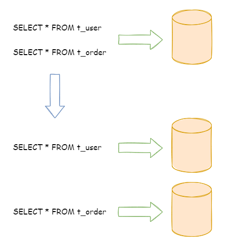
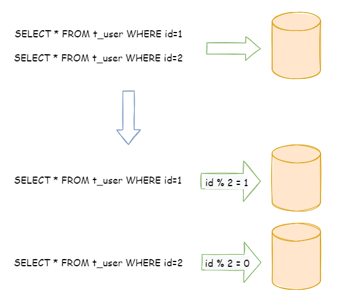

.. _sec:survey:

Основные понятия и терминология шардирования
==============================================================

Вертикальное шардирование
---------------------------

Методы шардирования делятся на вертикальное и горизонтальное.

Основная идея вертикального (или продольного) шардинга заключается в том, чтобы разделять базы данных по разным назначениям.

Если до шардинга одна база данных содержит много таблиц, относящихся к разным бизнес-процессам, то 
после шардинга таблицы распределяются по разным базам данных в соответствии с бизнес-логикой, 
и нагрузка также распределяется между этими базами.

На схеме ниже показано решение, когда таблицы пользователей и таблицы заказов разнесены 
в разные базы данных с помощью вертикального шардинга в зависимости от бизнес-требований.

Вертикальный шардинг требует периодической корректировки архитектуры и дизайна.
В целом, он не всегда успевает за быстро меняющимися требованиями интернет-бизнеса 
и не способен полностью решить проблему единственного узла.
Он может смягчить проблемы, вызванные большим объёмом данных и высокой конкуренцией запросов, но не устранить их полностью.
После вертикального шардинга, если объём данных в таблице всё ещё превышает порог одного узла, 
необходимо дополнительно применить горизонтальный шардинг.

Горизонтальное шардирование
---------------------------

Этот вид подразумевает разделение хранилища на сгруппированные по каким-либо критериям строки. 
В этом случае каждый шард содержит одинаковые столбцы, но разные строки данных. 
Горизонтальное шардирование позволяет распределить нагрузку на запись и чтение данных между различными 
серверами, за каждый из которых отвечает отдельная машина.

Например, при шардинге по первичному ключу: чётные значения первичных ключей помещаются 
в базу данных (или таблицу) 0, а нечётные — в базу данных (или таблицу) 1. Это показано на следующей схеме.

Apache ShardingSphere реализует поддержку как горизонтального, так и вертикального шардирования, 
при этом основной фокус направлен на горизонтальное разделение данных.

.. 
  Проблемы
  -------------

  Хотя шардинг данных решает задачи, связанные с производительностью, доступностью и восстановлением после сбоев, 
  распределённая архитектура приносит свои новые сложности.

  Одной из главных проблем является то, что инженеры по разработке приложений и администраторы баз данных 
  оказываются сильно перегружены всеми операциями, возникающими при таком разрозненном подходе к шардингу. 
  Им приходится точно знать, из какой конкретной подтаблицы извлекать нужные данные.

  Ещё одна сложность в том, что SQL-запросы, корректно работающие в одноузловой базе данных, 
  не обязательно будут работать правильно в шардинговой системе. Например, разделение таблиц может 
  приводить к изменению имён таблиц, а также к некорректной обработке операций, таких как постраничная 
  навигация, сортировка и группировка агрегатов.

  Транзакции между разными базами данных также представляют сложность для распределённых 
  кластеров. Разумное использование разделения таблиц может минимизировать применение 
  локальных транзакций и одновременно уменьшить объём данных в одной таблице, а правильное 
  использование разных таблиц в одной базе данных может эффективно избегать проблем, связанных 
  с распределёнными транзакциями. В сценариях, где транзакции между базами неизбежны, некоторые 
  компании всё ещё нуждаются в поддержании консистентности транзакций. Распределённые транзакции 
  на основе XA не применяются в крупном масштабе интернет-гигантами, поскольку их производительность 
  не удовлетворяет требованиям в условиях высокой конкуренции, и большинство из них используют гибкие 
  транзакции с конечной (в итоге) консистентностью вместо транзакций с сильной консистентностью.

  Основная цель разработки модульного решения Apache ShardingSphere — попытаться снизить влияние шардинга, 
  чтобы пользователи могли использовать группу баз данных с горизонтальным шардингом как одну базу данных.

Таблицы
-------------

Таблицы являются ключевым понятием для прозрачного шардинга данных. 
Apache ShardingSphere адаптируется к требованиям шардинга в разных сценариях, предоставляя различные типы таблиц.

.. _subsubsec:logic_table:

Логическая таблица (Logic Table)
~~~~~~~~~~~~~~~~~~~~~~~~~~~~~~~~~~

*Логическая таблица* — это абстрактное имя таблицы в SQL, представляющей собой набор данных 
с одинаковой структурой, распределённых по шардированным физическим таблицам.  
Логическая таблица используется приложением как единая таблица, независимо от того, на сколько шардов она разделена.

.. rubric:: Пример
  :heading-level: 4

Данные заказов могут быть разделены на 10 таблиц по последней цифре первичного ключа:

.. code-block:: 

   t_order_0, t_order_1, ..., t_order_9

Общее логическое имя для всех этих таблиц — ``t_order``.  

Приложение обращается именно к логической таблице ``t_order``, не имея представления о физическом распределении данных.

Пример конфигурации:

.. code-block:: yaml

    rules:
    - !SHARDING
      tables:
        t_order:
          actualDataNodes: ds_${0..1}.t_order_${0..9}
          tableStrategy: ...

Подробнее о настройке правил для логических таблиц см. в разделе :ref:`sec:conf_database`.

Физическая таблица (Actual Table)
~~~~~~~~~~~~~~~~~~~~~~~~~~~~~~~~~~

*Физические таблицы* — это конкретные таблицы, которые реально существуют в шардированных базах данных.  
Каждый шард соответствует определённой физической таблице.  

В предыдущем примере физическими таблицами являются:

.. code-block:: 

   t_order_0, t_order_1, ..., t_order_9

ShardingSphere управляет маршрутизацией запросов и агрегацией данных из этих таблиц, 
обеспечивая прозрачный доступ к логической таблице ``t_order``.

.. _subsubsec:binding_table:

Связанная таблица (Binding Table)
~~~~~~~~~~~~~~~~~~~~~~~~~~~~~~~~~~

*Связанная таблица* — это набор шардированных таблиц, использующих одинаковые правила шардинга.  
Связанные таблицы обеспечивают корректную работу многотабличных запросов без возникновения 
декартова произведения или межбазовых соединений, что повышает эффективность выполнения запросов.

Для многотабличных операций следует использовать **ключ шардинга** для связывания таблиц. 
В противном случае генерация SQL приведёт к большому количеству запросов, что негативно сказывается на производительности.

.. rubric:: Пример
  :heading-level: 4

Если таблицы ``t_order`` и ``t_order_item`` зашардированы по ключу ``order_id`` и связываются через
``order_id``, то они являются связанными таблицами. 
В этом случае многотабличные запросы выполняются корректно и эффективно.

Пример SQL запроса:

.. code-block:: sql

    SELECT i.* 
     FROM t_order o 
     JOIN t_order_item i ON o.order_id = i.order_id 
     WHERE o.order_id IN (10, 11);

Если связи между таблицами не настроены, и ключ шардинга ``order_id`` направляет значение 10 в сегмент 0, 
а 11 — в сегмент 1, то сгенерированный SQL состоит из 4 запросов (декартово произведение):

.. code-block:: sql

    SELECT i.* FROM t_order_0 o JOIN t_order_item_0 i ON o.order_id=i.order_id WHERE o.order_id in (10, 11);
    SELECT i.* FROM t_order_0 o JOIN t_order_item_1 i ON o.order_id=i.order_id WHERE o.order_id in (10, 11);
    SELECT i.* FROM t_order_1 o JOIN t_order_item_0 i ON o.order_id=i.order_id WHERE o.order_id in (10, 11);
    SELECT i.* FROM t_order_1 o JOIN t_order_item_1 i ON o.order_id=i.order_id WHERE o.order_id in (10, 11);

После настройки связанных таблиц по ключу ``order_id`` сгенерированный SQL сокращается до 2 запросов:

.. code-block:: sql

    SELECT i.* FROM t_order_0 o JOIN t_order_item_0 i ON o.order_id=i.order_id WHERE o.order_id in (10, 11);
    SELECT i.* FROM t_order_1 o JOIN t_order_item_1 i ON o.order_id=i.order_id WHERE o.order_id in (10, 11);

В данном наборе связанных таблиц таблица ``t_order`` используется в качестве основной, так как в ней задаётся условие шардинга.  
Все вычисления маршрутизации выполняются по правилам основной таблицы, а расчёты для ``t_order_item`` используют условия из ``t_order``.

.. note::
  
  Для связанных таблиц необходимо определить правила шардинга для каждой 
  физической таблицы, используя комбинацию имени логической таблицы и номера шарда (суффикса), 
  соответствующего конкретному шардированному экземпляру.

Пример конфигурации:

.. code-block:: yaml

    rules:
    - !SHARDING
      tables:
        t_order:
          actualDataNodes: ds_${0..1}.t_order_${0..1}
          tableStrategy: ...
        t_order_item:
          actualDataNodes: ds_${0..1}.t_order_item_${0..1}
          tableStrategy: ...
      bindingTables:
        - t_order, t_order_item

Настройка правил для связанных таблиц осуществляется в файле конфигурации ``database-sharding.yaml`` (см. :ref:`sec:conf_database`).

.. _subsubsec:broadcast_table:

Broadcast таблица
~~~~~~~~~~~~~~~~~~~~~

*Broadcast таблица* — это таблица, которая существует на каждом источнике данных (шарде) и имеет одинаковую 
структуру и содержимое во всех шардах.  
Обычно такие таблицы небольшого объёма и редко изменяются. 
Они используются при ``JOIN`` с большими таблицами: например, справочники, константы, словари.

.. rubric:: Пример
  :heading-level: 4

Предположим, что имеется шардированная таблица ``t_order``, разбитая по пользователям, 
и справочная таблица ``t_country``, содержащая названия стран.  
В данной конфигурации ``t_country`` является *Broadcast*-таблицей.

При выполнении запроса:

.. code-block:: sql

    SELECT o.id, o.amount, c.name 
    FROM t_order o 
    JOIN t_country c ON o.country_id = c.id;

ShardingSphere выполнит ``JOIN`` локально на каждом шарде, используя собственную копию таблицы ``t_country``.  
Благодаря этому нет необходимости собирать данные из разных баз, что значительно повышает производительность запроса.

Пример конфигурации:

.. code-block:: yaml

    rules:
    - !BROADCAST
      tables: 
      - t_country
      - t_address

Подробнее о настройке правил для Broadcast-таблиц см. в разделе :ref:`sec:conf_database`.

.. _subsubsec:single_table:

Одиночная таблица (Single Table)
~~~~~~~~~~~~~~~~~~~~~~~~~~~~~~~~~~

*Одиночная таблица* — это таблица, существующая только в одном источнике данных (шарде).  
Она **не шардируется** и **не реплицируется** между другими источниками.  
Такие таблицы, как правило, содержат небольшой объём данных и не требуют горизонтального разделения.

ShardingSphere при обработке запросов к одиночным таблицам знает их точное расположение и направляет 
запрос непосредственно в соответствующий источник данных.

Если таблица была создана пользователем через ShardingSphere (например, с помощью команды DDL ``CREATE TABLE ...``)  
или указана в одном из правил конфигурации (например, для шифрования или маскирования данных),  
ShardingSphere автоматически загрузит информацию о ней и определит, что таблица является *Single*.

Если же таблица создана напрямую в физической базе данных, минуя ShardingSphere,  
она не будет обнаружена автоматически. 
В этом случае пользователю необходимо **вручную добавить правила для одиночной таблицы** в конфигурацию ShardingSphere.

.. rubric:: Пример конфигурации:
  :heading-level: 4

.. code-block:: yaml

    rules:
    - !SINGLE
      tables:
        - ds_0.*
      defaultDataSource: ds_0

Подробнее о настройке правил для Single-таблиц см. в разделе :ref:`sec:conf_database`.

.. _subsec:data_nodes:

Узлы данных (Data Nodes)
-----------------------------

*Узел данных (Data Node)* — это наименьшая единица шардирования, представляющая собой 
комбинацию имени источника данных и физической таблицы.  
Пример: ``ds_0.t_order_0``.

Связь между логической таблицей и физической таблицей может быть организована двумя способами:

- *Равномерное распределение (uniform distribution)* — физические таблицы распределены равномерно между источниками данных.  

  Пример структуры:

  .. code-block:: properties

      db0
        |-- t_order0
        |-- t_order1
      db1
        |-- t_order0
        |-- t_order1

- *Пользовательское распределение (custom distribution)* — таблицы распределяются по источникам данных 
  по произвольной схеме, заданной пользователем.  

  Пример структуры:

  .. code-block:: properties

      db0
        |-- t_order0
        |-- t_order1
      db1
        |-- t_order2
        |-- t_order3
        |-- t_order4

  Такое распределение позволяет гибко настраивать шардирование в соответствии с требованиями конкретного приложения.

Узлы данных для каждой логической таблицы определяются в конфигурационном файле ``database-sharding.yaml`` в параметре ``actualDataNodes``.
Значения указываются с использованием Groovy-выражений, что позволяет описывать диапазоны баз данных и таблиц 
в компактной форме (см. :ref:`sec:conf_database`). 

.. rubric:: Пример конфигурации:
  :heading-level: 4

.. code-block:: yaml

  rules:
  - !SHARDING
    tables:
      T_ORDER:
        actualDataNodes: ds_$->{0..1}.T_ORDER_$->{0..1}
        ...

.. _subsec:shard_key:

Ключ шардинга (Sharding key)
-----------------------------

*Ключ шардинга* — это поле таблицы базы данных, по значению которого выполняется горизонтальное разбиение 
данных между шардами.

Например, если первичный ключ заказов в таблице ``t_order`` используется для распределения 
записей по шардам на основании остатка от деления, то этот первичный ключ является ключом шардинга.

Если в SQL-запросе не указан ключ шардинга, система выполняет полную маршрутизацию (full routing) — 
запрос направляется на все шарды, что приводит к снижению производительности.

Apache ShardingSphere поддерживает не только шардинг по одному полю, но и составной шардинг — распределение 
данных на основе комбинации нескольких полей.

Ключ шардинга задается параметром ``shardingColumn``  для каждой логической таблицы
в конфигурационном файле ``database-sharding.yaml`` (см. :ref:`sec:conf_database`). 

.. rubric:: Пример конфигурации:
  :heading-level: 4

.. code-block:: yaml

  rules:
  - !SHARDING
    tables:
      T_ORDER:
        actualDataNodes: ds_$->{0..1}.T_ORDER_$->{0..1}
        tableStrategy:
          standard:
            shardingColumn: ORDER_ID
            shardingAlgorithmName: T_ORDER_inline

.. _subsec:shard_algorithm:

Алгоритм шардинга (Sharding Algorithm)
----------------------------------------------------------

*Алгоритм шардинга* — это механизм, определяющий, в какой физический узел данных (шард) будет 
направлена запись или запрос.

Алгоритм определяет стратегию распределения строк таблицы между базами данных и таблицами 
в зависимости от значения одного или нескольких полей (ключей шардинга).

Apache ShardingSphere поддерживает использование встроенных алгоритмов шардинга, 
а также позволяет разработчикам реализовывать пользовательские алгоритмы, адаптированные под конкретную бизнес-логику.

Алгоритмы шардинга поддерживают следующие операции сравнения для ключей шардинга в SQL-запросах:
``=, >=, <=, >, <, BETWEEN, IN``.

.. _subsubsec:auto_algor:

Автоматический алгоритм шардинга (Automatic Sharding Algorithm)
~~~~~~~~~~~~~~~~~~~~~~~~~~~~~~~~~~~~~~~~~~~~~~~~~~~~~~~~~~~~~~~~~~~~

*Автоматический алгоритм шардинга* — это упрощённый механизм, позволяющий управлять распределением 
данных без явного указания всех физических таблиц и узлов.  
Разработчику достаточно указать диапазон источников данных, а ShardingSphere автоматически вычислит и создаст 
необходимые таблицы в каждом шарде.

Автоматический алгоритм настраивается в файле конфигурации ``database-sharding.yaml`` через модуль ``autoTables``.  

При использовании ``autoTables`` необходимо указать только список источников данных (шардов) через параметр 
``actualDataSources`` без указания узлов, а ShardingSphere автоматически вычислит и создаст необходимые таблицы в каждом шарде.  

Этот алгоритм особенно полезен для систем с большим количеством однотипных таблиц и равномерным распределением данных.

Поддерживаются несколько встроенных автоматических алгоритмов:

- ``MOD`` — распределение по остатку от деления ключа шардинга (например, ``user_id % 4``);
- ``HASH_MOD`` — распределение по хэш-функции от значения ключа;
- ``VOLUME_RANGE`` — распределение по диапазонам значений;
- ``BOUNDARY_RANGE`` — распределение по заданным граничным значениям
- ``AUTO_INTERVAL`` — распределение по временным интервалам (например, по месяцам или по годам).

.. rubric:: Пример конфигурации:
  :heading-level: 4

.. code-block:: yaml

    rules:
    - !SHARDING
      ...
      shardingAlgorithms:
        mod_algorithm:
          type: MOD
          props:
            sharding-count: 4
      ...

Подробнее о встроенных автоматических алгоритмах шардирования см. в разделе :ref:`subsec:buildin_alg_autotables`.

.. _subsubsec:standart_algor:

Стандартный алгоритм шардинга (Standard Sharding Algorithm)
~~~~~~~~~~~~~~~~~~~~~~~~~~~~~~~~~~~~~~~~~~~~~~~~~~~~~~~~~~~~~~

Используется в сценариях, где шардинг выполняется **по одному ключу**.  
Поддерживаются SQL-операции: ``=, IN, BETWEEN AND, >, <, >=, <=``.

Встроенные реализации стандартного алгоритма:

- ``INLINE`` -  простое выражение для вычисления целевого шарда (например, ``t_order_${user_id % 4}``);
- ``INTERVAL`` - распределение по временным диапазонам значений ключа.  

.. rubric:: Пример конфигурации:
  :heading-level: 4

.. code-block:: yaml

  rules:
  - !SHARDING
    ...
    shardingAlgorithms:
      order_inline_algorithm:
        type: INLINE
        props:
          algorithm-expression: t_order_${order_id % 4}
    ...

Подробнее о встроенных стандартных алгоритмах шардирования см. в разделе :ref:`subsec:buildin_alg_standart`.

.. _subsubsec:complex_algor:

Составной алгоритм шардинга (Composite Sharding Algorithm)
~~~~~~~~~~~~~~~~~~~~~~~~~~~~~~~~~~~~~~~~~~~~~~~~~~~~~~~~~~~~~~

Применяется для сценариев, где распределение данных 
зависит **от нескольких ключей шардинга** одновременно.  

В отличие от стандартного алгоритма, который работает только с одним полем, 
составной алгоритм позволяет учитывать комбинацию значений нескольких колонок для 
определения целевого шарда. Это особенно полезно, когда логика маршрутизации сложна и зависит от нескольких факторов.

Встроенные реализации составного алгоритма:

- ``COMPLEX_INLINE`` - распределение данных по нескольким ключам с помощью выражения на 
  основе этих ключей, аналогично тому, как работает ``INLINE`` для стандартного алгоритма.

Подробнее о встроенных комплексных алгоритмах шардирования см. в разделе :ref:`subsec:buildin_alg_complex`.

.. _subsubsec:hint_algor:

Алгоритм шардинга с подсказками (Hint Sharding Algorithm)
~~~~~~~~~~~~~~~~~~~~~~~~~~~~~~~~~~~~~~~~~~~~~~~~~~~~~~~~~~~~~~

Используется в сценариях, когда направление шардинга не может быть определено из SQL-запроса.  
Вместо этого приложение явно указывает, в какой шард должны попасть данные или выполняться запросы, 
передавая  подсказки (Hint).  

Встроенные реализации составного алгоритма:

- ``HINT_INLINE`` - делает распределение не на основе ключей, а на основе hint-подсказок, 
  передаваемых приложением во время выполнения запроса. 

Подробнее о встроенных hint- алгоритмах шардирования см. в разделе :ref:`subsec:buildin_alg_hint`.

Пользовательский алгоритм шардинга (Customized Sharding Algorithm)
~~~~~~~~~~~~~~~~~~~~~~~~~~~~~~~~~~~~~~~~~~~~~~~~~~~~~~~~~~~~~~~~~~~~

Предоставляет разработчикам приложений возможность реализовать собственные алгоритмы шардинга, основанную на специфике бизнес-логики.

Пользовательские алгоритмы могут быть реализованы в виде Java-классов, которые наследуют интерфейсы ShardingSphere, например:

- ``StandardShardingAlgorithm``
- ``ComplexKeysShardingAlgorithm``
- ``HintShardingAlgorithm``

Подробнее о пользовательских (универсальных) алгоритмах шардирования см. в разделе :ref:`subsec:custom_alg`.

.. _subsec:shard_strategy:

Стратегия шардинга (Sharding Strategy)
-----------------------------------------

*Стратегия шардинга* — это комбинация **ключа шардинга** (sharding key) и **алгоритма шардинга** (sharding algorithm), 
которая определяет, как данные распределяются между базами и таблицами.  

Стратегии шардинга задаются в файле конфигурации ``database-sharding.yaml`` в следующих модулях:  

- ``tableStrategy`` — стратегия для конкретной таблицы;  
- ``databaseStrategy`` — стратегия распределения между базами;  
- ``defaultTableStrategy`` — стратегия по умолчанию для всех таблиц;  
- ``defaultDatabaseStrategy`` — стратегия по умолчанию для всех баз.  

.. rubric:: Пример конфигурации:
  :heading-level: 4

.. code-block:: yaml

  rules:
  - !SHARDING
    tables:
      t_order:
        actualDataNodes: ds_${0..1}.t_order_${0..3}
        tableStrategy:
          standard:                  # Стратегия для таблицы
            shardingColumn: order_id
            shardingAlgorithmName: hash_mod_algorithm
        databaseStrategy:
          standard:                  # Стратегия для базы данных
            shardingColumn: user_id
            shardingAlgorithmName: modulo_db_algorithm

    defaultTableStrategy:           # Стратегия по умолчанию для всех таблиц
      standard:
        shardingColumn: id
        shardingAlgorithmName: hash_mod_algorithm

    defaultDatabaseStrategy:        # Стратегия по умолчанию для всех баз
      standard:
        shardingColumn: user_id
        shardingAlgorithmName: modulo_db_algorithm

Принудительная маршрутизация шардинга (Mandatory Sharding Routing)
----------------------------------------------------------------------------------

Это механизм принудительной маршрутизации запросов на шарды, который используется в случаях, 
когда поле шардинга не может быть определено напрямую из SQL-запроса, а задаётся внешними условиями.

В обычных сценариях шардинга ShardingSphere использует ключ шардинга, указанный в SQL (например, ``order_id``). 
для определения, в какой шард направить запрос.

Иногда в SQL нет поля шардинга или оно недоступно (например, нужно шардинговать по логину 
пользователя, а в запросе этого поля нет).

В таких случаях применяется Mandatory Sharding Routing — разработчик вручную передаёт 
значение шарда через аннотацию в SQL (Hints) или Java API.

.. _subsec:row_expressions:

Строковые выражения (Row Expressions) 
-----------------------------------------

*Строковые выражения* предназначены для двух основных целей:

1. Упрощение конфигурации — сокращают количество повторяющихся записей в настройках шардинга.

2. Интеграция и читаемость — позволяют централизованно задавать правила шардинга в декларативной форме.

При увеличении числа шардов конфигурация с явным перечислением всех узлов данных становится 
громоздкой и трудной в сопровождении. Использование строковых выражений позволяет значительно 
уменьшить объём конфигурации, сделать её более наглядной и гибкой.

Строковые выражения применяется для описания узлов данных (``actualDataNodes``, ``actualDataSources``) и 
для настройки алгоритмов шардинга (``algorithm-expression``) в файле конфигурации ``database-sharding.yaml`` (см. :ref:`sec:conf_database`).

Более подробно о строковых выражениях описано в подразделе :ref:`subsec:row_expr`.

.. _subsec:distributedPK:

Распределённый первичный ключ (Distributed Primary Key)
-------------------------------------------------------------

Автоматическая генерация первичных ключей является базовой возможностью большинства систем 
управления базами данных. В частности, в Red Базе Данных для этого используются столбцы идентификации.

Однако после внедрения шардинга возникает новая задача — необходимо обеспечивать глобально 
уникальные первичные ключи среди всех физических узлов данных.
Обычные автоинкрементные ключи, используемые в каждой таблице независимо, приводят к 
появлению дублирующихся значений, поскольку генерация ключей не синхронизируется между шардами.

Избежать коллизий можно, настроив разные начальные значения и шаги инкремента для каждой таблицы, 
но этот подход требует ручного администрирования и плохо масштабируется, особенно при увеличении числа шардов.

Для решения этой задачи существуют сторонние подходы, например:

- UUID — генерация уникальных идентификаторов с помощью алгоритмов без централизованного управления;

- Сервисы генерации ключей — выделенные системы, создающие уникальные значения и распределяющие их между узлами.

Чтобы удовлетворить разные потребности и сценарии, Apache ShardingSphere предоставляет 
собственные встроенные генераторы распределённых первичных ключей, такие как ``UUID`` и ``SNOWFLAKE``.
Кроме того, реализован абстрактный интерфейс генератора ключей, который позволяет разработчикам создавать 
и подключать собственные реализации для генерации глобально уникальных идентификаторов.

Распределленные первичные ключи задаются параметром ``keyGenerateStrategy`` 
в файле конфигурации ``database-sharding.yaml`` (см. :ref:`sec:conf_database`).

.. code-block:: yaml

  rules:
  - !SHARDING
    tables:
      t_order:
        actualDataNodes: ds_$->{0..2}.t_order
        keyGenerateStrategy:
          column: order_id
          keyGeneratorName: sflake
    ...
    keyGenerators:
      sflake:
        type: SNOWFLAKE

Подробнее об алгоритмах генерации распределённых (глобально уникальных) первичных ключей 
описано в :numref:`подразделе %s<subsec:dist_pk>`.

.. _subsec:auditors:

Аудиторы SQL-запросов (Sharding SQL Auditors) 
-----------------------------------------------------

*Аудитор* — это встроенный механизм ShardingSphere-Proxy. 
Он входит в его архитектуру безопасности и маршрутизации SQL, и работает как дополнительный уровень проверки, 
который позволяет контролировать выполнение SQL до его реального исполнения.
Аудит шардинга предназначен для проверки SQL-операторов в базе данных. Аудит шардинга не только
перехватывает недопустимые SQL-операторы, но и собирает статистику SQL.

Аудиторы реализуются через механизм SPI (Service Provider Interface) — стандартный плагинный интерфейс Java.
ShardingSphere-Proxy включает базовую инфраструктуру аудита и несколько встроенных реализаций,
например ``DML_SHARDING_CONDITIONS``.

Кроме того, система поддерживает подключение пользовательских аудиторских модулей —
для этого достаточно реализовать соответствующий интерфейс и подключить JAR-файл с кастомной реализацией.

Настройка аудиторов осуществляется в файле конфигурации ``database-sharding.yaml`` (см. подробнее :ref:`sec:conf_database`).

.. code-block:: yaml

  rules:
  - !SHARDING
    auditors:
      sharding_key_required_auditor:
      type: DML_SHARDING_CONDITIONS